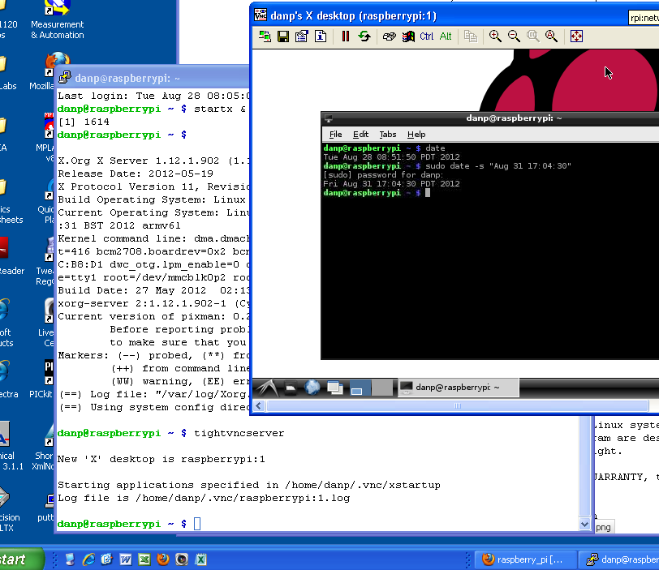

% Raspberry Pi Desktop for PC and Mac
% Notes by Dan Peirce B.Sc.

<!---
use pandoc -s --toc -t html5 -c ../../pandocbd.css RPi-PC-desktop.md -o RPi-PC-desktop.html
-->

# Raspberry Pi Desktop for PC (and Mac)

The Raspberry Pi foundation has made available a Debian derived Linux distribution that 
has the same look and feel as Raspbian that runs on the ARM based Raspberry Pi but instead runs 
on a x86 based processor (PC or MAC). It can be run from a bootable flash drive or installed on the computers 
hard drive.

* [www.raspberrypi.org blog stretch pcs macs update](https://www.raspberrypi.org/blog/stretch-pcs-macs-raspbian-update/)
* [My early post to forum](https://www.raspberrypi.org/forums/viewtopic.php?f=116&t=198934&p=1244030#p1244030)

## Initial Testing of Raspberry Pi Desktop

I have the Raspberry Pi up and running on a PC desktop. I believe this was the easiest install 
of a Linux desktop I have done. Often I have used Linux on older machines and chosen a light desktop like 
LXDE which was not the default for the distribution. This typically resulted in hours tweaking and not getting
everything working just as it should. It seems with this version of Debian Stretch the RPi Foundation has done
the tweaking and gotten it all right.

The ISO image was loaded onto the flash drive using **rufus-2.18p.exe** on a windows 7 computer. To ensure the 
persistence option will work it is important to choose the **dd** (entire disk image) option rather than the 
**ISO** (file by file) option. 

Very nice the way it all works without needed to do a lot of configuration.

## GPIO Expander

Quoting from the Raspberry Pi Blog:

~~~~
Use the GPIO pins of a Raspberry Pi Zero while 
running Debian Stretch on a PC or Mac with our 
new GPIO expander software! With this tool, 
you can easily access a Pi Zero’s GPIO pins 
from your x86 laptop without using SSH, and 
you can also take advantage of your x86 
computer’s processing power in your physical 
computing projects.
~~~~

* [RPi Blog - GPIO Expander](https://www.raspberrypi.org/blog/gpio-expander/)
* [RPi Blog - UPDATES TO GPIO ZERO, THE PHYSICAL COMPUTING API Aug 2017](https://www.raspberrypi.org/blog/gpio-zero-update/)

This is something I plan to test.

### For Debugging - Log onto Zero

In a terminal on the PC desktop after the RPi Zero (USB OTG port not PWR port) has been attached to the PC USB port.
This connection will also provide power. 

~~~~
screen /dev/ttyACM0 115200
Username: root
Password: raspberry
~~~~

One will get a "#" as a prompt. There will be a limited temporary file system on a RAM drive.

#### Mount microSD

A bootable microSD would need to be removed to get the Zero to boot from the USB port rather than booting
from the microSD.Once the boot is complete one can reinsert the microSD and mount it (it won't mount 
automatically).

First just to make sure the micro SD is detectable try:

~~~~
# blkid
/dev/mmcblk0p2: UUID="202638e1-4ce4-45df-9a00-ad725c2537bb"
/dev/mmcblk0p1: LABEL="boot" UUID="22E0-C711"
~~~~

I created a directory to be used as a mount point

~~~~
# mkdir /mnt/sd
~~~~

then mounted the microSD to that directory:

~~~~
# mount -t ext4 /dev/mmcblk0p2 /mnt/sd
~~~~

In my case I used a microSD already set up with Noobs on it. That is why it
had been formatted with the ext4 file system. The disadvantage of formatting with
ext4 is that only Linux systems can read it. FAT32 is more universal (but less
rich in features).

The file system loaded correctly indicating the USB boot for the RPi Zero had worked 
successfully. 

## New PC applications - PiServer

There is a section in [https://www.raspberrypi.org/blog/stretch-pcs-macs-raspbian-update/](https://www.raspberrypi.org/blog/stretch-pcs-macs-raspbian-update/)
called *New PC applications* and it talks about **PiServer**. If PiServer is run on the RPi PC desktop, 
PiServer enables up to three Raspberry Pi 3s to do a network boot (over Ethernet). 

I expect the following advantages over booting from a microSD:

* The microSD cards can easily be corrupted if the Raspberry Pi 3 if it looses power unexpectedly. 
  This would not affect the operating system if a network boot is used. One could pull power on 
  the Raspberry Pi 3 without worry.
* It will likely make the setup of headless operation and control of the Raspberry Pi 3 from a PC more 
  straightforward.

Quoted from link given above:

~~~~
We have included a couple of new applications in the PC version. One is called PiServer — this allows 
you to set up an operating system, such as Raspbian, on the PC which can then be shared by a number 
of Pi clients networked to it. It is intended to make it easy for classrooms to have multiple Pis all 
running exactly the same software, and for the teacher to have control over how the software is 
installed and used. PiServer is quite a clever piece of software, and it’ll be covered in more detail 
in another blog post in December.
~~~~

I will be watching for the new blog post. Raspberry Pi 3s are available from many sources. Raspberry Pi Zeros 
are not as easy to get in quantity or in a reasonable time. 

## Running a Raspberry 3 Headless

In some cases it would be advantageous to run a Raspberry Pi 3 headless. That is without a monitor, keyboard and mouse.
On example is if one has access to a laptop. It is not hard to log into a Raspberry Pi remotely from 
a laptop connected to the same Ethernet router. In the past (2012) I did this with an original Raspberry Pi. 
I have not taken the time to try it with a new Raspberry Pi three but it would work much the same.

Here is an example of a Raspberry Pi desktop sitting on a windows XP desktop. This example used both a 
Virtual Network Computing (VNC) session and a Secure shell (SSH).

More on remote access on this old page from 2012:

* [raspberry_pi.html#remote-login](../../raspberry_pi.html#remote-login)
* [ssh.html](../../ssh.html)
* [vnc.html](../../vnc.html)

### Advantage of booting Laptop with the Debian Desktop

One advantage of using a Debian desktop on the Laptop (PC) rather than the Windows boot is that Debian computers 
can find each other by computer name. That does not work out of the box with the Windows laptop connecting to 
the Debian RPi. In that case one needs to know the IP address of the Raspberry Pi.

At the moment I do not have a RPi 3 handy for testing so I am testing with two netbooks running the RPi version of 
Debian Stretch.

* I changed the hostname of one to **proton** and the other **electron**. This can be done with a GUI
  under **Preferences -> Raspberry Pi Configuration**. On the first tab the hostname can be changed.
* The the second tab SSH needs to be enabled on the remote. This means one session with a 
  keyboard, monitor and mouse.
 
See example session below. 

* The first time one logs on a computer remotly the user is given an alert.
  The purpose is to let the user know if the OS has not seen that remote machine
  before. If this is a surprise there may be a hacker luring on the network.
* the last line indicates one os now controlling the other machine from the
  command line. Note the user host name of the prompt has changed. 

~~~~bash
pi@proton:~ $ ssh electron.local
The authenticity of host 'electron.local (192.168.0.19)' can't be established.
ECDSA key fingerprint is SHA256:GZzJbOpMgXTSWbKvH7s6kTkZcFrcVpAheQid8TqJVho.
Are you sure you want to continue connecting (yes/no)? yes
Warning: Permanently added 'electron.local,192.168.0.19' (ECDSA) to the list of known hosts.
pi@electron.local's password: 
Linux electron 4.9.0-4-686-pae #1 SMP Debian 4.9.51-1 (2017-09-28) i686

The programs included with the Debian GNU/Linux system are free software;
the exact distribution terms for each program are described in the
individual files in /usr/share/doc/*/copyright.

Debian GNU/Linux comes with ABSOLUTELY NO WARRANTY, to the extent
permitted by applicable law.
Last login: Wed Dec 20 14:26:05 2017 from 192.168.0.19
pi@electron:~ $ 
~~~~

