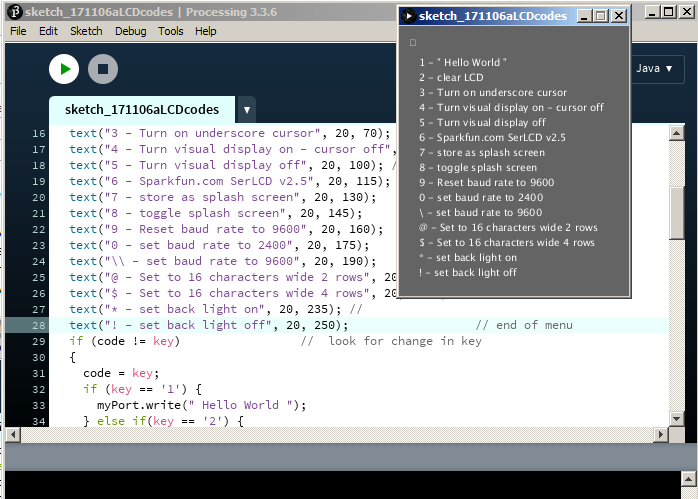

% Serial LCD Configuration

<!---
use pandoc -s --toc -t html5 -c ../../pandocbd.css LCDconf.md -o LCDconf.html
-->

# Serial LCD Configuration

There is an image of the GUI in the screenshot.  I could do some of the commands just using PuTTY 
but when attempting to find a way to send the 0xFE code I came across the suggestion on line to use Processing. 
The little application is something like a special purpose terminal program. 
 

Most printable characters are sent over the USB to serial link to the LCD just as one types them. 

* The last character typed appears in the upper left corner of the GUI window.
* The numeric keys 0-9 and the backslash get intercepted and send special characters to configure the display. 
The GUI displays a menu saying what each numeric key will do. The backslash was used because the LCD shows a 
Japanese character rather than a backslash and I figured we don't need that.​
* The com port used was written into the script as a literal. One will have to check which com port the USB to 
serial board has been assigned and then change line 7 of the sketch to reflect that. Generally each board gets 
assigned a different number but a given board typically always gets assigned the same number on a given computer 
so one won't need to change the number if sticking with the same hardware each time. It makes no difference 
which LCD is connected.
* ​There are comments in the code that explain what the menu items are for.
* ​the code that I could not send in Putty was the 0xFE code. I was searching on line for a way to do it 
  and noticed someone suggested using Processing. It turned out easy to use 
  (I'm sure my code can be improved as I essentially looked at two examples and went from there. 
  I have not read the language reference)
* It is easy to send the 0x7C code in Putty as it is just the "|" character.
* I think most of the other non printable codes used can be sent in PuTTy as control+character.

## The Processing Code

_The code here needs to be updated to match the screenshot in the previous section._

* This version includes the function keyPressed() which solves some issues of the previous version. It no 
longer ignores keys if the same key is repeated.

~~~~java
import processing.serial.*;
Serial myPort; 

void setup() {
  size(230, 200);
  myPort = new Serial(this, "COM7", 9600);
  textSize(10);
}

void draw() {
  background(100);
  text(key, 10, 20); // Draw "key" at coordinate (10,20)
  text("1 - \" Hello World \"", 20, 40); // start of Menu
  text("2 - clear LCD", 20, 55);
  text("3 - Turn on underscore cursor", 20, 70); 
  text("4 - Turn visual display on - cursor off", 20, 85); //
  text("5 - Turn visual display off", 20, 100); //
  text("6 - Sparkfun.com SerLCD v2.5", 20, 115);
  text("7 - store as splash screen", 20, 130);
  text("8 - toggle splash screen", 20, 145);
  text("9 - Reset baud rate to 9600", 20, 160);
  text("0 - set baud rate to 2400", 20, 175);
  text("\\ - set baud rate to 9600", 20, 190); // end of menu

}

void keyPressed() {

    if (key == '1') {
      myPort.write(" Hello World ");
    } else if(key == '2') {
      myPort.write(0xFE); // command code
      myPort.write(0x01); // clear screen
    } else if (key =='3') {
      myPort.write(0xFE); // command code
      myPort.write(0x0E); // Underline cursor on
    } else if (key =='4') {
      myPort.write(0xFE); // command code
      myPort.write(0x0C); // Underline cursor off display on
    } else if (key =='5') {
      myPort.write(0xFE); // command code
      myPort.write(0x08); // display off
    } else if (key =='6') {
      myPort.write("  Sparkfun.com     SerLCD v2.5  ");
    } else if (key =='7') {
      myPort.write(0x7C); // command code
      myPort.write(0x0A); // store display as splash screen
    } else if (key =='8') {
      myPort.write(0x7C); // command code
      myPort.write(0x09); // toggle splash screen
    } else if (key =='9') {
      myPort.write(0x7C); // command code
      myPort.write(0x12); // reset to 9600 baud
    } else if (key =='0') {
      myPort.write(0x7C); // command code
      myPort.write(0x0B); // set to 2400 baud
    } else if (key =='\\') {
      myPort.write(0x7C); // command code
      myPort.write(0x0D); // set to 9600 baud
    } else if (key == ' ') {
      myPort.write(0x20);
    } else if (key == CODED) 
    {
          
    } else
    {
       myPort.write(key);
    }

}
~~~~
 
# Old Notes

I looked at Processing once before. It has an advantage in being quick and easy to use.

Old notes at [old Processing Notes](../../Processing/ProcessingComputerLanguage.html)
  