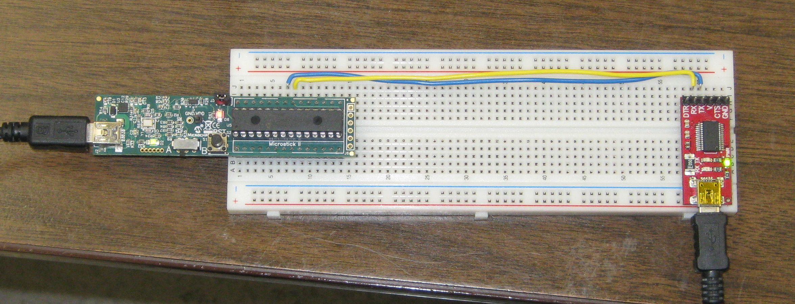

% Testing Microstick II with USB to Serial Adaptor
% Dan Peirce B.Sc.

<!---
use pandoc -s --toc -t html5 -c ../../pandocbd.css testing.md -o testing.html
-->

# Microstick II with USB to Serial Adaptor

I'm setting up a class set of 
[Microstick II](http://www.microchip.com/DevelopmentTools/ProductDetails.aspx?PartNO=DM330013-2) with a 
[PIC32MX150F128B](http://www.microchip.com/wwwproducts/en/PIC32MX150F128B) installed in the socket. 
A USB to Serial adaptor is also wired to the PIC Tx and Rx lines.

The Microstick II schematic included with the kit as shipped has Tx and Rx marked backwards! I have used the 
following arrangement:

~~~~c
      PPSOutput(4, RPB10, U2TX);        // MAP Tx to PB10 - pin 21
      PPSInput (2, U2RX, RPB11);        // MAP Rx to PB11 - pin 22
~~~~

## Schematic

A portion of [the schematic](http://ww1.microchip.com/downloads/en/DeviceDoc/51951B.pdf) 
is here (note interchange TxD and RxD):

The pinout can be found on page four of the [datasheet](http://ww1.microchip.com/downloads/en/DeviceDoc/60001168J.pdf).

## Test Setup

## Test Program

The Test program is here:

* [hello-32MX.c](https://github.com/danpeirce/danpeirce.github.io/blob/master/2017/testStarterKitII/hello-32MX.c)

* Previous notes -- [testing without microstick](https://sites.google.com/site/danpeircenotes/pic32mx/worked-through-guide)

# XC32 Compiler Note from August 1, 2017

~~~~
I found by trial and error that with the newest version of the xc32 compiler (today it is v1.44) that one 
must change the install folder for the peripheral library. At least with what I have downloaded the legacy 
peripheral library installer is defaulting to install into

C:\Program Files (x86)\Microchip\xc32\v1.40

but it actually needed to go into 

C:\Program Files (x86)\Microchip\xc32\v1.44​

It seems to compile my old example fine with that change. I suspect when I tried this at home I had 
xc32 v1.40 installed. I don't think there are different versions of the pic32 peripherals library 
installer for different versions of the xc32 compiler.
~~~~
