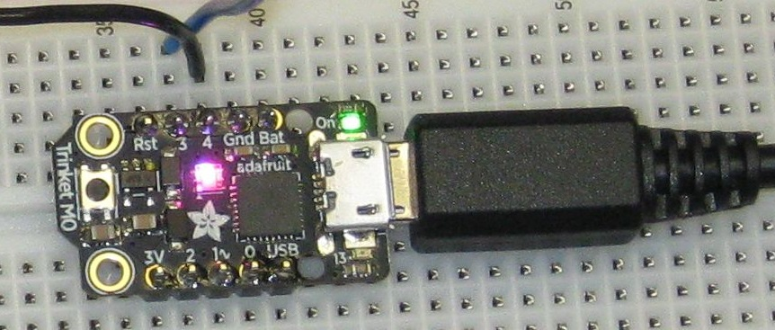
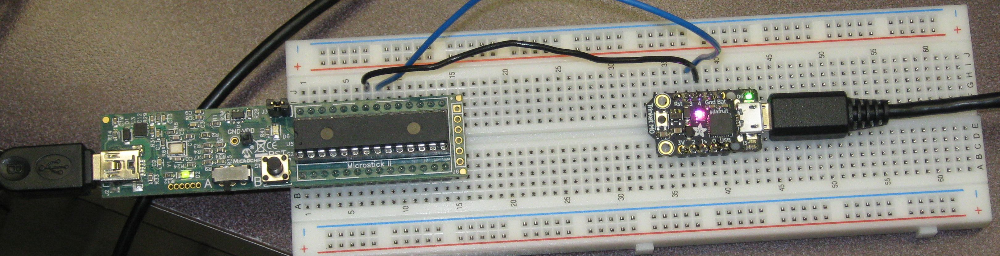

% Notes on Trinket M0
% Dan Peirce B.Sc.

<!---
use pandoc -s --toc -t html5 -c ../../pandocbd.css testing.md -o testing.html
-->

# Notes on Testing Trinket M0

Obtained first Trinket M0 on September 29, 2017. Initially impressed by low price combined with numerous features. 
Initially it occurred to me that it could do the job of a USB to serial to adaptor at a lower cost and much more besides.

## Helpful Links

* [https://learn.adafruit.com/adafruit-trinket-m0-circuitpython-arduino?view=all](https://learn.adafruit.com/adafruit-trinket-m0-circuitpython-arduino?view=all)
    * [UART example](https://learn.adafruit.com/adafruit-trinket-m0-circuitpython-arduino?view=all#circuitpython-uart-serial)
	* [I2C example](https://learn.adafruit.com/adafruit-trinket-m0-circuitpython-arduino?view=all#circuitpython-i2c-scan)
    * [Trinket M0 Schematic](https://cdn-learn.adafruit.com/assets/assets/000/045/723/original/adafruit_products_schem.png?1503525048)
	    * [On board 3.3 volt regulator](https://www.digikey.ca/product-detail/en/diodes-incorporated/AP2112K-3.3TRG1/AP2112K-3.3TRG1DICT-ND/4505257)
* [http://www.bc-robotics.com/shop/adafruit-trinket-m0/](http://www.bc-robotics.com/shop/adafruit-trinket-m0/)
* [https://www.digikey.ca/products/en?keywords=trinket%20m0](https://www.digikey.ca/products/en?keywords=trinket%20m0)

### Drivers needed for windows 7. 

No drivers need to be installed for windows 10, for mac  or for Linux.
 
* [Drivers needed for windows 7](https://learn.adafruit.com/adafruit-trinket-m0-circuitpython-arduino?view=all#windows-driver-installation)

### USB Device Properties windows 7

Note virtual com port number may be different an different systems.

## Using as Shipped with Demo Program

The Trinket M0 ships loaded with **CiruitPython** loaded and a demo program preloaded. The demo does a number of 
things. My initial focus was the voltage out on the analog output pin. 

The demo program loaded generates a slow ramp voltage. The output starts close to zero and ramps up 
close to 3.3 volts. The program does other things too. For example if one connects the analog out pin to analog in 0 
the board will read the current voltage and send it via USB virtual com port to a Putty session. 

Note that if the USB cable is connected this board enumerates as a composite device capable of many things.

Example output from board using demo program (sample from near peak voltage):

~~~~
D0: 3.09
D0: 3.11
D0: 3.12
D0: 3.13
D0: 3.15
D0: 3.16
D0: 3.17
D0: 3.18
D0: 3.20
D0: 3.21
D0: 3.22
D0: 3.24
D0: 3.25
D0: 3.26
D0: 3.27
D0: 3.29
D0: 0.02
D0: 0.02
D0: 0.03
D0: 0.04
D0: 0.06
D0: 0.07
~~~~

## Alternate example Program that Generates a Ramp

The documentation provided for the Trinket M0 contains a small CircuitPython program specifically 
made for creating a ramp without other features. Note that the preloaded demo program also does several other things.
This program is specific to creating a signal out. This runs faster. It could be sped up more by incrementing **i**
in larger steps (instead of 64 steps a smaller number of steps could be used).

~~~~python
# Trinket IO demo - analog output

from analogio import AnalogOut
import board
import time
    
aout = AnalogOut(board.D1)

while True:
  # Count up from 0 to 65535, with 64 increment
  # which ends up corresponding to the DAC's 10-bit range
  for i in range (0,65535,64):
    aout.value = i
~~~~

There is an example scope waveform in the Adafruit documentation.

# Arduino IDE

The Arduino IDE is not necessarily a good programming teaching tool but for some applications it has advantages.
For example it occurred to me that the Trinket M0 could act as an USB to serial adaptor at a lower cost than a 
FTDI based adaptor. A simple efficient Arduino example for that application exists and works with the Trinket M0. 
This was not true of the CircuitPython interpreter. 
See [https://forums.adafruit.com/viewtopic.php?f=52&t=124495](https://forums.adafruit.com/viewtopic.php?f=52&t=124495) 

## Trinket M0 as a USB to Serial Adaptor

There is an existing example program shown here. The only change I made was to the bit rate.

~~~~cpp
void setup() {
  Serial.begin(115200);
  Serial1.begin(115200);
}
 
void loop() {
  if (Serial.available()) {      // If anything comes in Serial (USB),
    Serial1.write(Serial.read());   // read it and send it out Serial1 (pins 0 & 1)
  }
 
  if (Serial1.available()) {     // If anything comes in Serial1 (pins 0 & 1)
    Serial.write(Serial1.read());   // read it and send it out Serial (USB)
  }
}
~~~~

We may use the Trinket as an adapter between the Pic serial and PC USB port.

<figure>

</figure>

# More to come...

These notes are still in a very early stage. More to come as time permits.