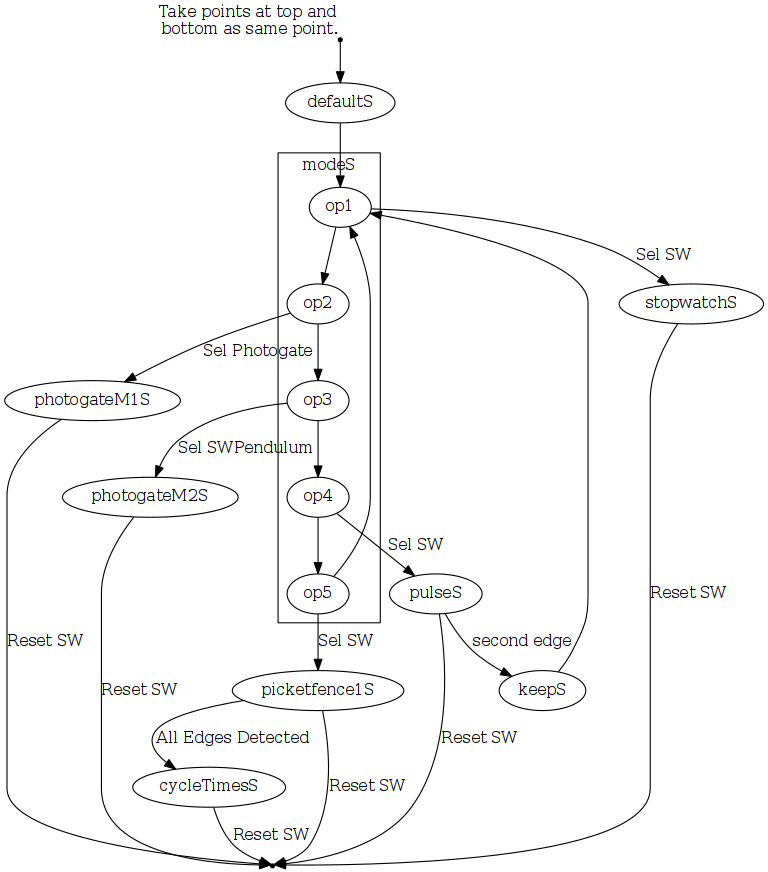

-   [Graphviz](#graphviz)
    -   [First use of Graphviz and Dot](#first-use-of-graphviz-and-dot)
        -   [Inconsistent use of Semicolons](#inconsistent-use-of-semicolons)

Graphviz
========

When looking for a method of automating the creation of state transition drawings I came across Graphvis. It looked promising so I decided to keep notes. The fist example I found that was essentially what I was looking for was here:

-   <http://tonyballantyne.com/graphs.html#sec-6-1>

I modified that example for my needs.

First use of Graphviz and Dot
-----------------------------

My first Graphviz Dot file:

Graphviz produced the following image for the state transition diagram:

### Inconsistent use of Semicolons

One issue I noticed when the the initial example to others was the use of semicolons was not consistant. When searching for an explination for this I found:

    Semicolons and commas aid readability but are not required.

-   that from <https://www.graphviz.org/doc/info/lang.html>

<!---
use 
  pandoc -s --toc --toc-depth=5 -t html5 -c ../../pandocbd.css graphviz.md -o graphviz.html
  pandoc -t markdown_github -s --toc --toc-depth=5 -o readme.md graphviz.md
-->
