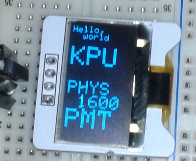

% IIC OLED V1.2
% Notes by Dan Peirce B.Sc.
%

# IIC OLED V1.2 Notes

The display was purchased from the Canadian version of the RobotShop website:

* [https://www.robotshop.com/ca/en/iic-128-64-oled-module-blue.html](https://www.robotshop.com/ca/en/iic-128-64-oled-module-blue.html)

Unfortunately they don't provide up to date information for the OLED module. The datasheet is for a previous version.
The Libraries supplied for the display are written by Adafruit. 

## Initial Testing of Display

### Wiring

Initial testing was done with an Ardunino Uno as this was what was shown in the datasheet. Note the silkscreen on the v1.2 board does not match
the v1.1 datasheet with regard to the pinout. I followed the silkscreen.

* Pin Vcc to Arduino Uno 5+
* Pin ground to Arduino Uno ground
* cl to Arduino Uno A5
* data to Arduiono Uno A4

No external pull ups were added!

### Arduino IDE Setup

1. Downloaded and installed Arduino IDE for windows 7. (used installer for XP and up)

    * [https://www.arduino.cc/en/Main/Software](https://www.arduino.cc/en/Main/Software)

2. Downloaded libraries from elecfreaks site. 

    * [https://elecfreaks.com/estore/download/EF03155-Paintcode.zip](https://elecfreaks.com/estore/download/EF03155-Paintcode.zip)
    * [https://www.elecfreaks.com/estore/iic-oled.html](https://www.elecfreaks.com/estore/iic-oled.html)
	
    The libraries are actually from Adafruit. One can learn more about them here:

    * [https://learn.adafruit.com/monochrome-oled-breakouts/arduino-library-and-examples](https://learn.adafruit.com/monochrome-oled-breakouts/arduino-library-and-examples)

3. Extracted files/folders from zip file.
4. Two folders containing files were copied to c:\\arduino\\libraries

~~~~
  C:\Users\Student\Downloads\EF03155-Paintcode\Code\Arduino_UNO_DEOM\Hardware I2C\Adafruit_GFX
  C:\Users\Student\Downloads\EF03155-Paintcode\Code\Arduino_UNO_DEOM\Hardware I2C\Adafruit_SSD1306
~~~~
	
5. A new example became available in the IDE

    

    The example was copied and pasted into a new sketch.

6. Initially the sketch would not compile. The compiler error indicated that a variable needed to be a constant to be placed in program memory.
   The following line was changed (line appears just after macro definitions near beginning of file).
   
    * *was        --* static unsigned char PROGMEM logo16_glcd_bmp[] =
	* *changed to --* static const unsigned char PROGMEM logo16_glcd_bmp[] =
	
    Once the **const** reserved word was added the sketch compiled.
   
7. The display still remained blank. An I2C scanner Arduino sketch was used to find that the board responded to the address **0x3C**. A line in the example was changed 
   to include this address. Once this was done the display showed the example code.
	
    * display.begin(SSD1306_SWITCHCAPVCC, 0x3C);

8. Other modifications were made as I was interested in concentrating on the display of text rather than graphics.

### Demo Video

This was recorded at the end of the day in a rush. I expect to get a better quality video soon -- it looks better
in person. Also I will do some testing of different text sizes.

<iframe width="560" height="315" src="https://www.youtube.com/embed/nSQjUFMyLBs" frameborder="0" allow="autoplay; encrypted-media" allowfullscreen></iframe>

### Code Used on First Day	

Code moved to new file to avoid clutter on this page.

* [ssd1306_128x64_i2c.ino.html](ssd1306_128x64_i2c.ino.html)

## Switching to Current Adafruit Libraries (May 20, 2018)

It became apparent that the elecfreaks.com site provided an old version of the libraries and it seemed
expedient to test the current version of the files. 

It worked with a minor adjustment for the electfreak display.

### Documentation of Adafruit Graphics Library

* [https://learn.adafruit.com/adafruit-gfx-graphics-library?view=all](https://learn.adafruit.com/adafruit-gfx-graphics-library?view=all)

### Adjustments for 3rd Party Display.

1. As before the address of the display had to be adjusted.

    *  display.begin(SSD1306_SWITCHCAPVCC, 0x3C);  // was 0x3D
	
2. Had to make a change to Adafruit_SSD1306.had

    At line 73 changed which line was commented out.
	
~~~~c
   #define SSD1306_128_64
//   #define SSD1306_128_32
//   #define SSD1306_96_16
~~~~

### Forked on Github

I forked the project on Github and made a new branch called 3rdparty.

* [https://github.com/danpeirce/Adafruit_SSD1306/tree/3rdparty](https://github.com/danpeirce/Adafruit_SSD1306/tree/3rdparty)
* [https://github.com/adafruit/Adafruit_SSD1306/compare/master...danpeirce:3rdparty](https://github.com/adafruit/Adafruit_SSD1306/compare/master...danpeirce:3rdparty)

### Explore Text Branch

Added a new branch to fork of Adafruit_SSD1306 repository Called exploring_text.

* [https://github.com/danpeirce/Adafruit_SSD1306/blob/explore_text/examples/explore_text/explore_text.ino](https://github.com/danpeirce/Adafruit_SSD1306/blob/explore_text/examples/explore_text/explore_text.ino)

### Terminal Branch

Added a new branch to fork of Adafruit_SSD1306 called terminal. The intent is to be able to send serial strings to
the Arduino that will act as a controller for the display. The stream of characters could come from any MCU which 
would not need the graphics library ported. Current testing is being done with Arduino serial monitor but will follow up with project MCU.

1. Runs Adafruit splash screen followed by Hello World KPU PHYS1600. It then waits for input and blanks the screen 
   when input received, then shows text in top left of screen. 
2. Display wraps to start of next line if it runs out of room on current line. In addition a newline character will 
   also send the cursor to beginning of next line.
3. If too many rows of text are received new text is not visible.
4. Intercepts a number of ASCII control codes and calls a corresponding library function. The number of codes may 
   be expanded.
5. To facilitate testing a Processing sketch has been written that is capable of both sending regular text and 
   generating the control characters when select non-alphanumeric characters are used.

~~~~cpp
 display.setRotation(1); // results in a portrait orientation for text on the screen
~~~~
 
* [https://github.com/danpeirce/Adafruit_SSD1306/blob/terminal/examples/explore_text/explore_text.ino](https://github.com/danpeirce/Adafruit_SSD1306/blob/terminal/examples/explore_text/explore_text.ino)

### Terminal Branch with SO

Added a new branch with SO (shift out) support. To facilitate multiple SO commands the sketch/program was converted to a state machine structure. This permits the 
ability to add parameters to a command. The set text position command for example requires X and Y coordinates as parameters for setting the cursor position.

#### Code for this branch:

* [https://github.com/danpeirce/Adafruit_SSD1306/blob/terminal_so/examples/explore_text/explore_text.ino](https://github.com/danpeirce/Adafruit_SSD1306/blob/terminal_so/examples/explore_text/explore_text.ino)
* [https://github.com/danpeirce/Adafruit_SSD1306/blob/terminal_so/examples/explore_text/sketch_180522a_test_oled/sketch_180522a_test_oled.pde](https://github.com/danpeirce/Adafruit_SSD1306/blob/terminal_so/examples/explore_text/sketch_180522a_test_oled/sketch_180522a_test_oled.pde)

As of the time of this entry (June 6, 2018) The font has been changed to the 9 point Serif font. This font is 
easier to read than the built in font.

* *an image of display with serif font will be added when time permits*.

##### Moving String Literals to Flash

To save RAM space the F() macro is being used with string literals. This conserves RAM. (June 17, 2018)

### Timer Branch

A new branch was added which differs from terminal_so primarily in the look of the start screen.

* [https://github.com/danpeirce/Adafruit_SSD1306/blob/timer/examples/explore_text/explore_text.ino](https://github.com/danpeirce/Adafruit_SSD1306/blob/timer/examples/explore_text/explore_text.ino)

The code in the **setup()** function was simplified by breaking out lines responsible for the 
start screen into a separate function. A SO command was added so that this function can be called 
again after the screen is cleared. This refactoring will be merged back into the timer_so branch.

 

#### tic tac toe branch Merged in

The tictactoe branch was merged into the timer branch to take advantage of new features. The essential difference 
now is in the default screen.

### Tic Tac Toe Branch

Tic tac toe branch allows easy setup of Tic Tac Toe screens for play.

The next image shows the numbered positions corresponding to the nine positions that an X or and O can be placed. 
The numbers are added with the sequence: **"&ts"**

The next image shows an example. 

* An X is put in position "1" with the sequence: **"&t1X" enter**
* The O is placed with the sequence: **"&t9O" enter**

The sequence shown above was typed into the Processing sketch. Note that the "&" is not sent as is to the 
"terminal" but is used in the sketch as it is easy to type. If one were writing a PIC program 
a 0x0E would be sent for the Shift Out command.

Menu items for Tic Tac Toe have been added for testing.

 

#### Code for this branch

* [https://github.com/danpeirce/Adafruit_SSD1306/blob/tictactoe/examples/explore_text/explore_text.ino](https://github.com/danpeirce/Adafruit_SSD1306/blob/tictactoe/examples/explore_text/explore_text.ino)
* [https://github.com/danpeirce/Adafruit_SSD1306/blob/tictactoe/examples/explore_text/sketch_180522a_test_oled/sketch_180522a_test_oled.pde](https://github.com/danpeirce/Adafruit_SSD1306/blob/tictactoe/examples/explore_text/sketch_180522a_test_oled/sketch_180522a_test_oled.pde)

#### Command Codes to control the Display Terminal

In the default state most ASCII characters sent will be printed if printable but do not appear on display until
a newline/linefeed "\n" is sent (0x0A).

* Default state
    * **0x0C** is an ASCII Form Feed and will be used for **Clear Screen**
	    * if using Processing sketch use "~" to send 0x0C
	* **0x11** is an ASCII Device Control 1 and will be used for **Text Size 1**
	    * if using Processing sketch use "!" to send 0x11
	* **0x12** is an ASCII Device Control 2 and will be used for **Text Size 2**
	    * if using Processing sketch use "@" to send 0x12
	* **0x13** is an ASCII Device Control 3 and will be used for **Text Size 3**
	    * if using Processing sketch use "#" to send 0x13
    * **0x14** is an ASCII Device Control 4 and will be used for **Text Size 4**
	    * if using Processing sketch use "$" to send 0x14
    * **0x09** is an ASCII Horizontal Tab and will be used for **Landscape Mode**
	    * if using Processing sketch use "%" to send 0x09
    * **0x0B** is an ASCII Vertical Tab and will be used for **Portrait Mode**
	    * if using Processing sketch use "^" to send 0x0B
    * **0x0E** is an ASCII Shift Out and will be used for **Control Mode**
	    * if using Processing sketch use "&" to send 0x0E
		* do not add newline
* Shift Out state **Control Mode**
    * A **Back Tick** "`" is used for **Set Text Position Mode**
	    * expects a byte for X position and a byte for Y position for text insertion position
		    * decimal 0x20 will be subtracted if the value is greater 0x20 or greater so that
			  any binary value can be typed from a terminal
			* do not add newline
	* A **Hyphen** "-" is used for **Draw Line Mode**
	    * expects four bytes for two endpoints
   		    * byte order x1,y1,x2,y2 
		    * decimal 0x20 will be subtracted if the value is greater 0x20 or greater so that
			  any binary value can be typed from a terminal
			* do not add newline
	* A **'f'** is used for **Set Font**
	    * **'0'** internal font
		* **'1'** 9pnt Serif font
		    * do not add newline
    * A **'p'** is used for **Show Photogate Timer** start screen
	* A **'t'** is used for **Tic Tac Toe**
	    * **'1' to '9'** is used to set area for entry
		* **'s'** is used for **Show Position** used to show position codes/labels
		* **'d'** is used for **Delete Entry** 
		    * **'1' to '9'** is used to set area for deletion 
	* A **'r'** is used for **Revert to Start Screen**  

## New Target Pro Trinket 5v

On May 28, 2018 moved testing from Arduino Uno to Adafruit Pro Trinket 5 volts. This board is much like the Uno when combined with a USB to serial adaptor board.
The Arduino IDE sees the combination as the same as a Arduino Uno. The Pro Trinket will shrink the size of the project and reduce cost. The final project will not
need the USB to serial adaptor board attached which will further reduce cost when we make a class set. I will continue
 to use the USB to serial board for programming and testing only.

* [https://www.digikey.ca/product-detail/en/adafruit-industries-llc/2000/1528-1039-ND/4990788](https://www.digikey.ca/product-detail/en/adafruit-industries-llc/2000/1528-1039-ND/4990788)

# Applications

## Photogate Timer Repository

### pickmode2620

The pickmode2620 branch allows selection of different operating modes. 

1. Stopwatch
2. Photogate
    a. continual update
	b. keep first time measured
3. Pendulum
4. Pulse
5. Picket Fence 1

The descriptions at [https://github.com/danpeirce/photogate-box-ssd1306term](https://github.com/danpeirce/photogate-box-ssd1306term)
are updated more frequently than the descriptions of the modes found here.

When the timer box is powered up window 1 of the display will cycle displaying possible mode selections in a repeating 
sequence. The **mode select** button allows one to select the mode.

The pickmode2620 differs from the pickmode branch in thaat it was updated for the PIC18F2620. The project was 
started on a breadboard using a PIC18F4525 as it happened to be available. The intent was to use the PIC18F2620 on 
the final project as it is physically smaller.  

#### Stopwatch mode

When the Stopwatch mode is selected the **mode select** button becomes the Start/Stop button.
During timing window 2 of the display shows **- - -**.
When timing is stopped the time will be displayed in window 2. Time is reset automatically if/when the Start/Stop 
button is pressed again.
The Mode Reset button will restart the timer with window 1 cycling the available modes.

#### Photogate

The Photogate mode will time the duration between negative going edges on the photogate1 input.

#### Pendulum

The Pendulum mode is similar to Photogate mode but is displays the total period of a swinging pendulum.

#### Pulse

The Pulse mode times the duration from falling edge to rising edge. Currently this mode runs once and returns 
to the mode selection state with the time displayed in window 2. 

#### Picket Fence 1

This mode measures the duration between the first falling edge (the trigger point) and each 
of eight subsequent falling edges. None of the times are displayed until they have all been 
recorded. The display will then continuously cycle through and display each time.
 

### Historical Notes (before pickmode2620 was created)

The old Git PIC MCU photogate box repository was imported into a new repository and will be modified to 
make use of the graphics display terminal.

* [https://github.com/danpeirce/photogate-box-ssd1306term#photogate-box](https://github.com/danpeirce/photogate-box-ssd1306term#photogate-box)

### justcount

A simple exploratory project that combines a PIC MCU with the OLED terminal. This is essentially my first experiment
in using the **Pro 5+ Volt Trinket -- OLED graphics display** combo as a **display terminal** for a **PIC project**.

* [https://github.com/danpeirce/photogate-box-ssd1306term/tree/justcount](https://github.com/danpeirce/photogate-box-ssd1306term/tree/justcount)

The Circuit with the PIC18F4525 and Display Terminal

#### Power Source

There are several possible methods of powering the Pro Trinket board which distributes power to the rest of the 
project.

##### When Programming the Trinket

The Pro 5+Volt Trinket board was powered from a USB to serial adapter board that was also used to
program the Trinket. 

##### When Receiving Serial Data from a PIC MCU

The adapter is removed and power comes through a Micro B USB connector in the 
Trinket. VDD and ground is being distributed to the PIC MCU and the OLED display from the Trinket.

There is a jumper from the PIC Tx pin to the Trinket board Rx.

#### Added a Window State to Terminal

In an effort to eliminate flicker that was evident in the count line on the display a window state was created. 
There is no call to **display.display()** until a newline is received.

* The window state looks for a numeral input indicating which window to clear and print into. So 
  far only one window has been defined and named '2'.
* **window2** is the area below the lower line of the Photogate Timer heading. 
    * There is an intent to define window1 as the area of the heading.
	* There is an intent to define window3 as the space to the right that includes KPU.
	
The main while loop running in the PIC for **justcount** is very simple. The count is free running and the time
per cycle is not a prime consideration.

~~~~c
    while(1)
    { 
        count++;
        if (count > 500000)
        {
            static unsigned int cycle = 0; 
            static const char code[] = {SHIFTOUT, 'w', '2', 0};
            count = 0;
            printf("%s> %d\n", code, cycle);
            cycle++;
        }
    }
~~~~

### keypress

This branch explores posting a message to the display that indicates if a pushbutton switch has 
been pressed or released.

#### Use of sprintf and a char buffer

Since printf() does not return until all but the last two characters are sent it generally causes delays. Those delays 
could result in missed key presses. To avoid that issue sprintf() is being used rather than printf().

~~~~c
        keyp = PORTDbits.RD2;
        if (keyp != keyplast)
        {
            if (keyp == 1) 
            {
                inIndexBuff = inIndexBuff + sprintf( buffer+inIndexBuff, "%sKey Press\n", code);
                
            }
            else 
            {
                inIndexBuff = inIndexBuff + sprintf( buffer+inIndexBuff,"%sKey Release\n", code);
            }
        }
        keyplast = keyp;
~~~~

There is also a task to send a byte to the USART whenever it is ready for one if the buffer is not empty..

~~~~c
        if(TXIF && (inIndexBuff > 0))
        {
            TXREG = buffer[outIndexBuff];
            outIndexBuff++;
            if (inIndexBuff == outIndexBuff) 
            {
                inIndexBuff = 0;
                outIndexBuff= 0;
            }
        }
~~~~

After speeding up the loop significant switch bounce became apparent. This was mitigated by reducing the frequency 
of checking the switch condition.

~~~~c
    while(1)
    {  
        static int loopcount=0;
        if (loopcount > 500)
        {
            keypresstask();
            loopcount=0;
        }
        loopcount++;
        txbuffertask();
    } 
~~~~

#### oledterminal.ino has been moved to PhotogateLV.c Repository

It seemed more practical to have a copy of the terminal sketch in the PhotogateLC.c repository.

### switchpresscount

This branch counts the number of times a button switch has been pressed. This could be useful to ensure switch 
bounce has been deal with adequately.

  *place image*

### timeswitch 

This branch was initially intended to time the interval between key presses. It became apparent testing would be 
more consistent if a photogate were simulated with a digital signal from another MCU. A **Trinket M0** was 
available and used for this purpose. 

#### Code for timewswitch

The code for this branch is on Github.

* [https://github.com/danpeirce/photogate-box-ssd1306term/tree/timeswitch](https://github.com/danpeirce/photogate-box-ssd1306term/tree/timeswitch)

#### Simple Simulation of Photogate

The Trinket M0 code used to generate a period of about 20 seconds.

~~~~cpp
// the setup function runs once when you press reset or power the board
void setup() {
  // initialize digital pin 13 as an output.
  pinMode(13, OUTPUT);
  pinMode(0, OUTPUT);
}

// the loop function runs over and over again forever
void loop() {
  digitalWrite(13, HIGH);   // turn the LED on (HIGH is the voltage level)
  digitalWrite(0, HIGH);
  delay(10000);              // wait for 10 seconds
  digitalWrite(13, LOW);    // turn the LED off by making the voltage LOW
  digitalWrite(0, LOW);
  delay(10000);              // wait for 10 seconds
}
~~~~

##### Notes on the Trinket M0

Notes on the Trinket M0 at link:

* [https://danpeirce.github.io/2017/testTrinketM0/testing.html](https://danpeirce.github.io/2017/testTrinketM0/testing.html)

#### Renamed main File

It was decided to rename the main file of the project and move unused functions to a different file. This
change has now been cherry picked and merged into older branches. 

##### Branches Graphic

* The hash that was cherry picked from is given below:

    * <3962c9e44e09b1ef240829ac2531e926d5549208>
  
### timegateosc

This branch was derived from [timeswitch](#timeswitch). The code was altered to work with an external 32 MHz rather 
than the internal oscillator used initially.  

Watch for updates to this page.
 
### stopwatch

This branch was derived from [timegateosc](#timegateosc). The code was altered to time between start and stop button 
presses. This branch ignores the simulated photogate on the CCP1 input. The follow up branch will create a mode 
select to allow one to choose either mode of operation.

The function main() looks like this now:

~~~~c
void main(void)
{
    char gate_mode = 0;
    Delay10KTCYx(20); 
  
    initialization();
    debounceSW.a_byte = 0;
    inputSW.a_byte = 0;
    
    while(1)
    { 
        static unsigned int listTmr[] = {0,0,0,0,0,0};
        static unsigned int indexTmr = 0;
        static unsigned int cyclecount = 0;
        
        if(TXIF && (inIndexBuff > 0)) txbuffertask();
        if (PIR1bits.TMR1IF) // Timer1 clock has overflowed
        {
            PIR1bits.TMR1IF = 0; // reset Timer1 clock interrupt flag
            timerCountOvrF++;
        }
        inputSW.bit0 = PORTDbits.RD2;
        if (!debounceSW.bit0)
        {
            if (!inputSW.bit0 && (cyclecount>2)) cyclecount--;
            if (inputSW.bit0) 
            {
                cyclecount++;
                if (cyclecount == 1)
                {
                    listTmr[indexTmr] = ReadTimer1();
                    indexTmr++;
                    listTmr[indexTmr] = timerCountOvrF;
                    indexTmr++;
                    running();
                }
            }
            if (cyclecount > 100)
            {
                cyclecount = 0;
                debounceSW.bit0 = 1;
            }
        }
        else
        {
            if (inputSW.bit0 && (cyclecount>2)) cyclecount--;
            if (!inputSW.bit0) cyclecount++;
            if (cyclecount > 100) 
            {
                cyclecount = 0;
                debounceSW.bit0 =0;
            }
        }
        /* if (PIR1bits.CCP1IF)
        {
            listTmr[indexTmr] = ReadCapture1();
            indexTmr++;
            listTmr[indexTmr] = timerCountOvrF;
            indexTmr++;
            PIR1bits.CCP1IF = 0; //clear flag for next event
        } */
        if (indexTmr == 4) 
        {    
            sendTime(listTmr);
            indexTmr = 0;
            timerCountOvrF = 0;
        }
    } 
}
~~~~
 

<!---
use 
  pandoc -s --toc --toc-depth=5 -t html5 -c ../../pandocbd.css oled-v1.2.md -o oled-v1.2.html
  pandoc -t markdown_github -s --toc --toc-depth=5 -o readme.md oled-v1.2.md
-->
