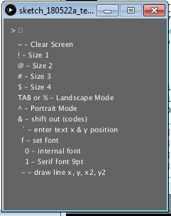
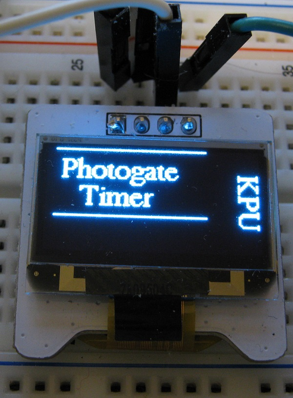

-   [IIC OLED V1.2 Notes](#iic-oled-v1.2-notes)
    -   [Initial Testing of Display](#initial-testing-of-display)
        -   [Wiring](#wiring)
        -   [Arduino IDE Setup](#arduino-ide-setup)
        -   [Demo Video](#demo-video)
        -   [Code Used on First Day](#code-used-on-first-day)
    -   [Switching to Current Adafruit Libraries (May 20, 2018)](#switching-to-current-adafruit-libraries-may-20-2018)
        -   [Documentation of Adafruit Graphics Library](#documentation-of-adafruit-graphics-library)
        -   [Adjustments for 3rd Party Display.](#adjustments-for-3rd-party-display.)
        -   [Forked on Github](#forked-on-github)
        -   [Explore Text Branch](#explore-text-branch)
        -   [Terminal Branch](#terminal-branch)
        -   [Terminal Branch with SO](#terminal-branch-with-so)
            -   [Code for this branch:](#code-for-this-branch)
                -   [Moving String Literals to Flash](#moving-string-literals-to-flash)
        -   [Timer Branch](#timer-branch)
        -   [Tic Tac Toe Branch](#tic-tac-toe-branch)
            -   [Code for this branch](#code-for-this-branch-1)
            -   [Command Codes to control the Display Terminal](#command-codes-to-control-the-display-terminal)
    -   [New Target Pro Trinket 5v](#new-target-pro-trinket-5v)

IIC OLED V1.2 Notes
===================

The display was purchased from the Canadian version of the RobotShop website:

-   <https://www.robotshop.com/ca/en/iic-128-64-oled-module-blue.html>

Unfortunately they don't provide up to date information for the OLED module. The datasheet is for a previous version. The Libraries supplied for the display are written by Adafruit.


Initial Testing of Display
--------------------------

### Wiring

Initial testing was done with an Ardunino Uno as this was what was shown in the datasheet. Note the silkscreen on the v1.2 board does not match the v1.1 datasheet with regard to the pinout. I followed the silkscreen.

-   Pin Vcc to Arduino Uno 5+
-   Pin ground to Arduino Uno ground
-   cl to Arduino Uno A5
-   data to Arduiono Uno A4

No external pull ups were added!

### Arduino IDE Setup

1.  Downloaded and installed Arduino IDE for windows 7. (used installer for XP and up)

    -   <https://www.arduino.cc/en/Main/Software>

2.  Downloaded libraries from elecfreaks site.

    -   <https://elecfreaks.com/estore/download/EF03155-Paintcode.zip>
    -   <https://www.elecfreaks.com/estore/iic-oled.html>

    The libraries are actually from Adafruit. One can learn more about them here:

    -   <https://learn.adafruit.com/monochrome-oled-breakouts/arduino-library-and-examples>

3.  Extracted files/folders from zip file.
4.  Two folders containing files were copied to c:\\arduino\\libraries

<!-- -->

      C:\Users\Student\Downloads\EF03155-Paintcode\Code\Arduino_UNO_DEOM\Hardware I2C\Adafruit_GFX
      C:\Users\Student\Downloads\EF03155-Paintcode\Code\Arduino_UNO_DEOM\Hardware I2C\Adafruit_SSD1306

1.  A new example became available in the IDE

    

    The example was copied and pasted into a new sketch.

2.  Initially the sketch would not compile. The compiler error indicated that a variable needed to be a constant to be placed in program memory. The following line was changed (line appears just after macro definitions near beginning of file).

    -   *was --* static unsigned char PROGMEM logo16\_glcd\_bmp\[\] =
    -   *changed to --* static const unsigned char PROGMEM logo16\_glcd\_bmp\[\] =

    Once the **const** reserved word was added the sketch compiled.

3.  The display still remained blank. An I<sup>2</sup>C scanner Arduino sketch was used to find that the board responded to the address **0x3C**. A line in the example was changed to include this address. Once this was done the display showed the example code.

    -   display.begin(SSD1306\_SWITCHCAPVCC, 0x3C);

4.  Other modifications were made as I was interested in concentrating on the display of text rather than graphics.

### Demo Video

This was recorded at the end of the day in a rush. I expect to get a better quality video soon -- it looks better in person. Also I will do some testing of different text sizes.

<iframe width="560" height="315" src="https://www.youtube.com/embed/nSQjUFMyLBs" frameborder="0" allow="autoplay; encrypted-media" allowfullscreen>
</iframe>
### Code Used on First Day

Code moved to new file to avoid clutter on this page.

-   [ssd1306\_128x64\_i2c.ino.html](ssd1306_128x64_i2c.ino.html)

Switching to Current Adafruit Libraries (May 20, 2018)
------------------------------------------------------

It became apparent that the elecfreaks.com site provided an old version of the libraries and it seemed expedient to test the current version of the files.

It worked with a minor adjustment for the electfreak display.

### Documentation of Adafruit Graphics Library

-   <https://learn.adafruit.com/adafruit-gfx-graphics-library?view=all>

### Adjustments for 3rd Party Display.

1.  As before the address of the display had to be adjusted.

    -   display.begin(SSD1306\_SWITCHCAPVCC, 0x3C); // was 0x3D

2.  Had to make a change to Adafruit\_SSD1306.had

    At line 73 changed which line was commented out.

``` c
   #define SSD1306_128_64
//   #define SSD1306_128_32
//   #define SSD1306_96_16
```

### Forked on Github

I forked the project on Github and made a new branch called 3rdparty.

-   <https://github.com/danpeirce/Adafruit_SSD1306/tree/3rdparty>
-   <https://github.com/adafruit/Adafruit_SSD1306/compare/master...danpeirce:3rdparty>

### Explore Text Branch

Added a new branch to fork of Adafruit\_SSD1306 repository Called exploring\_text.

-   <https://github.com/danpeirce/Adafruit_SSD1306/blob/explore_text/examples/explore_text/explore_text.ino>


### Terminal Branch

Added a new branch to fork of Adafruit\_SSD1306 called terminal. The intent is to be able to send serial strings to the Arduino that will act as a controller for the display. The stream of characters could come from any MCU which would not need the graphics library ported. Current testing is being done with Arduino serial monitor but will follow up with project MCU.

1.  Runs Adafruit splash screen followed by Hello World KPU PHYS1600. It then waits for input and blanks the screen when input received, then shows text in top left of screen.
2.  Display wraps to start of next line if it runs out of room on current line. In addition a newline character will also send the cursor to beginning of next line.
3.  If too many rows of text are received new text is not visible.
4.  Intercepts a number of ASCII control codes and calls a corresponding library function. The number of codes may be expanded.
5.  To facilitate testing a Processing sketch has been written that is capable of both sending regular text and generating the control characters when select non-alphanumeric characters are used.


``` cpp
 display.setRotation(1); // results in a portrait orientation for text on the screen
```

-   <https://github.com/danpeirce/Adafruit_SSD1306/blob/terminal/examples/explore_text/explore_text.ino>


### Terminal Branch with SO

Added a new branch with SO (shift out) support. To facilitate multiple SO commands the sketch/program was converted to a state machine structure. This permits the ability to add parameters to a command. The set text position command for example requires X and Y coordinates as parameters for setting the cursor position.



#### Code for this branch:

-   <https://github.com/danpeirce/Adafruit_SSD1306/blob/terminal_so/examples/explore_text/explore_text.ino>
-   <https://github.com/danpeirce/Adafruit_SSD1306/blob/terminal_so/examples/explore_text/sketch_180522a_test_oled/sketch_180522a_test_oled.pde>

As of the time of this entry (June 6, 2018) The font has been changed to the 9 point Serif font. This font is easier to read than the built in font.

-   *an image of display with serif font will be added when time permits*.

##### Moving String Literals to Flash

To save RAM space the F() macro is being used with string literals. This conserves RAM. (June 17, 2018)

### Timer Branch

A new branch was added which differs from terminal\_so primarily in the look of the start screen.



-   <https://github.com/danpeirce/Adafruit_SSD1306/blob/timer/examples/explore_text/explore_text.ino>

The code in the **setup()** function was simplified by breaking out lines responsible for the start screen into a separate function. A SO command was added so that this function can be called again after the screen is cleared. This refactoring will be merged back into the timer\_so branch.


### Tic Tac Toe Branch

Tic tac toe branch allows easy setup of Tic Tac Toe screens for play.


The next image shows the numbered positions corresponding to the nine positions that an X or and O can be placed. The numbers are added with the sequence: **"&ts"**


The next image shows an example.

-   An X is put in position "1" with the sequence: **"&t1X" enter**
-   The O is placed with the sequence: **"&t9O" enter**

The sequence shown above was typed into the Processing sketch. Note that the "&" is not sent as is to the "terminal" but is used in the sketch as it is easy to type. If one were writing a PIC program a 0x0E would be sent for the Shift Out command.


Menu items for Tic Tac Toe have been added for testing.


#### Code for this branch

-   <https://github.com/danpeirce/Adafruit_SSD1306/blob/tictactoe/examples/explore_text/explore_text.ino>
-   <https://github.com/danpeirce/Adafruit_SSD1306/blob/tictactoe/examples/explore_text/sketch_180522a_test_oled/sketch_180522a_test_oled.pde>

#### Command Codes to control the Display Terminal

In the default state most ASCII characters sent will be printed if printable but do not appear on display until a newline/linefeed "" is sent (0x0A).

-   Default state
    -   **0x0C** is an ASCII Form Feed and will be used for **Clear Screen**
        -   if using Processing sketch use "~" to send 0x0C
    -   **0x11** is an ASCII Device Control 1 and will be used for **Text Size 1**
        -   if using Processing sketch use "!" to send 0x11
    -   **0x12** is an ASCII Device Control 2 and will be used for **Text Size 2**
        -   if using Processing sketch use "@" to send 0x12
    -   **0x13** is an ASCII Device Control 3 and will be used for **Text Size 3**
        -   if using Processing sketch use "\#" to send 0x13
    -   **0x14** is an ASCII Device Control 4 and will be used for **Text Size 4**
        -   if using Processing sketch use "$" to send 0x14
    -   **0x09** is an ASCII Horizontal Tab and will be used for **Landscape Mode**
        -   if using Processing sketch use "%" to send 0x09
    -   **0x0B** is an ASCII Vertical Tab and will be used for **Portrait Mode**
        -   if using Processing sketch use "^" to send 0x0B
    -   **0x0E** is an ASCII Shift Out and will be used for **Control Mode**
        -   if using Processing sketch use "&" to send 0x0E
        -   do not add newline
-   Shift Out state **Control Mode**
    -   A **Back Tick** "\`" is used for **Set Text Position Mode**
        -   expects a byte for X position and a byte for Y position for text insertion position
            -   decimal 0x20 will be subtracted if the value is greater 0x20 or greater so that any binary value can be typed from a terminal
            -   do not add newline
    -   A **Hyphen** "-" is used for **Draw Line Mode**
        -   expects four bytes for two endpoints
            -   byte order x1,y1,x2,y2
            -   decimal 0x20 will be subtracted if the value is greater 0x20 or greater so that any binary value can be typed from a terminal
            -   do not add newline
    -   A **'f'** is used for **Set Font**
        -   **'0'** internal font
        -   **'1'** 9pnt Serif font
            -   do not add newline
    -   A **'p'** is used for **Show Photogate Timer** start screen
    -   A **'t'** is used for **Tic Tac Toe**
        -   **'1' to '9'** is used to set area for entry
        -   **'s'** is used for **Show Position** used to show position codes/labels
        -   **'d'** is used for **Delete Entry**
            -   **'1' to '9'** is used to set area for deletion
    -   A **'r'** is used for **Revert to Start Screen**

New Target Pro Trinket 5v
-------------------------

On May 28, 2018 moved testing from Arduino Uno to Adafruit Pro Trinket 5 volts. This board is much like the Uno when combined with a USB to serial adaptor board. The Arduino IDE sees the combination as the same as a Arduino Uno. The Pro Trinket will shrink the size of the project and reduce cost. The final project will not need the USB to serial adaptor board attached which will further reduce cost when we make a class set. I will continue to use the USB to serial board for programming and testing only.

-   <https://www.digikey.ca/product-detail/en/adafruit-industries-llc/2000/1528-1039-ND/4990788>


<!---
use 
  pandoc -s --toc --toc-depth=5 -t html5 -c ../../pandocbd.css oled-v1.2.md -o oled-v1.2.html
  pandoc -t markdown_github -s --toc --toc-depth=5 -o readme.md oled-v1.2.md
-->
