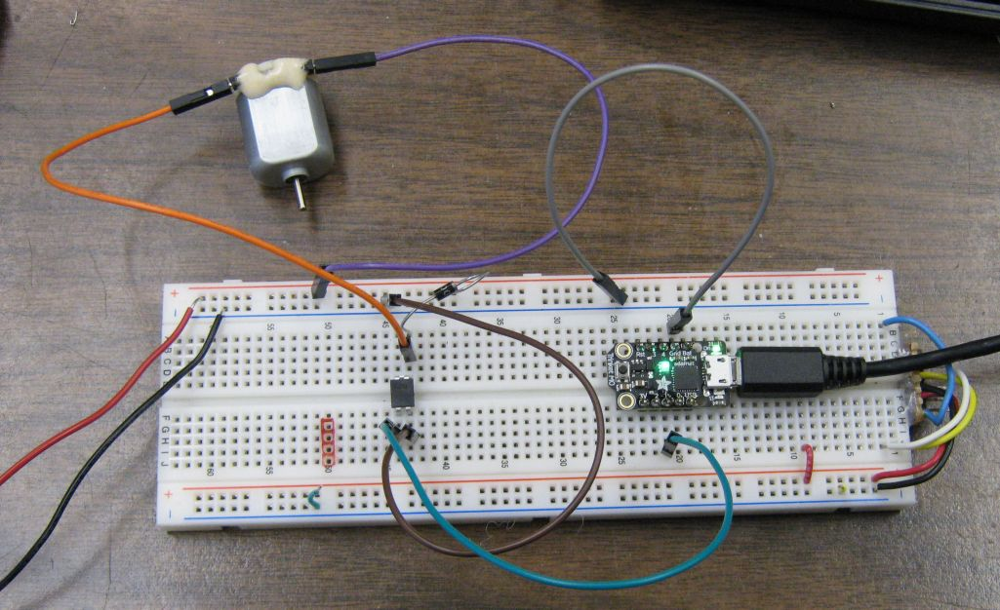
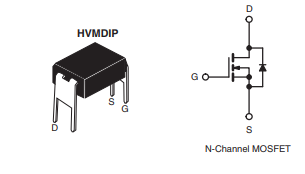
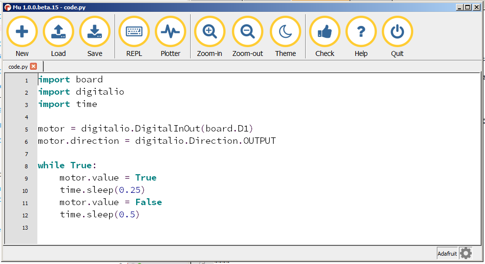

% Motor MOSFET and Trinket M0
% by Dan Peirce B.Sc.
% 

# Motor MOSFET and Trinket M0

<!---
use pandoc -s --toc -t html5 -c ../../pandocbd.css motor-mosfet.md -o motor-mosfet.html
-->

Simple example of Trinket M0 controlling a motor with a power MOSFET. The trinket M0 digital output can 
only source 7 mA. The motor in this example has a stall current of 500 mA so the trinket M0 can not drive 
the motor directly.

## Power MOSFET

* [http://www.vishay.com/docs/91308/sihld24.pdf](http://www.vishay.com/docs/91308/sihld24.pdf)
* [https://www.digikey.ca/product-detail/en/IRLD024PBF/IRLD024PBF-ND/812492](https://www.digikey.ca/product-detail/en/IRLD024PBF/IRLD024PBF-ND/812492)

### The Circuit

The MOSFET is used in much the same way as in [https://danpeirce.github.io/remote-actuator.html#schematic-of-circuit](https://danpeirce.github.io/remote-actuator.html#schematic-of-circuit)
except the gate circuit is replaced with a Trinket M0 and D2 is not required. 

* DIO pin 1 of the Trinket M0 is connected directly to the MOSFET gate. 
* The MOSFET source is connected to ground
* A bench power supply is used to power the Motor/Drain circuit.
    * The positive terminal of the bench power supply will go to one terminal of the motor
	* The other terminal of the motor is connected to the MOSFET drain
	* A reversed biased diode wired across the motor terminals provides a short path for any negative 
	  voltage spikes from the motor.
	* The current limit on the power supply is set it 1 amp. 
	    * Warning: If the current limit is set too low the Tricket M0 will not be able to contend with the 
		           noise on the ground line and will have random resets causing reset issues, output glitches 
				   and USB enumeration issues.
	
* USB from a computer will power the Trinket M0
* A connection from the Trinket M0 / USB ground is connected to the bench power supply negative terminal 
  in only one polace to avoid ground loops (the ground terminal on the power supply is left open). One
  should take care with the circuit layout to avoid inadvertent resets of the Trinket M0 board that would
  interfere with proper running of the program.

## Trinket M0

Another page lists some significant links for the Trinket M0 and testing that was done in 2017:

* [https://danpeirce.github.io/2017/testTrinketM0/testing.html](https://danpeirce.github.io/2017/testTrinketM0/testing.html)

### CircuitPython Code

Sample CircuitPython 
[code is provided by Adafruit for blinking an LED](https://learn.adafruit.com/welcome-to-circuitpython/creating-and-editing-code). 
I have modified the code to cycle a motor on and off continuously.

~~~~python
import board
import digitalio
import time
 
motor = digitalio.DigitalInOut(board.D1)
motor.direction = digitalio.Direction.OUTPUT
 
while True:
    motor.value = True
    time.sleep(0.25)
    motor.value = False
    time.sleep(0.5)
~~~~

### Mu Editor

Adafruit recommends using the Mu editor.

* [https://learn.adafruit.com/welcome-to-circuitpython/installing-mu-editor](https://learn.adafruit.com/welcome-to-circuitpython/installing-mu-editor)

