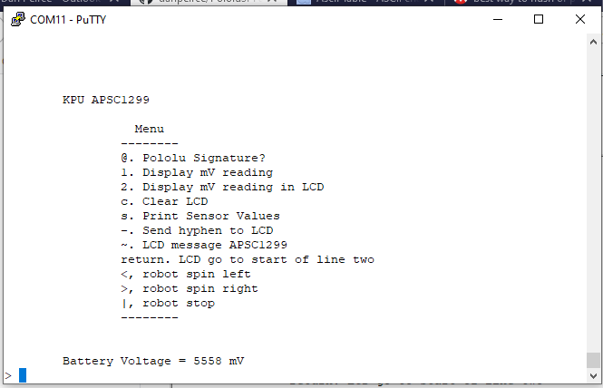
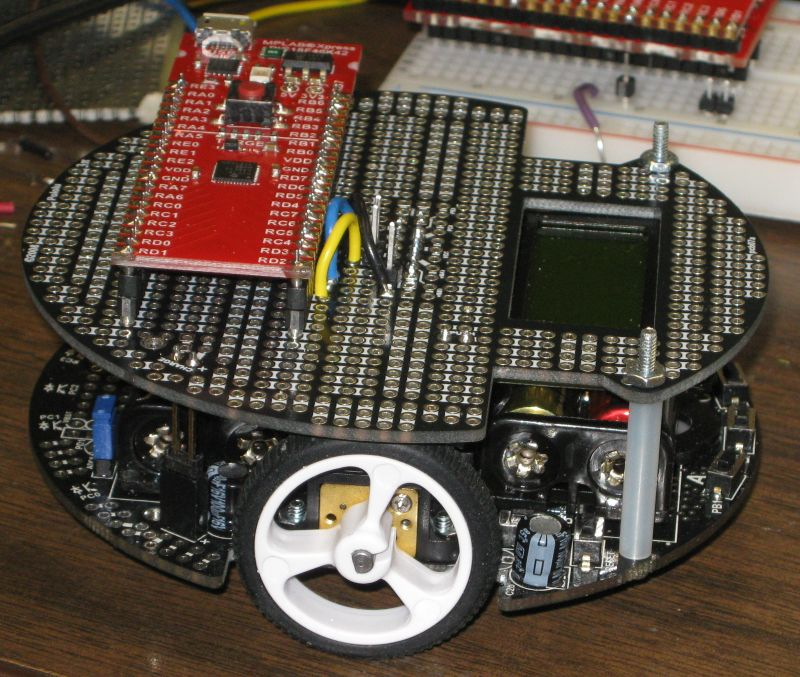
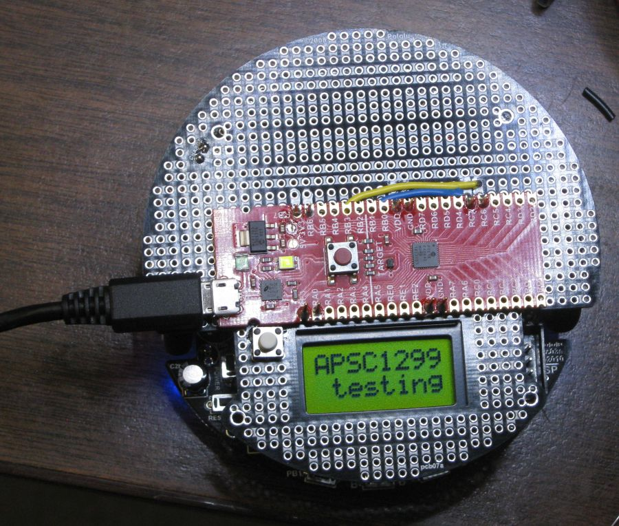
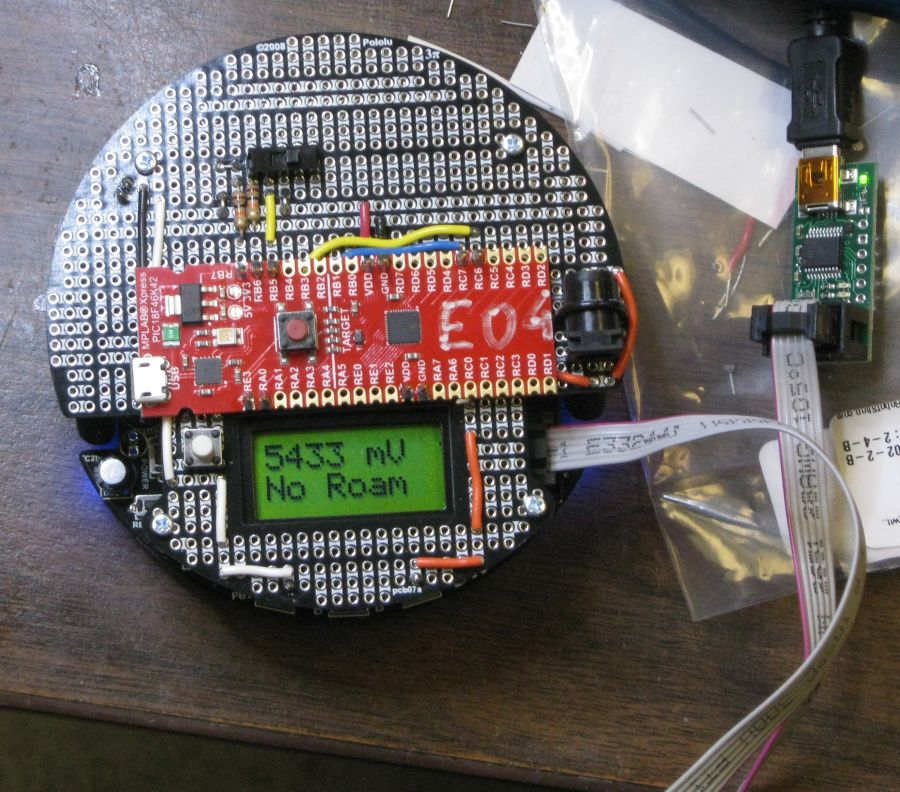
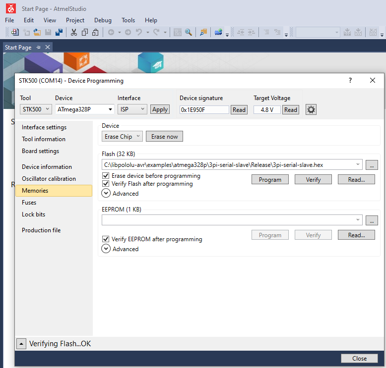
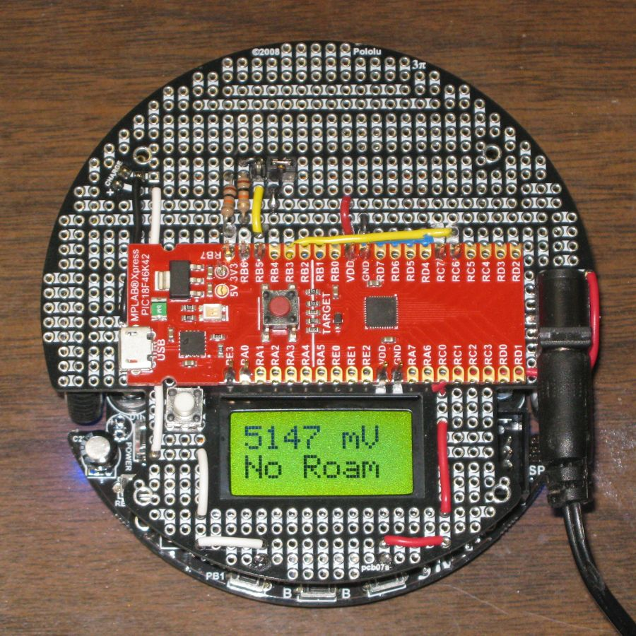
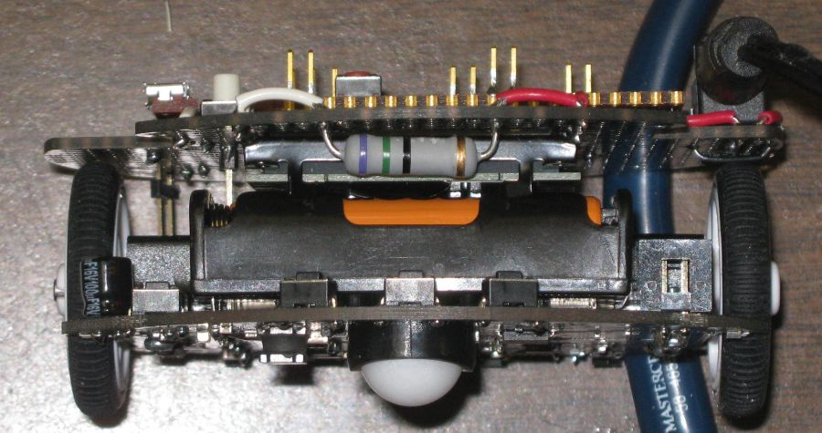
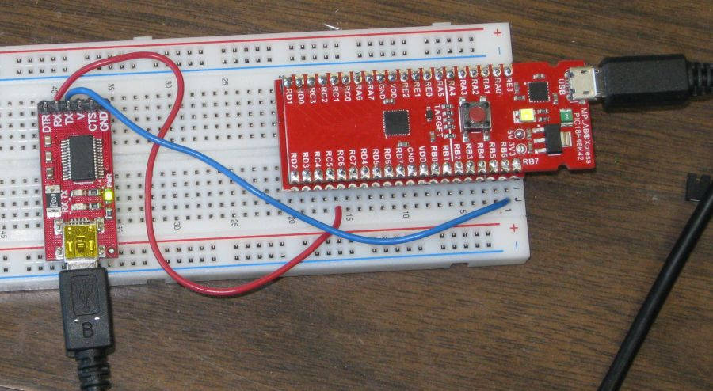
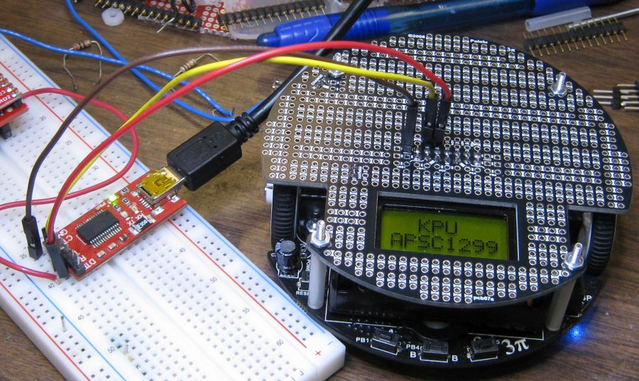

% Pololu 3Pi Expansion
% By Dan Peirce B.Sc.

<!---
use 
pandoc -s --toc -t html5 -c ../../pandocbd.css README.pandoc.md -o README.html

pandoc -s --toc -t gfm README.pandoc.md -o README.md
-->

# Pololu 3Pi Expansion

## PIC18F46K42 XPRESS Board Features

This board has a USB microB connector. It has a PIC MCU on board configured to act as an interface and it enumerates as 
a multifunction device. This allows one to both download programs to it and use the interface as a virtual com port. The board
is also less expensive than the USB to serial board we have used in the past with the Microstick II or PIC18F4525.

### Pins Used

* UART1 is at 115200 baud. Tx1 is on RC6.
* UART2 is connected to the XPRESS boards USB interface PIC. 
    * Communication between UART2 and the interface IC is at 9600 baud.
* roam input used to determine if robot should
    1. Stay in place (perhaps for programming)
	2. Roam (perhaps following a line)
* PWM output at about 1 KHz on pad RC4 (set to 10% duty cycle)

## Pololu 3Pi robot

The robot is running the serial slave program from Pololu. This will allow the 3Pi robot to be 
controlled from a XPRESS board.

* [10.a. Serial slave program](https://www.pololu.com/docs/0J21/all#10.a)

More information on the Pololu 3Pi robot

* [https://www.pololu.com/product/975](https://www.pololu.com/product/975)

### Roam Mode

In roam mode the robot will 

1.  do a self calibration of the sensors and then follow a line for approximatly 10 seconds. 
2.  If the robot detects a line on both the far left and far right at the same time it will stop until power is cycled off and on. 
    Picking the robot up will have the same effect of shutting the robot down until power is recycled.
	
### No Roam Mode

The purpose of no Roam Mode is to

1. Allow the robot to be programmed
2. Allow the robot batteries to be charged
3. Allow the robot to be in an interactive mode in which a USB cable and PuTTY can be used to control the robot and check sensor readings.

The menu meantioned in list item 3. looks as follows:

## Mounting PIC XPRESS board on 3Pi Expansion board

### Mount 1 (no longer used)

The first XPRESS board mount was forward on the 3Pi expansion board. This appeared to have a negative effect on the balance and stability of
the robot. For a second mount position was tested.

### Mount 2

For better stability the XPRESS board was moved over the wheels.

  
## Expansion Board Wiring

See [wiring.html](wiring.html)

## Programming 3Pi Robot as a Slave

The 3Pi Robot has an MCU on board. In APSC1299 the on board MCU will contain a program from Pololu that they call 3Pi serial slave.
The MCU on the 3Pi board is wired directly to the 3Pi sensors and motor drivers. I will refer to this as the physical layer. The students 
will be programming the PIC18F46K42 located on the Xpress board. I will call this the executive layer. The communication between the two MCUs is 
via UARTs on each device. On the Xpress board it is UART1 that communicates with the robot physical layer at 115200 bps, no parity and no handshaking.

Programming the 3Pi Robot MCU requires a small programming board. The students will not be provided with this board as that MCU will be programmed by the technician 
with the following file [3pi-serial-slave.hex](3pi-serial-slave.hex) .

### Image of the Pololu Programmer Connected to the 3Pi

### Using Atmel Studio

* Power up the 3Pi before opening Atmel Studio.
* Open Atmel Studio
* Tools - Device Programming

* Check that the programmer is recognized before hitting apply

* click on apply

* Memories
* The path for the file **3pi-serial-slave.hex** will depend on where you save it.
* after browsing to the file **3pi-serial-slave.hex** click on program.

## Programming Xpress Board

This is done in the normal way over USB directly to the Xpress board. We can program the following into the Xpress boards before giving them 
to students. This program can also be used to test the basic function of the robot.

[xpress-pic18f46k42.3pi-basic.hex](xpress-pic18f46k42.3pi-basic.hex)

## Roam and No Roam Shunt Jumper

The image below shows the jumper in the no roam possition. This will be changed to a switch.
  

## Autocalibrates when in Roam mode

Will autocalibrate the sensors if in Roam mode. 
For meaningful results the robot should be sitting over a black tape line. The robot will spin to the left and right sweeping 
the sensors over the line so that normalized readings can be calculated.

## Demo

Demo Video at Link

* [Youtube Video Link](https://youtu.be/frrQDTKzhbE)

## Pull up on RX2/RB7

A 10 Kohm pull up resistor was added to RX2 for better reliability when USB cable is not attached.  
  
## Charging Circuit

A charging circuit has been added to the expantion board. The charging circuit is just a 75 ohm resistor in series with the four AAA
NiMH cells on the robot. A 9 volt external AC-DC adaptor provides power to the board.

Showing the 75 ohm 2 watt resistor (located under the expansion board.

**Will update photos. Had to move one jumper to top side of board as it caused rubbing on right wheel. Also bend tab on barrel connector
so it is flush on board before soldering.**
  
## Added Print Sensor Values to menu

Can now print sensor values in PuTTY when in No Roam mode. Can move robot over track by hand.  

## Working with PuTTY and issues

One can use a PuTTY terminal with the virtual serial port of the Xpress board. This works fine when one is typing into the 
terminal. There is an issue though if one attempts pasting into the PuTTY terminal (using a right mouse click). In that case
only the first character is sent. This is an issue of the USB to serial bridge on the Xpress board and not the PIC code!
This was verified by using a USB to serial bridge on a different board (TTLyFTDI USB-to-TTL Cable Adapter) fed into RB7. In this case the code worked as expected
and all pasted characters appeared in the PuTTY terminal and were correctly sent out uart1 TX.

Others have commented on the limitation of the USART to USB bridge on the Xpress board:

* [Xpress PIC18F46K42 board virtual COM port bridge to UART receive limitations](https://www.microchip.com/forums/m1097510.aspx)

## Test of Expansion Board

Initial testing of expansion board for 3PI.

