  - [Pololu 3Pi Expansion Wiring and
    Assembly](#pololu-3pi-expansion-wiring-and-assembly)
      - [Expansion Board Wiring](#expansion-board-wiring)
          - [Wiring under the XPRESS
            board.](#wiring-under-the-xpress-board.)
          - [Wiring near Expansion Port](#wiring-near-expansion-port)
          - [Add Short Jumpers](#add-short-jumpers)
          - [Added 10K Resistors and Mode
            Switch](#added-10k-resistors-and-mode-switch)
          - [Added Charging Circuit to Expansion
            Board](#added-charging-circuit-to-expansion-board)
      - [Assemble Parts](#assemble-parts)
          - [Jig for Board Interconnect
            Headers](#jig-for-board-interconnect-headers)
          - [Place Long Pin Headers for Xpress
            Board](#place-long-pin-headers-for-xpress-board)

<!---
use 
pandoc -s --toc -t html5 -c ../../pandocbd.css wiring.pandoc.md -o wiring.html

pandoc -s --toc -t gfm wiring.pandoc.md -o wiring.md
-->

# Pololu 3Pi Expansion Wiring and Assembly

## Expansion Board Wiring

### Wiring under the XPRESS board.

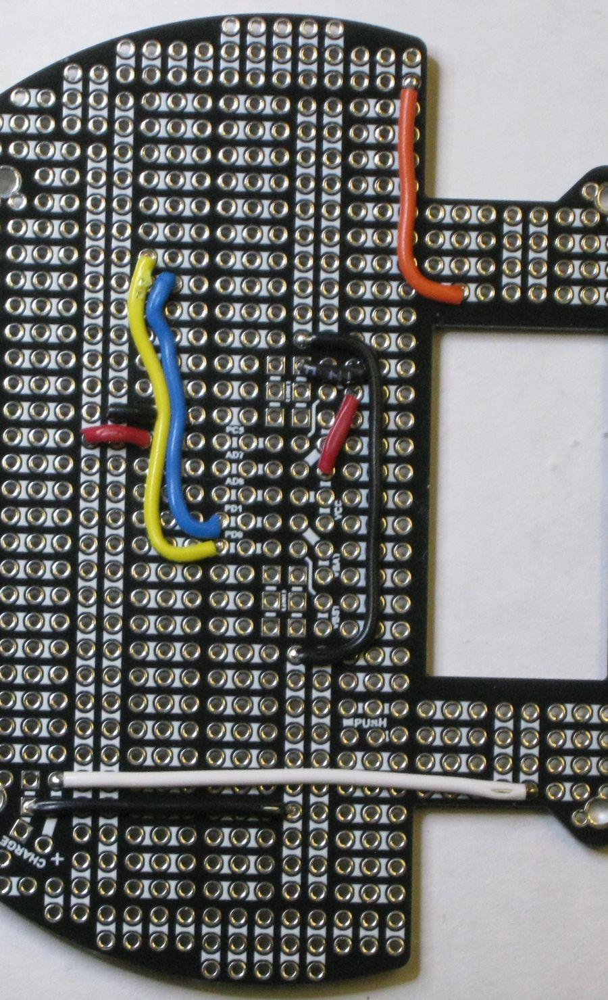

### Wiring near Expansion Port

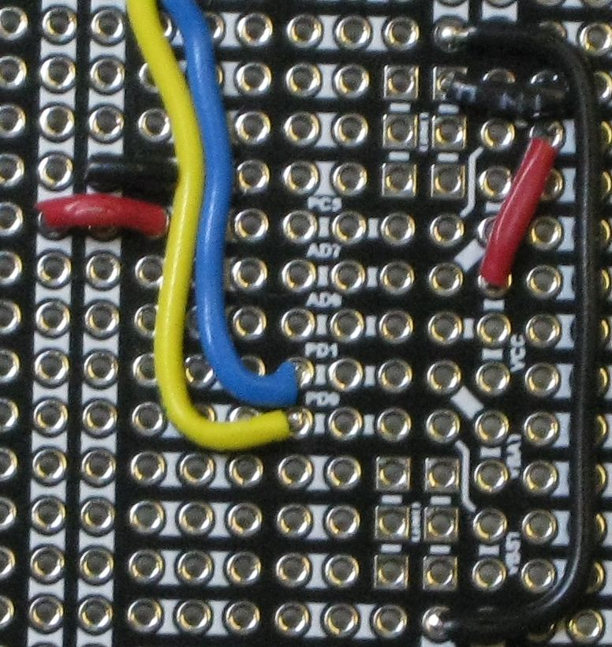

### Add Short Jumpers

There are five very short jumpers to add. A suggestion is made in the
next section to alter the arrangement of jumpers.

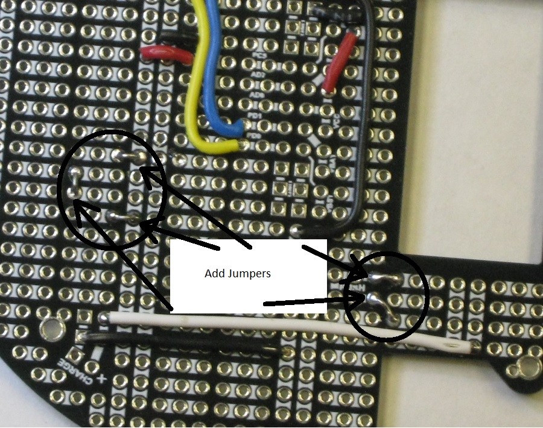

### Added 10K Resistors and Mode Switch

A change was made here from the prototype.

  - Now using a **switch** instead of a header and jumper.
  - The switch was added last but is wider than the header was.
  - To provide more space for the 10 K resister attached to ground near
    RB6 I suggest adjusting the jumper positions so that the switch can
    be moved one hole farther away from the Xpress board.

Example layout with switch before adjusting jumpers. Note that the photo
does not illustrate the ground connection of the resistor because the
lead is folded under the resister in this shot.

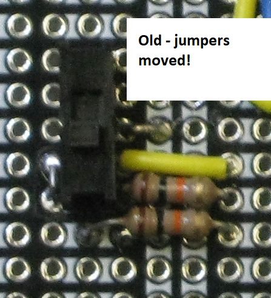images

### Added Charging Circuit to Expansion Board

Power jack not shown in this image.

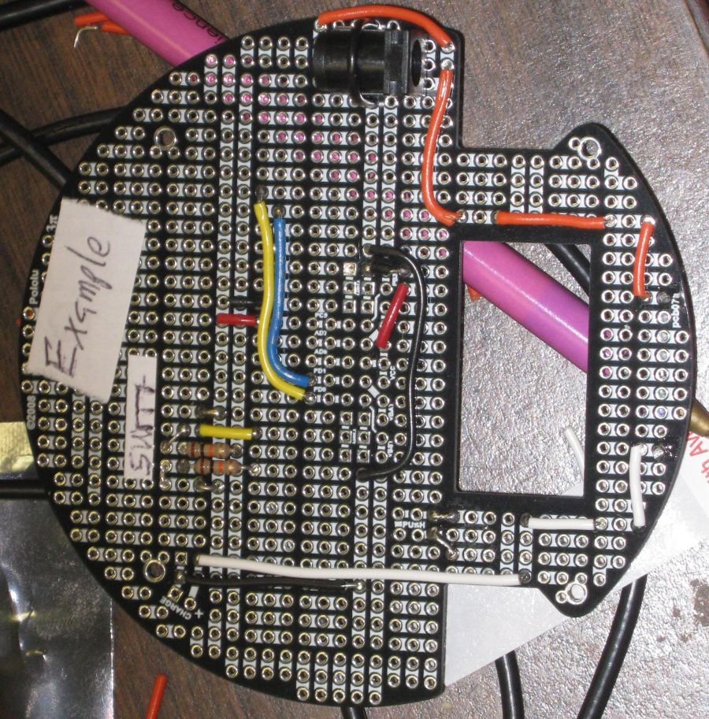

Power Jack shown here.

  - Black wire connected to horizontal strip to tie jack ground to
    charging point ground.

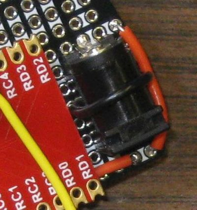

Current limiting resistor on underside of board.

  - Mounted one proto-board thickness above board.
      - gap to allow power resister to shed heat in all directions.

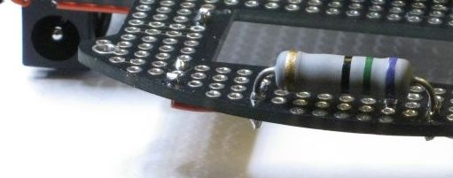

## Assemble Parts

### Jig for Board Interconnect Headers

The pins of the board interconnect headers are long. A jig was made to
hold long interconnect headers strait.

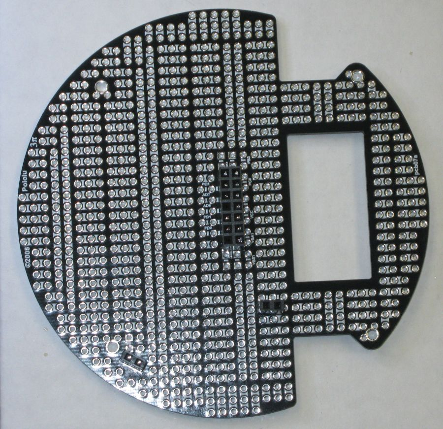

The long board interconnect headers are then put on the jig sockets.

<!---  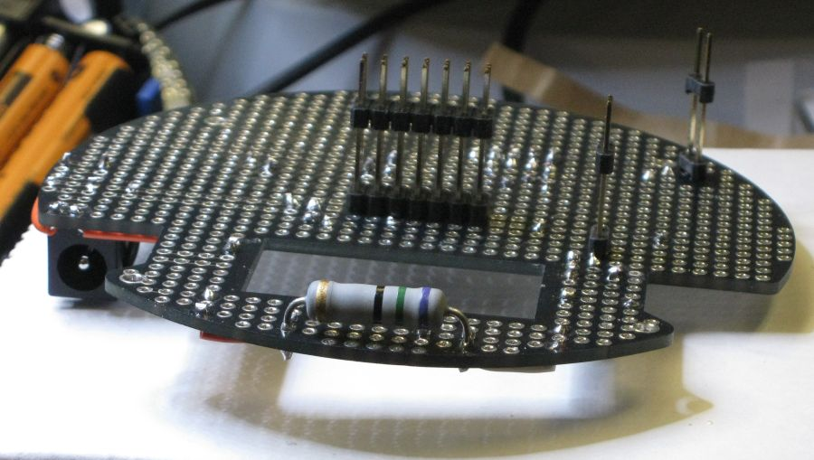  -->

{wrong image. need new photo}

The expansion board is fitted over the jig to solder the board
interconnect headers.

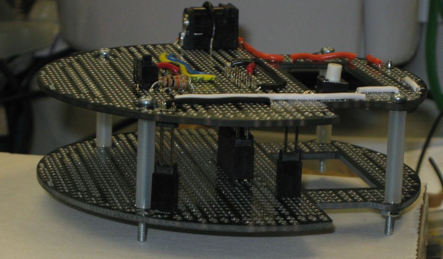

The expansion board is separated from the jig and sockets for the new
robot added to the pins.

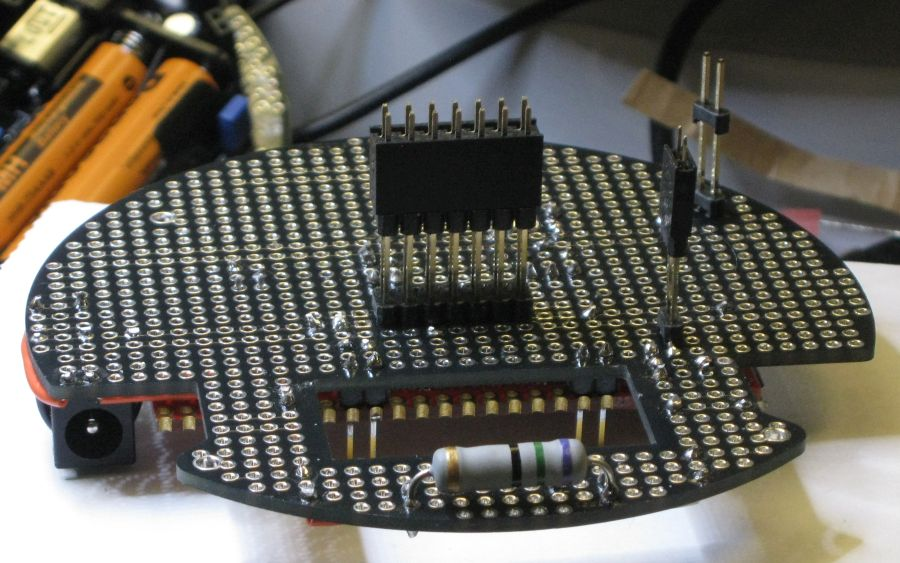

The expansion board can then be mounted on the robot and the sockets
soldered in place.

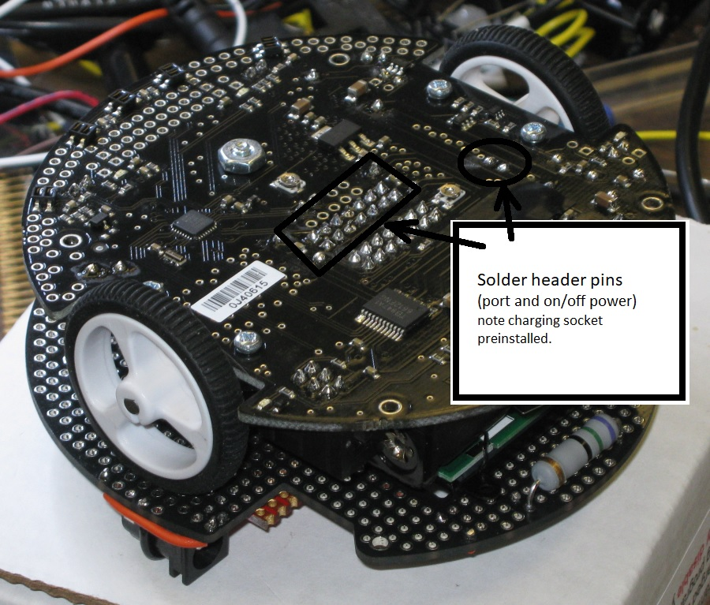

### Place Long Pin Headers for Xpress Board

One way to get the Header pins in strait is to place them in the correct
holes in the expansion board and then add the Xpress board. At this
point the Pins are soldered into the Xpress board and not yet to the
expansion board. Note the Xpress board must remain removable to solder
in very long headers for expansion to robot interconnect.

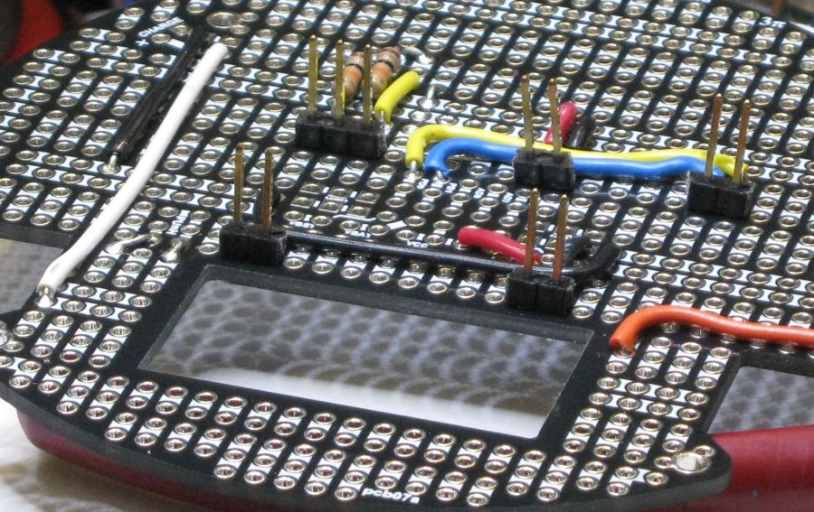

Xpress board added. Photo taken just before soldering long pins.

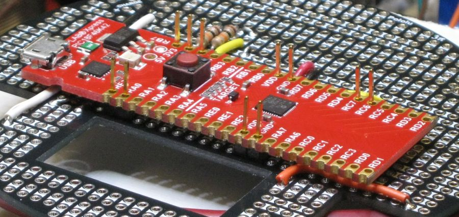
