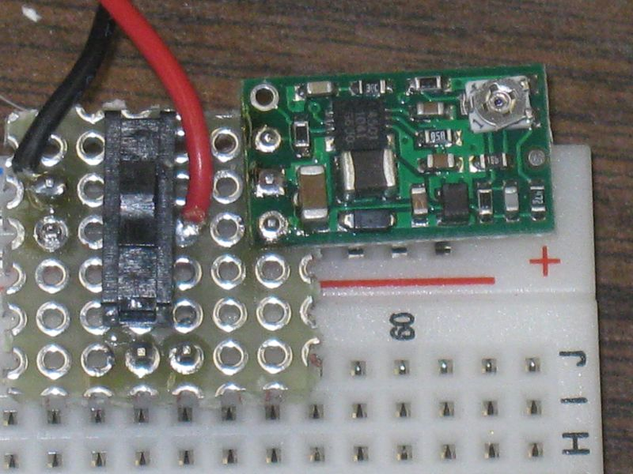
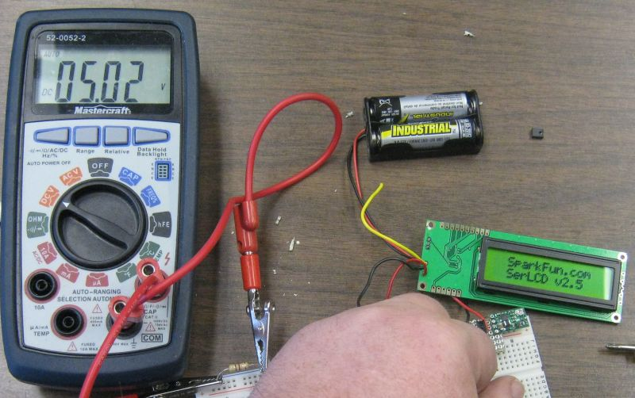

title: DC to DC Converter

# DC to DC Converter

     by Dan Peirce B.Sc.

I mounted the polou DC to DC converter on a small piece of protoboard which
was mounted on a solderless breadboard.

I then tested the board with a sparkfun 5V dc LCD display. For this test there
is a 470 ohm load resistor and the LCD display which has the back-light LED
turned on (takes another 60ish mA. The two AA batteries are not completely
fresh and the total battery voltage at this time was 2.8 volts. As shown in
this photo the output of the DC-DC converter is 5.02 v (that was as close to 5
volts as I could adjust the trip pot in a reasonable period of time).

The application this quick test would be good for is stand-alone battery
operated PIC projects. This should mantain a stable 5 Volts even as the
battery voltage drops.

  * <http://content.solarbotics.com/products/documentation/19200_pololu_vreg_s8v3a.pdf>

