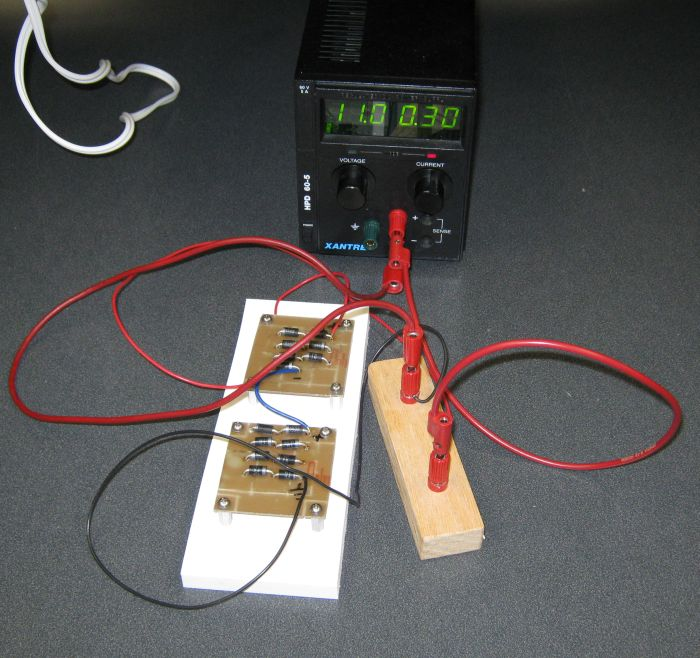

title: Solar Panel Dummy Load

# Dummy Load for the Solar Panel 

By Dan Peirce B.Sc. 2012

[TOC]

## Early Results

Tested the dummy load on the solar panel. Clearly light just from our florescent tube lighting 
in the lab is insufficiently bright to generate a significant amount of power.

Results with Dummy Load inside lab (there was very little sun light at 7 pm)

  potential  |  current  
-------------|------------
  9.26 V     |  6.7 mA  

My calculations for the design of the dummy load were based on the assumption a minimal 
current would be **200 ma**.  The rating for bright sunlight is 15V at 2A for 30Watts. 

The "typical" curves I saw in the datasheet appear to be different from the I/V values I 
am measuring for the diodes in the lab. When I run 2A through the diodes they get quite warm 
and the I-V curve shifts (total voltage drops at a given current). I am testing the load with a 
power supply set to current control mode. Current control mode avoids thermal run away and allows 
the voltage to stabilize at a set current. 

* Thermal run away can occur in voltage control mode because at a set voltage a temperature 
  increase shifts the I-V curve allowing the current to increase which causes more power dissipation, 
  more heating allowing more current...  This positive feedback can cause the temperature and current 
  to increase out of control.
* In current control mode an increase in temperature causes the I-V curve to shift such that the 
  voltage drops resulting in less power dissipation. This negative feedback allows the temperature 
  and voltage to stabilize.

The solar panel itself is not fixed in voltage or current but it does have a maximum power output 
which depends on the amount of light hitting the panel. This will ensure that the diode power can 
not run away. The I-V curve of the diodes will constrain the voltage within limits and the primary 
change resulting from changes in light level will be in current.

This does not look like a typical I/V curve because the temperature of the diode stabilizes at a 
different values as the current changes+ACE The voltage will initially increase as the current increases 
but then will drop as the temperature of the diode load increases.

I / V Values (current fixed by supply so temperature can stabilize)

  Current (A)  |  Potential (V)  
---------------|-------------------
  1.99  |  10.6  
  1.00  |  10.8  
  0.50  |  10.9  
  0.30  |  11.0  
  0.14  |  10.9  
  0.08  |  10.7  
  0.04  |  10.3  
  0.02  |  9.9  
  0.01  |  9.5   

Based on these result it would be necessary to add some more components to get a load that looks 
more like a battery. I am thinking of 4 more diodes plus a resistor (about 1 ohms 10W). This would 
also reduce the heating in each of the diodes.

## Revised Dummy Load 

I have added additional diodes and a resistor to the dummy load to better simulate a 12 volt lead 
acid battery. There are now 19 diodes and a single one ohm resistor all in series. Above 0.15 A 
there is significant heating in the diodes. It takes the diodes a few minutes to stabilize to a 
new temperature. The supply was used in current control mode to allow the temperature to stabilize.

I / V Values (current fixed by supply so temperature can stabilize) 

  Current (A)  |  Potential (V)  
---------------|------------------
  0.01  |  12.0 
  0.02  |  12.8 
  0.04  |  13.2 
  0.08  |  13.7 
  0.15  |  14.2 
  0.51  |  14.3 
  1.00  |  14.6  
  2.00  |  15.0   

## Early Concept 

I have looked up some specs on 3A diodes and charging curves for Lead Acid batteries.
If I purchase some **1N5402G diodes** I should be able to make a dummy load that behave somewhat 
like a charging Lead acid battery.
If I purchase about 25 (giving me some spares -- there is a price break at 25) I could put 
15 diodes in series. The forward voltage on these diodes will be about 0.9 volts at 2As and 
about 0.8 volts down around 200mA so we could expect the total voltage to range from about 
12V to 13.5 volts. This is much like a charging Lead acid battery.

<http://www.scubaengineer.com/documents/lead_acid_battery_charging_graphs.pdf>

The price for 25 diodes is just $7.52.

We can use our fluke meter on the 10A scale to measure current. A second meter could measure voltage.

If we want to measures with the Labquest mini we should would need the higher capacity current probe. 
I already have one of the 30V voltage probes. In Langley we currently have a class set of 
differential voltage Probes (plus minus 6V) and standard current probes (plus minus about 600mA).

They have a 10A current probe intended for this type of application.  
<http://www.vernier.com/products/sensors/current-sensors/hcs-bta/>

30V voltage probe  
<http://www.vernier.com/products/sensors/voltage-probes/30v-bta/>
