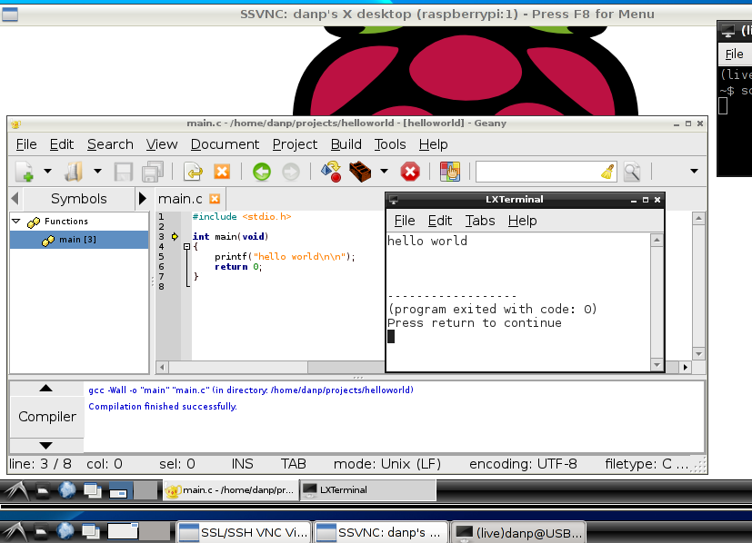
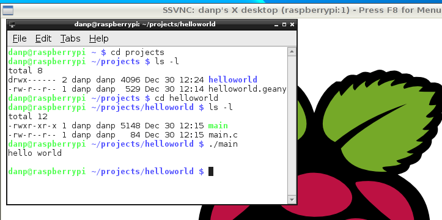

title: Geany IDE

# Geany IDE
**by Dan Peirce B.Sc.**  last update July 7, 2013
 
Documentation for Geany can be found at <http://www.geany.org/>

It was installed on a [Raspberry Pi](raspberry_pi) (running
[Raspbian/Linux](http://www.raspbian.org/)) with

    
    
    sudo apt-get install geany 

I started with a simple **hello world** program in C. There were no real
surprises with this simple project. Geany worked like a typical IDE. Meaning I
was able to create the project, create a simple c file, build the project and
run the result from within the IDE.

The compiled **hello world** program can now also be run from the command
line. 

This shows that our APSC1299/Physics1600 students could create simple programs
that will run on an ARM based Raspberry Pi board with the the knowledge they
gain in their existing courses.

