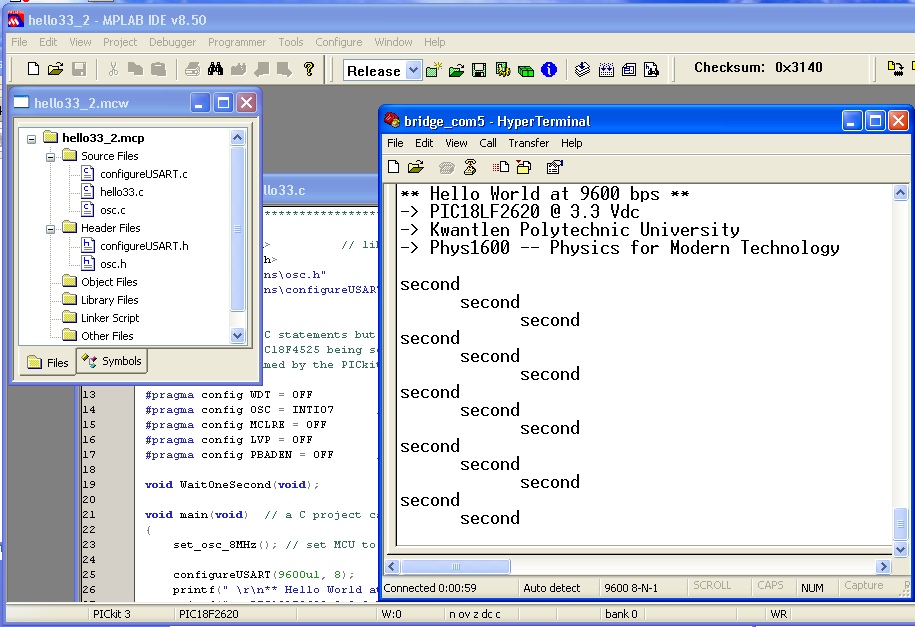

title: Hello World from PIC18LF2620 at 3.3 Vdc

[TOC]

# Hello World from PIC18LF2620 at 3.3 Vdc

    by Dan Peirce B.Sc.

Revised from [Dokuwiki](http://danpeirce.net46.net/dokuwiki/doku.php?id=hello33)

## Screen Shot

This screen show shows the example being used with MPlabx

The program can also be used with MPlab 8.5

## Files used in this example

### hello33.c

    
    :::c
    //***************************************************************************************
     
    #include <stdio.h>          // library containing printf() function
    #include <delays.h>
    #include "functions\osc.h"            // library for set_osc_32MHz()
    #include "functions\configureUSART.h" // library for configureUSART(baud)
     
     
    // These are not C statements but directives to the C18 compiler. They result in configuration
    // bits in the PIC18F4525 being set in the flash memory. This configuration is set when the 
    // PIC is programmed by the PICkit2 programmer and before any program starts to run in the PIC.
     
    #pragma config WDT = OFF
    #pragma config OSC = INTIO7      // puts osc/4 on pin 10 (0n 28 pin package) to check freq
    #pragma config MCLRE = OFF
    #pragma config LVP = OFF
    #pragma config PBADEN = OFF      // PORTB<4:0> are digital IO 
     
    void WaitOneSecond(void);
     
    void main(void)  // a C project can only have one main() function
    {
        set_osc_8MHz(); // set MCU to run at 8 MHz
     
        configureUSART(115200ul, 8); 
        printf(" \r\n** Hello World at 115200 bps **\r\n");
        printf("-> PIC18LF2620 @ 3.3 Vdc\r\n");
        printf("-> Kwantlen Polytechnic University \r\n");
        printf("-> Phys1600 -- Physics for Modern Technology\r\n\r\n");
        while(1)
        {
            printf("second\n");
            WaitOneSecond();
            printf("second\n");
            WaitOneSecond();
            printf("second\r\n");
            WaitOneSecond();
        }	
     
    }
     
    void WaitOneSecond(void)
    {
        Delay10KTCYx(200); // wait 10 000 * 200 * TCY = 1.000 seconds 
     
    }

### configureUSART.c

    
    :::c
    //****************************************************************************************
    #include <p18f2620.h>
    #include <usart.h>       // library containing serial communtication functions
    #include <delays.h>      // library containing delays - i.e. wait for time t
     
    void configureUSART(unsigned long baudrate, unsigned char osc_freq_MHz)
    {
      unsigned int spbrg;
     
      TRISCbits.TRISC6 = 0;     // set TX (RC6) as output 
      TRISCbits.TRISC7 = 1;     // and RX (RC7) as input
     
      // For a 16-bit sbprg value with USART_BRIGH_HIGH setting.
      // Formula from datasheet is Baudrate = FOSC/ (4 * (spbrg + 1 ))
      spbrg = (unsigned int)( ((float)osc_freq_MHz * 1.0e6) /(4.0*(float)baudrate) + 0.5 - 1.0); 
     
     
      OpenUSART( USART_TX_INT_OFF & USART_RX_INT_OFF & USART_ASYNCH_MODE & USART_EIGHT_BIT & 
                 USART_CONT_RX & USART_BRGH_HIGH, spbrg );  
      // OpenUSART is part of the C18 usart.h library        
     
      BAUDCONbits.BRG16 = 1;  	// needed so we can use a 16-bit spbrg
    							// Note that this is not discussed in the c18 Compiler Libraries guide
      Delay10KTCYx(1); // small 4x0.0125 s delay to allow communication speed to stabilize
    					// part of the C18 delays.h library
    }                      // original delay was 0.0125 s but that was with Fosc at 32 MHz (now is 8MHz)

### configureUSART.h

    :::c
    //****************************************************************************************
    //
    // configureUSART.h
    //
    // Function to configure the PIC18F4525 serial communication (USART) module for operation
    // and set the baud rate (communication speed). The SparkFun LCD has 5 different 
    // operating rates 2400, 4800, 9600 (default), 19200, and 38400. You can operate your P18f4525
    // MCU at different frequencies. osc_freq_MHz can be 32, 16, 8, 4, 2, and 1.
    //
    // Note 38400 bps is not available at 1 MHz!!!
    //
    // You can communicate with your PC at much greater speeds up to 1 000 000 bps
    //
    // Dan Peirce and Mike Coombes, May 2011
    //
    //****************************************************************************************
     
    void configureUSART(unsigned long baudrate, unsigned char osc_freq_MHz);
     

### osc.c

    
    :::c
    /* file osc.c */
    //***********************************************************************************
    //                          set_osc_8MHz()
    //    sets the oscillator from the default 1 MHz to 8 MHz
    //***********************************************************************************
     
    #include <p18F2620.h>
    #include "osc.h"
     
    void set_osc_8MHz(void)
    {
      int i;
     
      OSCCONbits.IRCF2 = 1;     // Set the OSCILLATOR Control Register to 8 MHz
      OSCCONbits.IRCF1 = 1;      
      OSCCONbits.IRCF0 = 1;        
    }

### osc.h

    
    :::c    
    /* file osc.h                                                */
     
    void set_osc_8MHz(void); 
     

