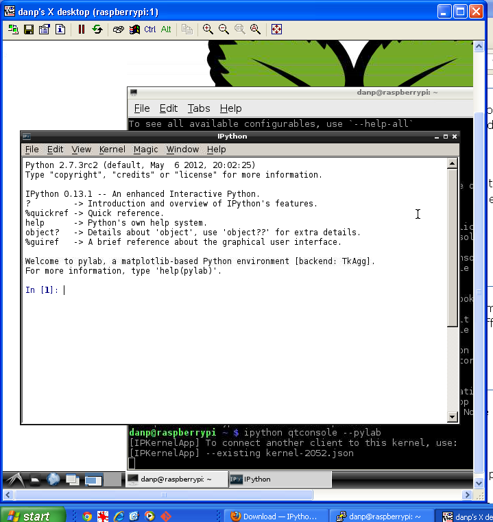
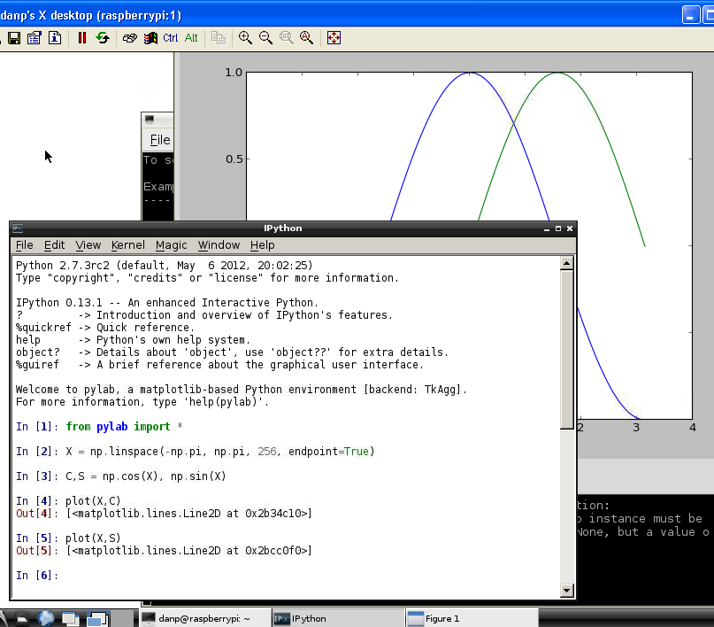
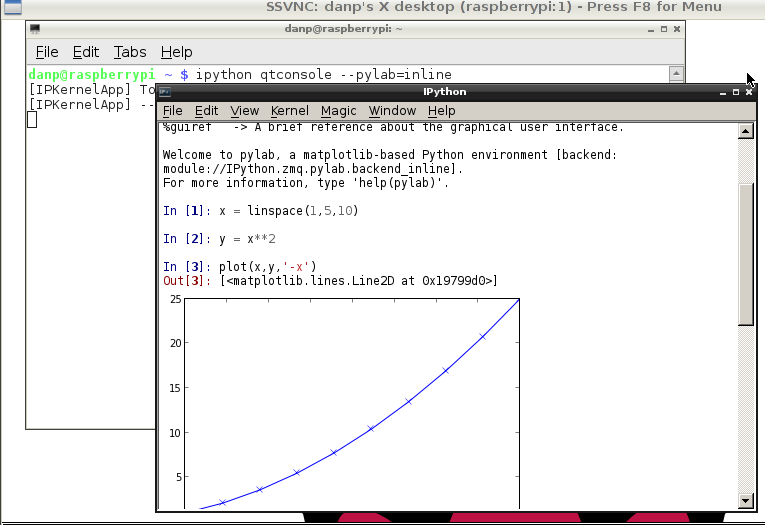

title: IPython on the Raspberry Pi

[TOC]

# IPython on the Raspberry Pi
    Notes by Dan Peirce B.Sc.  (reformated from my pages at 
                  danpeirce.net46.net/dokuwiki/

I have just started to explore this. In the examples given below IPython is
run on a headless Raspberry Pi. TightVNCServer is used to export the Raspberry
Pi desktop and a TightVNC Client is run on a Windows XP computer to operate
the Raspberry Pi. This gives on access to IPython without having to install it
on a PC. Also, any PC on the LAN could access the Raspberry Pi.

IPython can also be used on other platforms. More general info at
[ipython_notes](ipython_notes.html)

## Starting IPython within a Qt Console

(Starting IPython from the command line to run in a Qt Console)

## Creating a Matplotlib Plot from in IPython

## Getting the plots inline rather then in figure window

## Invoking IPython Qtconsole and Pylab

The following typed at the bash command line will invoke IPython in Qtconsole
with Pylab and all figures will be inline:

    
    :::python
    ipython qtconsole --pylab=inline

The image shows part of the Raspberry Pi desktop in a
[ssvnc](vnc.html#vnc-client-on-debian-linux-pc) session on a netbook running
Debian Linux.

## ipython qtconsole configuration

By default no Gui editor is set for the ipython qtconsole. That means the
magic command %edit will not work. To fix this I needed to go to the correct
directory in my home folder and create a file called
**ipython_qtconsole_config.py**

### The Path

    
    :::sh
    cd ~/.config/ipython/profile_default

### The file ipython_qtconsole_config.py

    :::sh
    c=get_config()
    c.IPythonWidget.editor = 'leafpad'

Info came from
<http://wiki.ipython.org/Cookbook/Moving_config_to_IPython_0.11> except he set
it up for emacs. I used leafpad (pre installed on Raspberry Pi).

