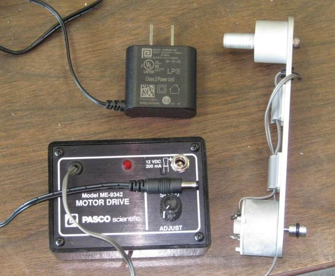

<!---
use 
     pandoc -s -t html5 -c pandocbd.css maintenanceBlog.md -o maintenanceBlog.html
-->

# Maintenance Blog

## March 31, 2017

I have made a simple modification to one of the motor drives to ensure better reliability.
 
Parts used (digikey part numbers given)

* Barrel socket EJ501A-ND
* New AC/DC Wall Adapter PSM03A-120-R
 
Note that the hole in the Motor Drive cover was made a bit bigger to 
accommodate the barrel connector. The drive seems to work well. Some 
students will be doing a makeup lab next week so we can have it student 
tested before I modify the full class set.
 
I should point out that the connector that I removed from the Motor Drive 
had significant amounts of black oxide which was likely a result of arcing 
that can occur when a phone plug is inserted into a phone jack used for 
power. This is one of the reasons that barrel jacks are more often used 
for power connections.
 
Another advantage of the new AC/DC adaptor is that it is of the high 
efficiency type that have been available since around 2008. The old 
adaptors were the old low efficiency type and would remain warm when 
plugged in even with no load!
 
The modified Motor Drive looks like this:

## March 23, 2017  

* Modifed newer Learning Ladders to secure base

## February 22, 2017

* ----- found one of the AC to 12V DC adaptors  was intermittent. This could also cause the issue --- described last night. 
  Some of these have been opened and repaired in the past. Currently these are low cost items not worth repairing. Especially 
  if opening the box requires a dermal.  New adaptors will be CSA or cUL approved and high efficiency models. Modifying the 
  adaptors voids the approval.
* The other issue with these power adaptors and Pasco that has been a long time irritant is that they use a mono phone plug 
  rather than a mostly standard barrel connector. Phone plugs should not be used for power because if they are inserted only 
  part way then can cause a short. We have been using the existing adaptors for years (perhaps a couple decades) but this 
  device would be more reliable if we got new supplies and replaced the existing sockets with barrel sockets.
  
Mono phone plug    can cause a short if used as a power connector this can cause trouble.

Common barrel connector 

I’ll try a few of the following parts and see how they work out with the existing controller.

* 993-1232-ND AC adaptor
* CP-065A-ND socket

## February 21, 2017

* I have gone around the lab and replaced all ten of the o-rings after getting you e-mail. There was noticeable wear on them. 
  Uneven wear was likely the crux of the issue. At least it could make the speed variable.
* There is one apparatus where I added a shim to raise up the motor arm and drive wheel as it was very low on the rotating disk.
