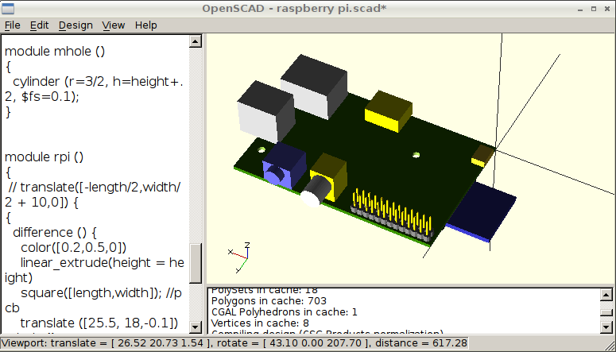
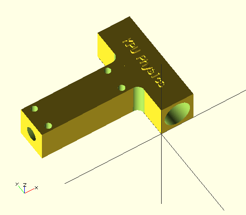

title: OpenSCAD Notes

[TOC]

# OpenSCAD Notes

    by Dan Peirce B.Sc.

Also see [printer3d.html](printer3d.html)

on <http://www.openscad.org/> they say *"OpenSCAD The Programmers Solid 3D CAD Modeller"*

## Links to Tutorials

* <http://en.wikibooks.org/wiki/OpenSCAD_User_Manual/Print_version>
* <http://www.makerbot.com/blog/tag/openscad-tutorial/>
* <http://edutechwiki.unige.ch/en/OpenScad_beginners_tutorial>

## Units?

The forums linked here point out that units in OpenSCAD are arbitrary; however when the 
3D model is put into the slicer program the numbers are interpreted as mm.

* <http://forum.openscad.org/Question-about-metric-vs-imperial-units-td3912.html>
* <http://rocklinux.net/pipermail/openscad/2011-August/001313.html>
* <http://forums.reprap.org/read.php?1,192905,192931>
* <https://groups.google.com/forum/#!topic/makerbot/5VO9tZ3ksIg>

## Found 3D Model of Raspberry Pi

I found an existing 3D model of the Raspberry Pi.

* [Raspberry Pi on Git Hub](https://github.com/rewolff/Raspberry-Pi-OpenSCAD-Model)

This looks like the newest version of the board with the two positioning holes.

Some of the details are not present but it would not be hard to add them.

Since I am new to OpenSCAD it is not too surprising that when I look at the model I 
see things that I have not seen before but it is not hard to figure out what is happening.
I see advantages in this method of creating a 3D model.

1. Since the text is used to create the model I can follow how it was done. In other 
   systems the "how it was done" would be hidden in menu mouse clicks and shortcuts
   that are not visible when the file gets stored.
2. ...

## Projects

### Fitting for ASTR1100 Photometer

The OpenSCAD file used to generate the 3D opject is linked here [support_astr1100_kpu.scad](support_astr1100.scad).

OpenSCAD does not contain native text ojects but it allows 2D DXF files to be imported and extruded to make a 
2D drawing into a 3D object. I found a project that does this and can be imported to new projects. 

* <https://github.com/rohieb/Write.scad>

This will work on different operating systems but the name should be changed to write.scad to get it working under Linux which is case sensitive on file names.

### Bracket to Attach Programming Header To Breadboard

My OpenSCAD file is in a github repository. An explination of the project is also given.

* <https://github.com/danpeirce/bracket-breadboard>
 
## Other Links

### Cubehero Blog

* <http://blog.cubehero.com/2013/11/19/know-only-10-things-to-be-dangerous-in-openscad/>

### Play list of Short Instructional Videos on OpenSCAD

This playlist seems to give a good introduction to OpenSCAD:

* [Intro Play list OpenSCAD](http://www.youtube.com/watch?v=XNghpq9sKRc&list=PLA9633900ACC80BA1)

