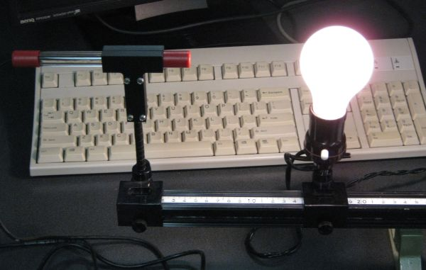
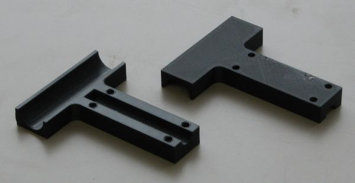
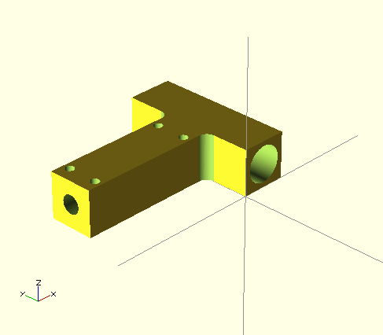
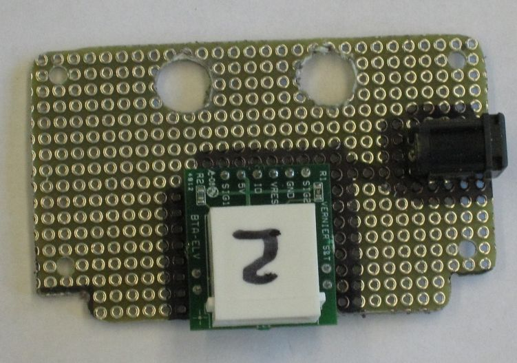
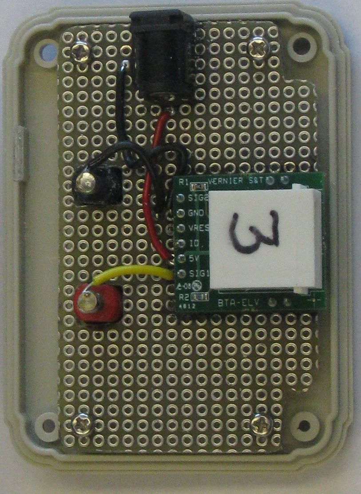

title:photometer

# Photometer for ASTR1100 Richmond  
    By Dan Peirce B.Sc.  
    July 15, 2013 (revised Sept. 20, 2013)

[TOC]

## The Sensor Support
The prototype photometer for Richmond ASTR1100 has been completed. I now have all the parts for 10 units (except I need to pick up some more threaded rod for the vertical support).

The parts that attache the sensor tube to the support rod were created with a 3D printer. 
The design for the part was done in an open source program called OpenSCAD.
When these parts were printed they were made with a shell and fill. The fill is actually mostly voids so the parts are very light.

For more on OpenSCAD see <http://members.shaw.ca/danielpeirce/notes/printer3d.html#3d-modeling-software>

## The Adaptor Box

### The adaptor box is shown here with connections.

Regarding the connectors visible here.

1. The rectangular connector at the bottom of the image is from the Vernier light Sensor.
2. The banana leads go to a multimeter.
3. Power comes into the box via the other connector.

### The adaptor board with connectors.

This board is attached to the lid of the box.

1. The main part of the box has two holes cut in it for access to the connectors that are not in the lid.
2. The four small holes in the corners are for short screws used to attach this board to the lid.
3. The two larger holes in this board allow the banana jacks to pass through the board. When assembeled the
    banana jack nuts are tighened to the lid itself and are underneath the board.

An example of the board attached to the lid and wired is shown in the next photo.

