<!---
use 
pandoc --metadata pagetitle="PHYS1600 Parts"  -s --toc -t html5 -c ../../pandocbd.css phys1600_parts.md -o phys1600_parts.html

-->

# Historical Only

This page was relavent in the early years of the PHYS1600 course. The parts used have been revised more than once since this page was last updated. 

A new page has been created for 2023.

## Related Pages

  * [pic18lf_sound_project](pic18lf_sound_project.html) \-- moved some "other things of interest" not related to sound from that page to this page.
  * <https://bitbucket.org/danpeirce/pic18_serial_io> \-- some basic code for testing the serial/USB interface is on that public page -- branches of the project related to specific projects has not been added to that repository. 
  * [hello33](hello33.html) even more basic code used to test the USB to UART bridge. 

    by Dan Peirce

reformated from [dokuwiki](http://danpeirce.net46.net/dokuwiki/doku.php?=phys1600_parts) on July 20, 2013

# Testing Parts for Physics 1600

  1. [PIC18LF2620](http://ww1.microchip.com/downloads/en/devicedoc/39626b.pdf)

  2. [uUSB-MB5](http://www.abra-electronics.com/products/%CE%BCUSB%252dMB5-Breakout-Board-for-CP2102-mini-USB-to-Serial-.html) \-- this board comes fully assembled as shown. ([note on driver](usb_mb5.html))

  3. [PICkit3](http://www.microchip.com/stellent/idcplg?IdcService=SS_GET_PAGE&nodeId=1406&dDocName=en538340&redirects=pickit3)

The uUSB-MB5 provides 3.3Vdc to the PIC18LF2620. The uUSB-MB5 has an on-board
3.3V regulator which converts the USB supplied nominal 5 V to the regulated
3.3volts. The regulator also provides short circuit and thermal protection. It
can supply a maximum of 100 mA.

## Important Note Regarding Using an Oscilloscope when using the uUSB-MB5

In APSC1299 the output of the power supply used floats relative to earth
ground as long as the PICkit2 is not attached to the circuit. When the uUSB-
MB5 is used power comes from the computer USB port. With a desktop computer
the negative side of the supply does not float relative to ground. It is
grounded. The oscilloscope ground clip is also grounded. Connected the
oscilloscope ground clip to anything but the USB ground will cause a short
circuit.

The situation is different when using a laptop powered from the battery. In
this case the negative side of the supply is floating relative to earth
ground. I tested one laptop with the charging power supply plugged in and
found the USB ground was still floating.

## With an External Oscillator

More than one variant of the supply wiring has been tested. The external
Oscillator used in testing

  * [Digikey Part number CTX743-ND](http://www.digikey.ca/product-detail/en/MXO45HS-3C-8M0000/CTX743-ND)

This is a five volt oscillator. In this variant of the wiring the positive
rail at the bottom of the solderless breadboard is used for 5 V and the
positive rail at the top of the breadboard is used for 3.3 volts.

Note that the PIC is tolerant of 5 volt inputs when powered at 3.3 volts!
**For student use the jumper wire from 5 volts out of the USB-MB5 could to the
nearby power rail could be replaced by a 400 mA axial leaded fuse.**

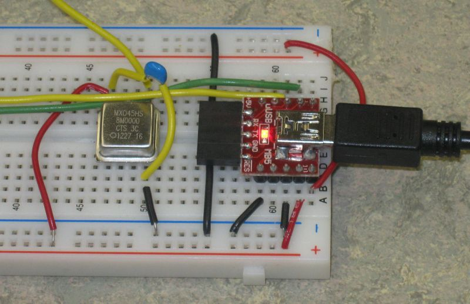

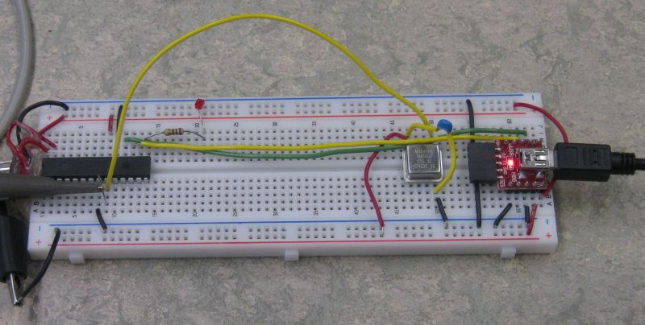

### Alternate Layout for 5 volt Bus

Rather then use the lower supply bus for 5 volts an alternative is to use just
one row for 5 volts and keep both positive rails at 3.3 volts. We would like
to minimize the use of the raw 5 volts.

### Oscillator on Protoboard for Short Signal Path

Since the oscillator is at an RF frequency it is a good idea to keep the lead
short. Building the oscillator on a little piece of protoboard facilitates
this.

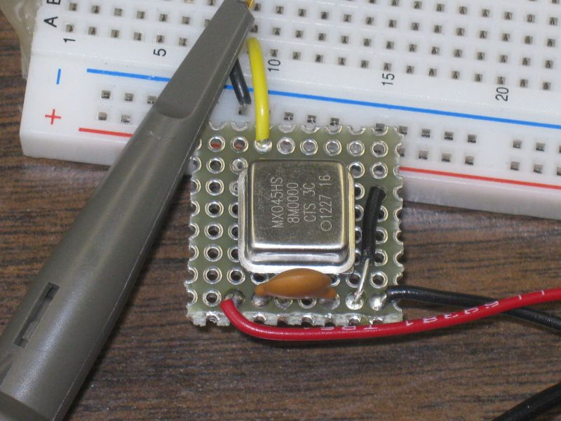

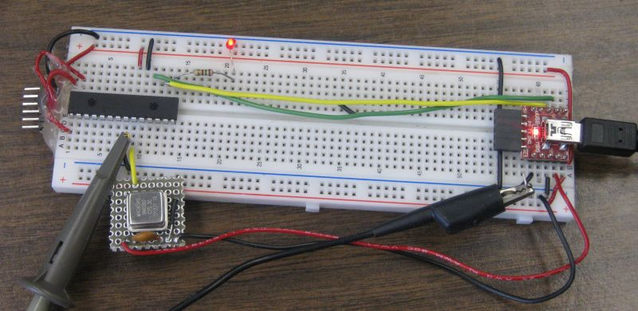

### Oscillator Protoboard Vertical for Even Shorter Signal Path

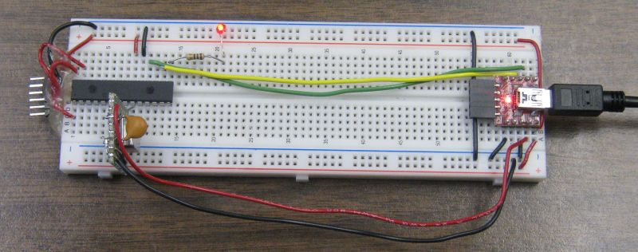

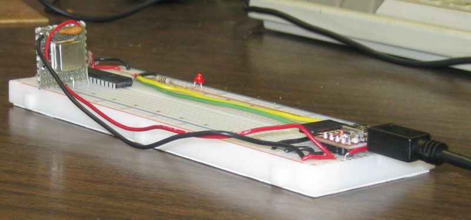

### Signal from Oscillator

Signal from Oscillator when loaded by PIC is shown below. The external
oscillator can be used when very precise time measurements are to be made. The
internal oscillator is quite adequate for many applications.

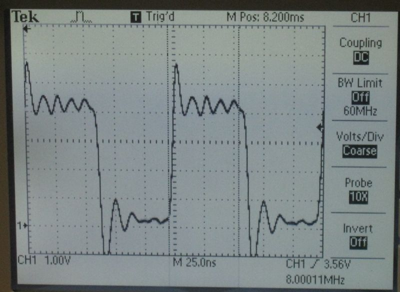

### New Branch on bitbucket repository

I created a new branch on my git bitbucket repository to reflect the use of an
external oscillator.

  * [https://bitbucket.org/danpeirce/pic18_serial_io/diff/USARTfunc.c?diff2=9517adf437b4&at=ext_osc](https://bitbucket.org/danpeirce/pic18_serial_io/diff/USARTfunc.c?diff2=9517adf437b4&at=ext_osc)

Screenshot of that link: (the other change not visible in this screen shot was
that the call to **set_osc_8MHz()** was commented out in **main.c**.

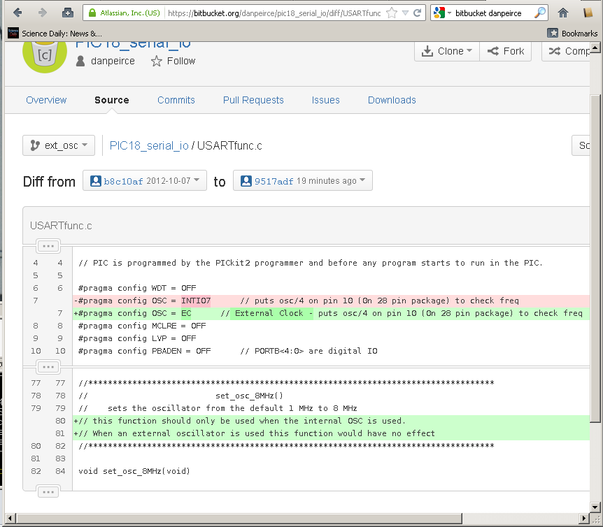

## Without an External Oscillator

In this case I have not used the 5 volt output from the USB-MB5.

<http://www.littelfuse.com/~/media/Files/Littelfuse/Technical%20Resources/Docu
ments/Data%20Sheets/Littelfuse_Fuse_251_253_Datasheet.pdf>

## Test Program

Made use of existing program
**[pic18_serial_io](https://bitbucket.org/danpeirce/pic18_serial_io)**. That
project was written for the PIC with interacting with a Raspberry Pi in mind
but it will interact with a Windows PC just as well. Currently this program
recognizes three commands.

  1. "M" -- sends a menu message - this was used for the test.

  2. "L" -- intended to turn on an LED.

  3. "F" -- intended to turn off an LED.

Note that to test the "L" and "F" commands a 200 ohm resistor should be
connected to pin 15 of the PIC and the other end of the resistor should
connect to the anode of a LED. The cathode of the LED is connected to ground.

The PIC will also echo any character it receives back over the serial link for
a loop-back test. If it receives a '\r' it will add a '\n'. see
<https://bitbucket.org/danpeirce/pic18_serial_io/src/b8c10af1b10d/commands.c>

Complete set of project files can be obtained from
<https://bitbucket.org/danpeirce/pic18_serial_io/get/b8c10af1b10d.zip>.

Within these files the header file p18f2620.h is used. There is no p18lf2620.h
file but from a the programming point of view the devices are equivalent.
Also, when the project wizard was used to create the project file the
PIC18F2620 device was selected. The resulting HEX file is still suitable for
the PIC18LF2620.

## Terminal Program

On Windows XP I used hyperterminal. Windows 7 does not ship with
hyperterminal.

I tested [PuTTY](http://www.putty.org/).

I have been using PuTTY as a SSH client but it also works as a simple serial
terminal.

This screen shot shows a PuTTY session connected to the PIC18LF2620 via the
USB to serial bridge uUSB-MB5:

Note that the PuTTY terminal screen will be empty until something is typed on
the computer (laptop). What ever is typed will be echoed to the screen (by the
PIC) if everything is set-up correctly. Typing "m" sends the menu message
(from the PIC): 

### PuTTY Settings

The following screen shots show the PuTTY settings:

**PuTTY -> Connection -> Serial** 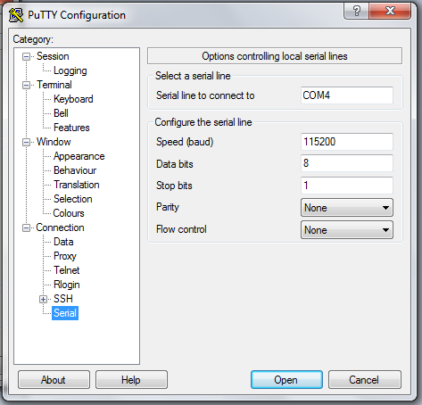

**PuTTY -> Window -> Colours**   
Select **Use System Colours** to avoid getting white on black.
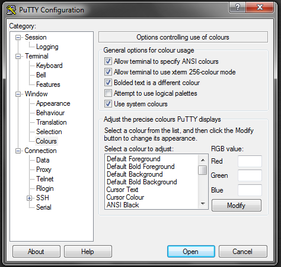

**PuTTY -> Session**   
Connection type must be selected as **Serial**
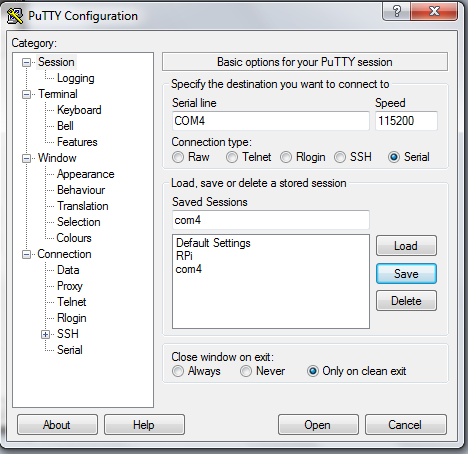

## Getting the PICkit3 to work with the PIC18LF2620

### With PICkit3 Pin 2 to 3.3 Volt Connection

Please note that when this was tested the connections between the PICkit3 and
the PIC18LF2620 were as follows:

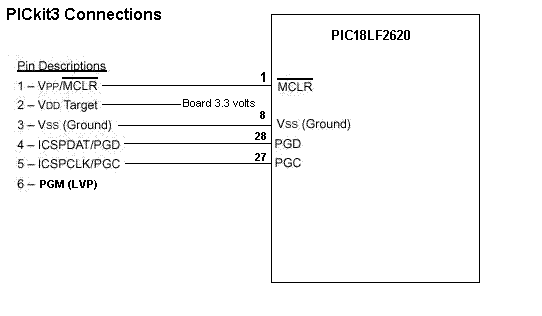

I am working on a plastic bracket with the intention of having it 3D printed. 
See [https://github.com/danpeirce/bracket-breadboard#purpose-of-the-bracket-breadboard-scad-project](https://github.com/danpeirce/bracket-breadboard#purpose-of-the-bracket-breadboard-scad-project)

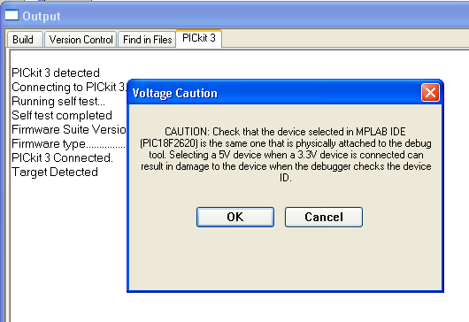

Once the **OK** is selected the device ID will be shown:

          Device ID Revision = 00000007

It is possible to read the source voltage:

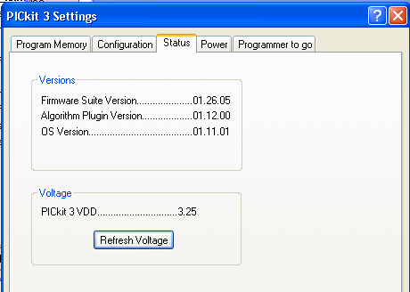

If the PICkit3 pin2 is connected to the circuit and the circuit is powered
from the USB connection it is essentially that Powering from the PICkit3 is
not checked on the power tab!

### With PICkit3 Pin 2 Left No Connection

With the PICkit2 we left the power connection open because we did not plan to
power the board from the PICkit2 and it seemed to avoid the possible issue of
someone inadvertently powering the board from the PICkit2. With the PICkit3 we
still don't want to power our board from the PICkit3 (and risk damage to it).
It appears that with the PICkit3 it would not be easy to power the board from
the PICkit3 unintentionally and as shown below leaving PIN2 open leads to many
extra steps being necessary. **This part is included for completeness -- For
the PICkit3 I recomend adding the wire from PIN2 to VDD.**

Note that a PICkit2 will attempt to read the voltage on its pin2. If no
voltage is pressent the firmware will assume that the target needs to be
powered from the PICkit2's supply. It appears that the firmware on the PICkit3
is different. If no voltage is sensed on pin2 it will give the following
error:

    
    
            PK3Err0045: You must connect a target device to use PICkit3.

Perhaps a better error message would have said that no voltage was detected.
One could use a wire from the board positive rail to the PICkit3 pin2 or one
could use the following procedure which I worked out by trial and error.

**The error:**

Select **Programmer -> Settings**

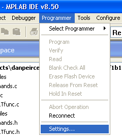

Select the **Power** tab and set the voltage to **3.375 volts** by dragging
the slider. Also, ensure that the **Power target circuit from PICkit3** check
box is checked! When that is all done click on **apply**.

A warning message will pop up. It will say the same thing regardless if the
voltage has been shifted down to 3.375 volts or not. The dialog box can be
moved around so check that the voltage is set to 3.375. The checking is not
essential if Pin2 of the PICkit3 is not actually connected to anything! Click
on **OK**.

The PICkit3 firmware progresses and says shows the **Device ID Revision =
00000007**. At this point the MPlab IDE tools for interacting with the PIC
device become viable, contain color and are responsive so the device can now
be programmed.

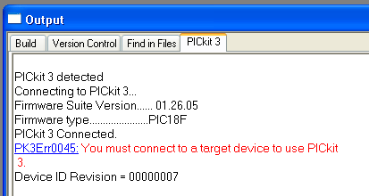

Once printed the error message does not go away (unless it scrolls up out of
view) but the new line with the device id is an indication that the MPlab IDE
is now talking to the PIC18LF device.

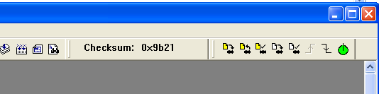

## For Standalone Projects

In Phys1600 there will be some projects which are standalone. In these cases
power from a USB port will not be available and a computer will not be
available to display results. In those cases battery power will be needed. The
LCD module that we typically use requires 5 VDC (the LCD is not required when
attached to a laptop since we can run a terminal program on the laptop).

I found a suitable DC-DC converter that can provide a regulated 5 Volts out
even when the input voltage is substantially less than 5 volts. See
[dc_to_dc_converter](dc_to_dc_converter.html).

## Other things of Interest

### PIC32 Devices and the XC32 Compiler

I have just started to look into the documentation of the PIC32 devices and the XC32 Compiler as of September 8, 2013.

#### PIC32 Devices

There are a few DIP versions of PIC32 devices and the price is actually lower than the PIC18 device we have been using!

* PIC32MX150F128B-I/SP - just $4.67 at digikey (the PIC18F2620 is actually $6.91) 
* [datasheet - PIC32MX150F128B-I/SP](http://ww1.microchip.com/downloads/en/DeviceDoc/61168E.pdf)

#### XC32 Compiler
 
* <http://ww1.microchip.com/downloads/en/DeviceDoc/XC32-v121-ReleaseNotes.html#Document>
* [MPLAB XC32 C Compieler User's Guide](http://ww1.microchip.com/downloads/en/DeviceDoc/51686F.pdf) -- note that **page 10** contains **recomended reading**

The XC32 compiler is a port of the GNU GCC compiler and is covered by the GPL.
The functions in the hardware library are specific to Microchip devices and they are not covered by the GPL.

### TFT LCD

4D Systems makes small TFT LCDs with full color, built-in controller, sound,
touch screen and SD-card interface. They package some in kits complete with
serial interface to a raspberry pi. The displays could also be used with a
microchip PIC.

See [4D_LCD](4d_lcd.html)

### Keypad

I have been looking at keypads. It appears one can get much better value
purchasing a 3by4 keypad rather than a 4by4 keypad. It would actually be cheaper
to have two 3by4 keypads on a project than one 4by4 so I'd recomend getting the
3by4\. I expect the 3by4 ones are less expensive because they are sutiable for
telephones.

this one looks like a good deal from a Canadian source:

  * <http://www.solarbotics.com/product/50847/>

### MEMS Microphone

[ Breakout Board for ADMP401 MEMS Microphone
](http://www.sparkfun.com/products/9868) \-- I used to think the [Electret
Microphones](http://www.sparkfun.com/products/8635) were small. This mems
Microphone board contains the microphone and op amp circuit. The entire board
with through hole solder pads is about the same size as an electret
microphone. -- \--[ Overview of MEMS microphone technologies for consumer
applications](http://www.memsjournal.com/2011/03/overview-of-mems-microphone-
technologies-for-consumer-applications.html)

### Breakout Board for SC16IS750 I2C/SPI-to-UART IC

[ Breakout Board for SC16IS750 I2C/SPI-to-UART
IC](http://www.sparkfun.com/products/9981) \-- while this is a real
interesting little board and one could gain an extra USART interface, it would
actually cost less and gain more functionality to connect to another
PIC18LF2620!

### Breakout Board for SD-MMC Cards

**Looks like this sparkfun breakout board has been discontinued.** [ Breakout Board for SD-MMC Cards](http://www.sparkfun.com/products/204) \-- "With SD and MMC memory prices dropping, the time is right for mass storage and datalogging. This breakout board will allow you to breakout the SD/MMC socket to a standard .1" 11-pin header. Perfect for breadboarding and the likes. Board comes fully assembled and tested as shown." see <http://www.maxim-ic.com/app-notes/index.mvp/id/3969>

<http://www.solarbotics.com/product/13200/> **Looks like this one costs less
and has more on it (changed link as old link was broken Nov. 21, 2012 --
nothing stands still).** Also, this is from a Canadian source.

Links to <http://site.gravitech.us/MicroResearch/Others/SD-ADP/SDmanual.pdf>

### 3.3 volt 8 MHz Crystal

<http://www.digikey.ca/product-detail/en/CB3LV-3C-8M0000/CTX264LVCT-ND/280258>

  * <http://www.ctscorp.com/components/Datasheets/008-0256-0_F.pdf>

### Line in vs Mic input of PC

  * <http://circuits.radio-electronics.co/audio/speakers-systems/line-level-signal-to-microphone-input-adapter/>

