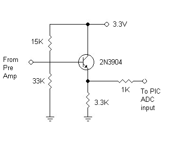
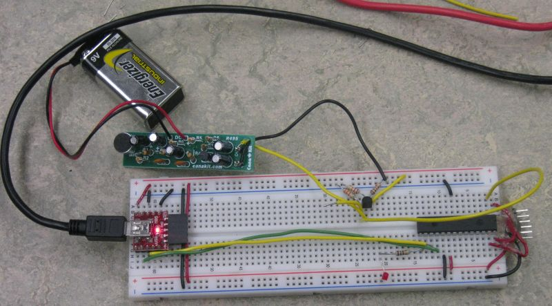
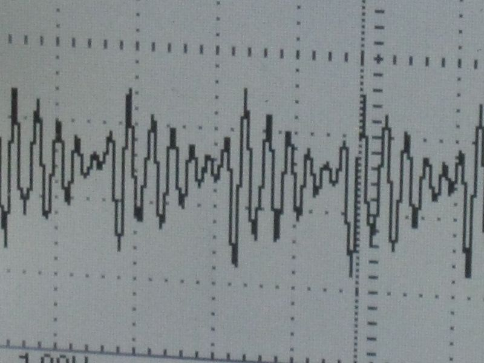
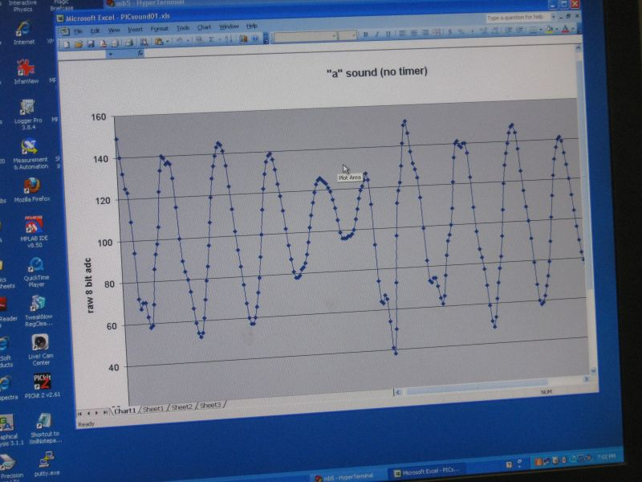
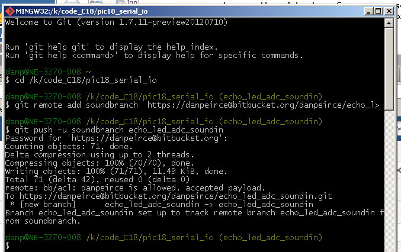

title: Sound Project

# Sound Project

    by Dan Peirce B.Sc.

reformatted from dokuwiki July 20, 2013

[TOC]

First test of preamp and level shifting circuit. I also captured about 10 msec
of sound (soft "a" vowel sound). Have not added serial eeprom to project yet.

The bias circuit looks like this (except I replaced the 33 Kohm resistor with
a 22 Kohm resistor to bring the quiescent point down to about half the 3.3
volt supply).

## Bias Circuit

## Pre Amp Circuit

A pre amp circuit was used in testing:

  * <http://www.canakit.com/electret-microphone-pre-amp-kit-ck495-uk495.html>

## Image of microphone/preamp/levelshifter with PIC18LF2620

## Image of signal on DSO

## Image of signal in excel

Application note on serial EEPROM

<http://ww1.microchip.com/downloads/en/AppNotes/00966A.pdf> AN966 Interfacing
SPI Serial EEPROMs to Microchip PICmicro Microcontrollers

## private repository for code

Created a private repository for branch of code for the sound project. This
way I can have access in different locations but not sharing it since it may
be a project for students.

## Datasheets

### 1 Mbit SPI Bus Serial EEPROM

<http://ww1.microchip.com/downloads/en/DeviceDoc/21836H.pdf> 1 Mbit SPI Bus
Serial EEPROM Sould be good for about 16 seconds of sound at 8 KS/s (8 bits
per sample) . Cost of $3.40 each if we get 10 or more.

### 12-Bit A/D Converter with SPI Serial Interface

[ 12-Bit A/D Converter with SPI Serial
Interface](http://ww1.microchip.com/downloads/en/DeviceDoc/21290F.pdf) \-

### 8/10/12-Bit Voltage Output Digital-to-Analog Converter with SPI Interface

<http://ww1.microchip.com/downloads/en/DeviceDoc/22248a.pdf>

## SPI

Suggested reading

  * <http://ww1.microchip.com/downloads/en/devicedoc/spi.pdf>

  * <http://ww1.microchip.com/downloads/en/AppNotes/01040A.pdf>

SPI is as about a simple a serial interface as one can get. The slave devices
only need to contain a parallel to serial device and a serial to parallel
device. Essentially shift registers.

## 3.3 Volt LCD

The LCD we have been using in apsc1299 runs off of 5 volts. Initially I
believed we would need a 3.3 volt LCD for phys1600. The adoption of the uUSB-
MB5 for physics 1600 probably makes the use of a serial LCD unnecessary
(except possibly for stand alone projects). see
[phys1600_parts](phys1600_parts.html).

## Notes from before the uUSB-MB5 was adopted

So far I have found 3.3 volt LCDs (2x16 characters as before) but not with a
built in serial interface. Example with a parallel interface
<http://www.solarbotics.com/product/50410/> Might have to build our own SPI to
8 bit parallel interface with the PIC18F2620.

Found an alternative LCD. It is physically smaller. It runs at 3.3 volts and
has a serial four wire input. I think it is worth a closer look. They are only
about $11 each from Digikey.

  * <http://www.newhavendisplay.com/specs/NHD-C0216CZ-FSW-FBW-3V3.pdf>
  * <http://www.digikey.ca/product-detail/en/NHD-C0216CZ-FSW-FBW-3V3/NHD-C0216CZ-FSW-FBW-3V3-ND/2059234>

Note that the LCD uses a charge pump. See [charge_pump](charge_pump.html)

## Public Switched Telephone Network

The world wide **public switched telephone network** uses digital encoding, 8
bit, 8 k samples/second. The sound quality for quite sounds is improved by
using a non linear encoding scheme. Don't think I'd go into that in this
course but just pointing out that 8 KHz sampling is adequate for voice.

In the phone system an analog anti-aliasing filter is used before the signal
is digitized by a codec in the switch station.

> "To carry a typical phone call from a calling party to a called party, the
audio sound is digitized at an 8 kHz sample rate using 8-bit pulse code
modulation."

See <http://www.networkdictionary.com/telecom/pstn.php>

<http://en.wikipedia.org/wiki/Non-linear_quantization> That system is old.
Digital cell phones have a better scheme but that makes little difference when
connecting to analog phones through the Public Switch Telephone Network.

For land lines the system is generally analog from a persons home to the
switch station. Between switching stations the system is digital. At one time
the whole system was analogue. Individual calls would be modulated to
different frequencies (or "channels) so that many calls could be put on one
pair of wires between switching stations. These days the calls are digitized
and time division multiplexing is used.

## Better Performance Development Board

Microchip produces a development board specifically for audio applicatio
ns.
Note that a 32 bit processor is used.

  * [http://www.microchip.com/stellent/idcplg?IdcService=SS_GET_PAGE&nodeId=1406&dDocName=en558421](http://www.microchip.com/stellent/idcplg?IdcService=SS_GET_PAGE&nodeId=1406&dDocName=en558421)

