title: Raspberry Pi

# Raspberry Pi
## This Page is Dated

In the summer of 2012 I recieved our first Raspberry Pi. That first summer I explored the early model B that had 256MB of ram. These are my notes.

* In October of 2012 the Raspberry Pi started to ship with 512MB
* In July 2014 the model B+ was announced.

## Initial Description

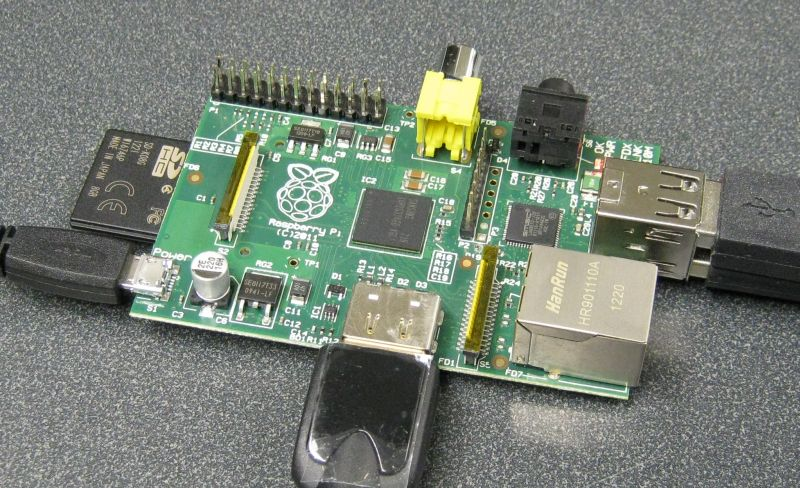

This is a single board [
ARM](http://www.arm.com/products/processors/index.php) processor computer. It
boots from an SD card. USB ports and an Ethernet LAN port are included. A
number of expansion boards are in the works. These should allow one to connect
to the real world. It is also possible to connect to the real world with a
general purpose USB virtual serial port.

It has an HDMI output that can connect to a digital TV or monitor. A USB
keyboard can be connected.

This is really modern looking as [
ARM](http://www.arm.com/products/processors/index.php) is the sort of low
power consumption processor used in tablets and smart phones including iPads
iPhones and Androids.

There are different options for operating system. We will start off with
Raspbian "wheezy" as this was the recommended downloadable image when our R-Pi
arrived. (download page <http://www.raspberrypi.org/downloads>). Some
background information can be found at <http://www.raspbian.org/RaspbianAbout>
.

Photo of the Raspberry Pi connected to a monitor via the HDMI. Power, USB
Keyboard and USB mouse also connected. When testing I also connected an
ethernet LAN cable (not shown here). The ARM processor is actually under the
RAM which can be seen at the center of the board  
(for layout diagram see <http://www.raspberrypi.org/wp-content/uploads/2011/11
/Raspi-Model-AB-Mono-1.png>)

Background <https://www.youtube.com/watch?v=u4THiC5-JZo>

Other Handy information <http://www.raspberrypi-spy.co.uk/>

[TOC]

## Raspberry Pi Received

The Raspberry Pi is here.

  * ordered and now also received HDMI to DVI-D cable so the RPi can be used with our lab monitors.

  * also ordered and received blank SD cards. The following links were used to get instructions and install the image.

  1. RPi Easy SD Card Setup -- <http://elinux.org/RPi_Easy_SD_Card_Setup>

how  2. <http://www.raspberrypi.org/downloads>

The [Raspbian](http://www.raspbian.org/) SD card image was recently released
so I decided to use it (see <http://www.raspberrypi.org/archives/1605> --
Raspbian-based SD card image released). I found the instructions given in 1
and 2 above easy to follow. Some people live video demos. One has been posted
here (<http://www.youtube.com/watch?v=ZpBThpH4iuA>).

I have plugged in our Raspberry Pi and so far everything seems to be working.
The Raspbian-based SD image has a new setup tool called raspi-config. I
stopped to checkout <http://elinux.org/RPi_raspi-config> to see if there is
anything I want to configure before I do anything else.

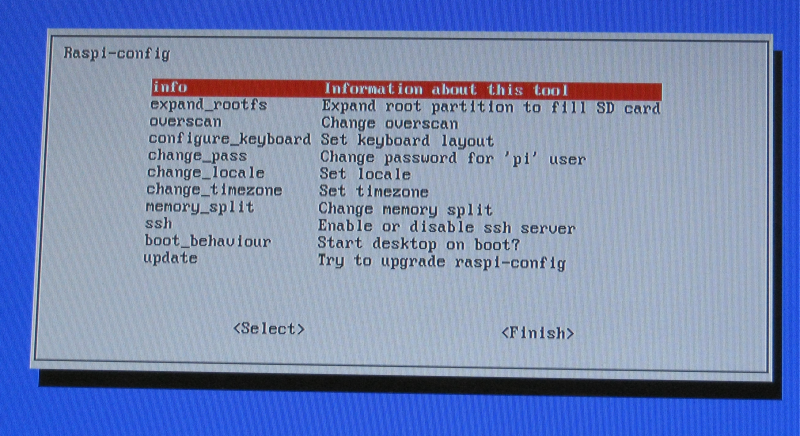

### Our First R-Pi is a Rev1 Board

There is a new revision 2.0 that will be shipping. Our first R-Pi is a
revision 1 board. The differences are itemized at the following link:

  * <http://www.raspberrypi.org/archives/1929> -- itemized changes

  * <http://www.raspberrypi.org/archives/1925> -- with a photo of new board

## Backing up SD Card

The tool recommended on the Raspberry Pi Downloads site

  * <http://www.raspberrypi.org/downloads>

for windows users to get an linux image onto a SD card and also to back up SD
cards is available here

  * <http://www.softpedia.com/get/CD-DVD-Tools/Data-CD-DVD-Burning/Win32-Disk-Imager.shtml>

It looks like this is still an early release of the tool and from what I read
in the forums it does not always work with SD readers built into laptops.
Fortunately when I tried it with our Dell Latitude laptop I was able to save
the Rasbian image to the SD card with no issues.

After working with the R-Pi for many days I wanted to save an card image
before making more changes. This did not work with the Dell Latitude. I did
not get any error messages but ended up with a tiny 57 MB *.img file which
could not be a proper image of a 8 GB SD card. After playing around with this
for some time I decided to try it out on our newest Acer netbook. It worked
perfectly and the new image file was just under 8 GB as expected.

## Checking the Raspberry Pi Out

### Setting Configuration

  1. I set this RPi to boot to the text login screen.   
The X window system is still available and can be started by simply typing
startx. On GNU/Linux systems (and Unix) the graphical windows system is
optional. When X is not used more memory is available for other tasks.

    * see <http://www.linfo.org/x.html>

  2. Set the timezone

  3. expanded the root partition to fill the 8 GB SD Card.

  4. Set it to use US keyboard layout (the default is UK which clearly is different -- <http://www.goodtyping.com/teclatUK.htm>). In Canada (outside of Quebec) the US Keyboard is typical (<http://www.cooltoyzph.com/image/US_Keyboard_layout.jpg>).

### Setting the Date and Time

The Raspberry Pi does not have a hardware real time clock. It looses the set
time and date every time it is powered off. It can automatically get date and
time off the internet. That works for me at home but in the lab on campus that
service is not available so the time and date must be set manually.

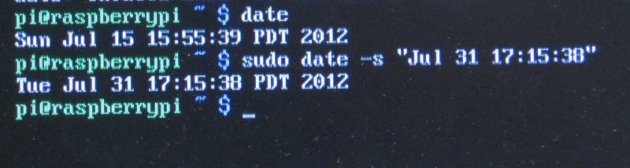

### Updating Wiki Using the RPi

This updadate to this page has been done on the Raspberry Pi itself. The
Raspbian SD image ships with more than one browser.

  * First attempt was using the **NetSurf** web browser. Editing this wiki page in this way is sluggish. The interface seemed fast enough until the edit session started.

  * The **Midori** web browser does not have the problem of lagging as I type when editing this wiki.

## Headless Local Login

### ttyAMA0 UART

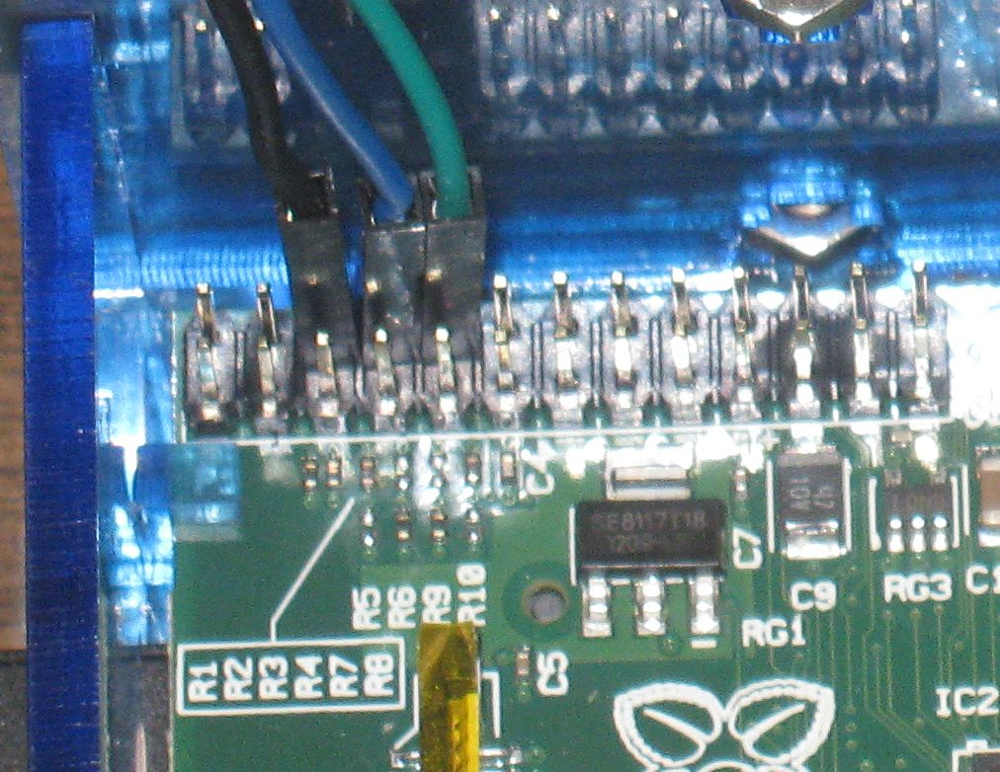 The ttyAMA0 UART provides a way to log on locally
with the Raspberry pi headless. Jumpers were connected to ground, Tx and Rx.

    Jumpers

    ground    black
    Tx        blue
    Rx        green

 Here the other end of the
jumpers connect to corresponding pins on a [ FTDI UART to USB converter (from
Solarbotics)](http://www.solarbotics.com/product/39240/) which connects to a
Personal Computer. The other end of the jumpers could be connected to other
interfaces. They could for example connect to a PIC board or a PIC on a
solderless breadboard. The jumpers could be eliminated entirely if one used
the [ Adafruit Pi Plate](http://adafruit.com/products/801).

The Solarbotics FTDI board is easily modified for 3.3 volt operation. This
modification involves cutting one hair line trace and adding a solder bridge
to the underside of the FTDI board.

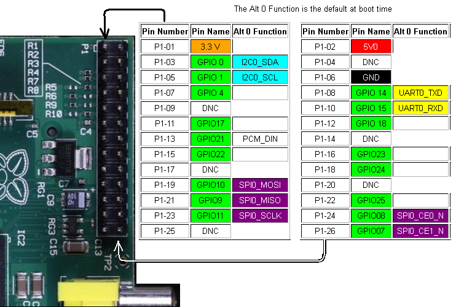

The end of the boot sequences messages looks as follows (as displayed in
hyperterminal on a XP computer.).

    
    
    ...
    [    4.872377] EXT4-fs (mmcblk0p2): mounted filesystem with ordered data mode. Opts: (null)
    [    4.885483] VFS: Mounted root (ext4 filesystem) on device 179:2.
    [    4.895629] Freeing init memory: 200K
    [    4.952638] usb 1-1: new high speed USB device number 2 using dwc_otg
    [    5.173196] usb 1-1: New USB device found, idVendor=0424, idProduct=9512
    [    5.186067] usb 1-1: New USB device strings: Mfr=0, Product=0, SerialNumber=0
    
    [    5.199258] hub 1-1:1.0: USB hub found
    [    5.207472] hub 1-1:1.0: 3 ports detected
    [    5.492967] usb 1-1.1: new high speed USB device number 3 using dwc_otg
    [    5.613317] usb 1-1.1: New USB device found, idVendor=0424, idProduct=ec00
    [    5.627921] usb 1-1.1: New USB device strings: Mfr=0, Product=0, SerialNumber=0
    [    5.644377] smsc95xx v1.0.4
    [    5.708429] smsc95xx 1-1.1:1.0: eth0: register 'smsc95xx' at usb-bcm2708_usb-1.1, smsc95xx USB 2.0 Ethernet, b8:27:eb:fc:b8:d1
    [   20.976886] EXT4-fs (mmcblk0p2): re-mounted. Opts: (null)
    [   21.338713] ### snd_bcm2835_alsa_probe c05d07a0 ############### PROBING FOR bcm2835 ALSA device (0):(1) ###############
    [   21.354768] Creating card...
    [   21.360206] Creating device/chip ..
    [   21.366883] Adding controls ..
    [   21.372375] Registering card ....
    [   21.387371] bcm2835 ALSA CARD CREATED!
    [   21.399343] ### BCM2835 ALSA driver init OK ###
    [   29.089017] smsc95xx 1-1.1:1.0: eth0: link up, 100Mbps, full-duplex, lpa 0x45E1
    
    Debian GNU/Linux wheezy/sid raspberrypi ttyAMA0
    
    raspberrypi login:

### Configuration for Command Shell or Other Uses

By default /dev/ttyAMA0 is set up to display the boot information and to allow
login. This would be particularly useful for headless operation particularly
if remote login via SSH goes down for some reason.

By default one would not be able to access this UART with programs like
minicom since it is by default listening to input to the command shell. If
desired the device configuration can be changed.

  * For details see <http://www.hobbytronics.co.uk/raspberry-pi-serial-port>.

### ttyAMA0 Configuration Reset

The ttyAMA0 interface has been reset for use by a user (meaning it is not
longer at the default settings). This required changes to

  1. /etc/inittab

  2. /boot/cmdline.txt

See <http://www.hobbytronics.co.uk/raspberry-pi-serial-port> for the details.

This allows one to use minicom with the /dev/ttyAMA0 device.

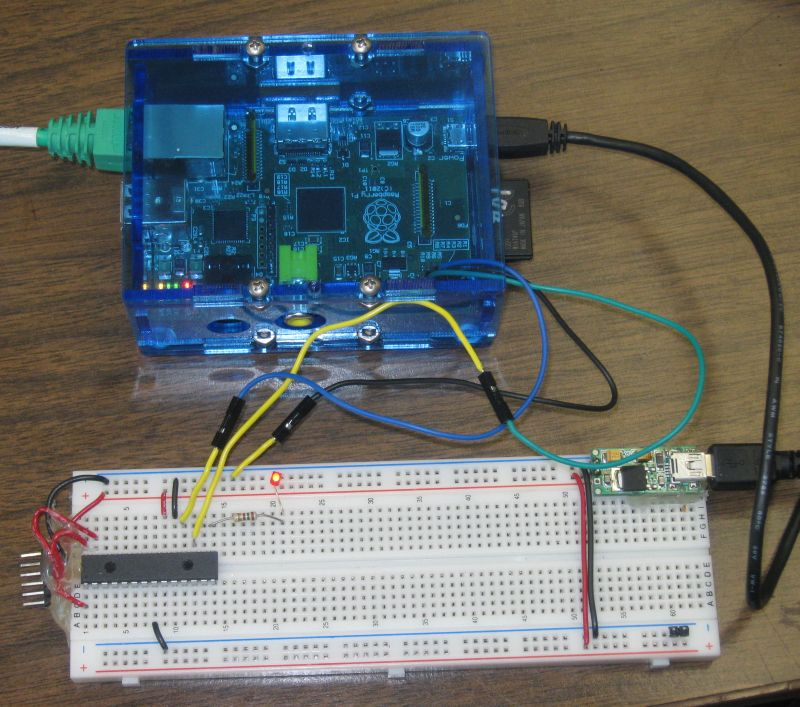

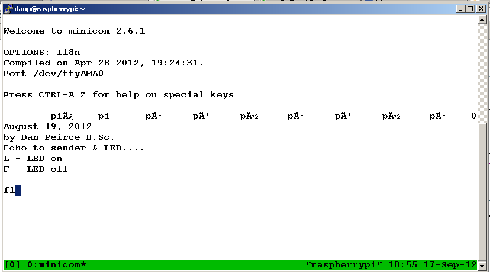

This is a screen shot of what is seen in a remote command shell session. Note
that the  terminal mutiplexer tmux is being used so exactly the same session
of minicom is visible at more than one remote computer.

In this case the PIC is not powered initially which results in some garbage
being displayed as a result of noise received. As soon as the PIC is powered
up a message is displayed. After this the Raspberry Pi passes on keystrokes to
the PIC which will turn the LED on when it receives an "L" and off when it
receives an "F".

Notes on PIC program and other details at [rpi_pic_led.html](rpi_pic_led.html)

## Remote Login

### remote command line interface (CLI)

While it is possible to use the Raspberry Pi connected to a monitor (or HDMI
TV), keyboard and mouse for us it would be great to have remote access most of
the time. This can be done with a secure shell.

  * [ For notes on remote login see ssh.html ](ssh.html).

Notes

  1. when this diagram was drawn I had not yet reconfigured /dev/ttyAMA0 for general use. Once this is done the PIC can be connected directly to the Raspberry Pi (see ttyama0_configuration_reset)

  2. The connection to the USB to Serial FTDI board is more reliable when the Raspberry Pi is connected to a USB hub and the USB to Serial FTDI board is downstream of the hub.

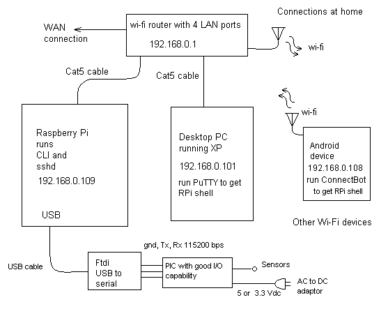

The screen shot below shows a remote login. This time the Raspberry Pi was
booted with no moitor, keyboard or mouse attached. I don't even have the
cables or USB devices at home! What I do have at home is a router (with wi-fi
and LAN connections) and a **winXP computer** as well as access to an
**Android tablet** (the Raspberry Pi can be accessed by both the winXP
computer and the tablet).

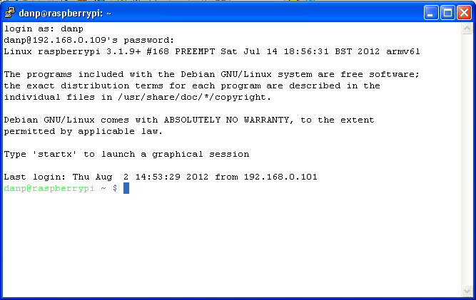

### Remote Raspberry Pi X Desktop

It is also possible to get a remote desktop. More at

  * [ Virtual Network Computing and the Raspberry Pi](vnc.html)

Example screen shot showing a remote Raspberry Pi X desktop window sitting on
a windows XP desktop. It is also possible to remotely interact with the
Raspberry Pi desktop on an Android device.

## Creating Plots with matplotlib

New page at [matplotlib.html](matplotlib.html) with more details.

### Screen Shot

A screen shot of how a matplotlib plot looks on the Raspberry Pi remote
desktop is shown below. This is the screenshot with the remote Raspberry Pi
desktop sitting on a windows XP desktop using the [ tightvnc
viewer](http://www.tightvnc.com/download.php). This can also be viewed on an
Android tablet using [ android-vnc-viewer](http://code.google.com/p/android-
vnc-viewer/)

Also of interest

  * [http://www.raspberrypi.org/phpBB3/viewtopic.php?f=32&t=24203](http://www.raspberrypi.org/phpBB3/viewtopic.php?f=32&t=24203) -- creating plot as PNG without using X windows system.

## IPython on the Raspberry Pi

IPython will run on the Raspberry Pi. I have a new page to show screen shots:

  * [ipython_rpi.html](ipython_rpi.html) -- with images

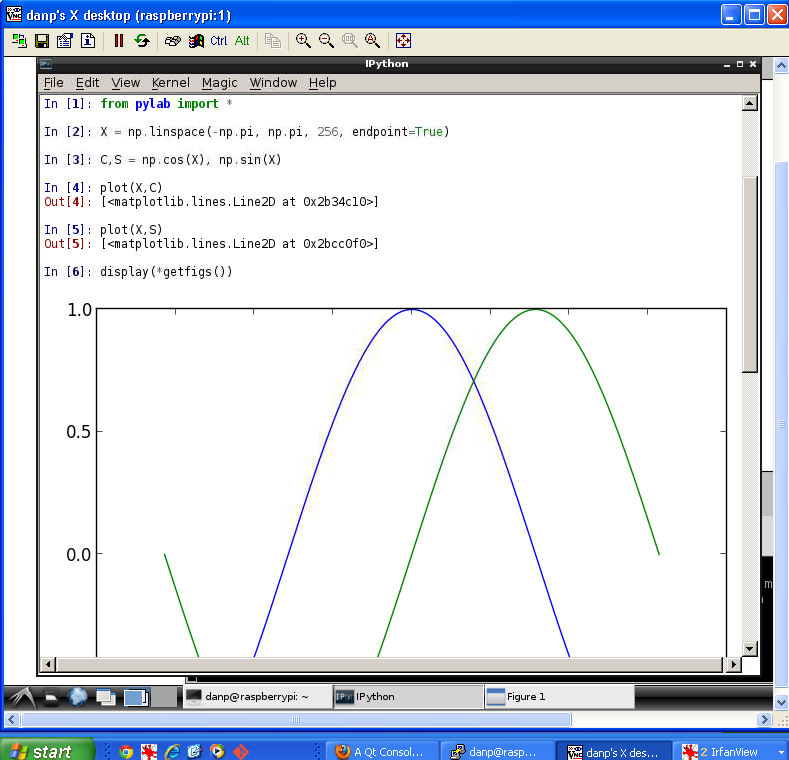

## Geany An IDE on the Raspberry Pi

I started to play with Geany. This is an IDE that can be used for C projects
(and other languages) on the Raspberry Pi.

I started with a simple **hello world** program in C. There were no real
surprises with this simple project. Geany worked like a typical IDE. Meaning I
was able to create the project, create a simple c file, build the project and
run the result from within the IDE.

More detail and screen shots at this link [geany.html](geany.html).

## Terminal Multiplexer tmux

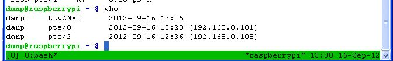 The terminal multiplexer tmux allows one
to access the same command shell session from more than one device. In this
screen shot one can see a PuTTY window and a hyperterminal window. They are
sharing a single tmux session so anything typed in one window shows up in all
(not shown here the same shell is appearing on a remote Android device.

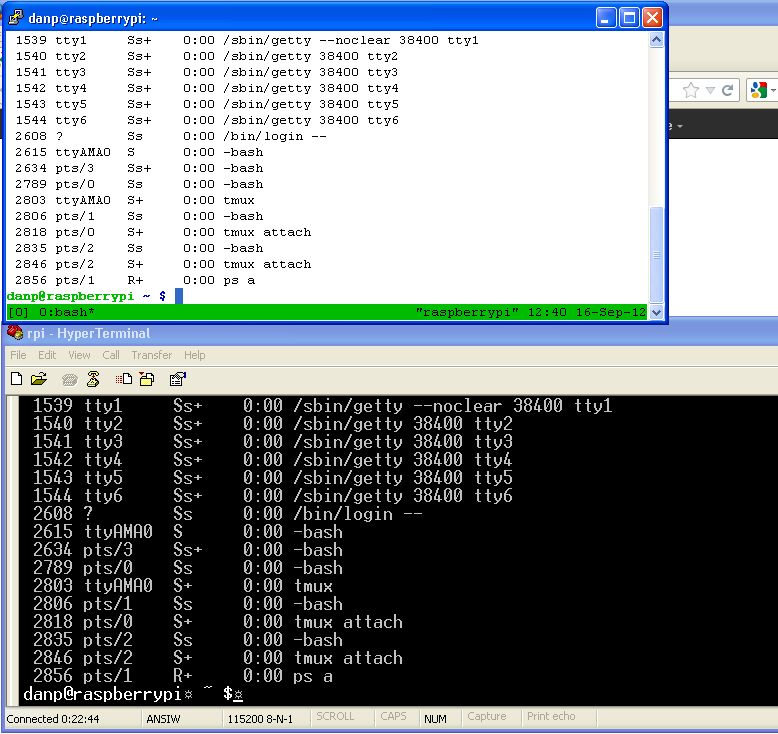

In this session /dev/ttyAMA0 is connected to a Serial to USB adapter and PC
running Hyperterminal. Alternatively /dev/ttyAMA0 could be  connected to a PIC
(running at 3.3 volts).

### manual page for tmux

* [http://www.openbsd.org/cgi-bin/man.cgi?query=tmux&sektion=1](http://www.openbsd.org/cgi-bin/man.cgi?query=tmux&sektion=1)

## USB virtual Serial Port

### Headless Raspberry Pi

### FTDI FT232RL

The Raspberry Pi running Raspian "Wheezy" boots with a driver installed for
FTDI FT232RL. A suitable board containing that IC and supporting parts is
available from Solarbotics.

  * See <http://www.solarbotics.com/product/39240/> -- TTLyFTDI USB-to-TTL Cable Adapter

I have used this board in the past to connect a PC running windows to PIC
projects. It works nicely plugged into the USB port of the Raspberry Pi (at
least when loaded with Raspbian which is what I am using).

  * Note that I have the board powered from the Raspberry Pi USB but I am not using the 5V output from the board. I am only using the Rx, Tx and ground lines. This should keep the power requirement from the PI's USB well within specification.

### The dialout Group

In Linux systems a user login must be a member of the **dialout** group in
order to use a tty device. At the command prompt a ID command allows one to
determine which groups they belong to.

    
    
    $ id
    uid=1002(pic18lf2620) gid=1003(pic18lf2620) groups=1003(pic18lf2620),20(dialout)
    $

**If dialout does not appear in the list the user must be added to the dialout group.** Instructions on added a user to a group appear here: 

  * <http://www.debian-administration.org/articles/109>

In Linux many users can be added. For testing the virtual USB device I used a
new user called pic18lf2620 and did not add this user to the sudo group. This
limits what can be done with the account.

Instructions regarding adding users can be found here:

  * <http://www.debianhelp.co.uk/userandgroup.htm>

### ttyUSB0

When the TTLyFTDI USB-to-TTL Cable Adapter board is plugged into the Raspberry
Pi USB port it can be accessed as /dev/ttyUSB0 A text file can be sent through
the virtal serial port using a copy command at the command prompt.

    
    
    $ cp textfile /dev/ttyUSB0

It is also possible to interact with the port using a terminal program. One
simple terminal program that can be started from the CLI is **minicom**. This
program is compatible with a secure shell.

### Installing minicom

Instructions at

  * <http://www.cyberciti.biz/faq/howto-setup-serial-console-on-debian-linux/>   
page down to the **How Do I Connect Using a Serial Console?** heading.

## Raspberry PI (Rasbian) Using a USB Virtual Serial Port with PIC Projects

For anyone already used to doing projects with PIC MCU's a USB Virtual Serial
Port provides a simple way to connect PIC project to the Raspberry Pi without
concern about damage to the Raspberry Pi board. The FTDI board acts as a
buffer as well as a USB to serial translator.

The **TTLyFTDI USB-to-TTL Cable Adapter board** from
[Solarbotics](http://www.solarbotics.com/product/39240/) is automatically
detected by a Raspberry Pi running [
Raspbian](http://www.raspberrypi.org/downloads) (the driver is pre-installed
in the Raspbian image).

I will create new pages for new projects.

  * [ Raspberry Pie connected to PIC which echo's what it receives back to R-Pi](rpi_echo_led.html)

  * As above and [the PIC will also respond to commands to turn an LED on or off](rpi_pic_led.html)

  * Updates on [bitbucket](https://bitbucket.org/danpeirce/pic18_serial_io). Have a new adc branch. The ADC can be used to read the voltage on the LED.

## Pushing to a Remote FTP Server Using Python

The Raspberry Pi can interact with a PIC MCU to read sensor data and push it
to a website.

  * [python_ftp.html](python_ftp.html)

## Server Related

### Apache Web Server on Raspberry Pi

Followed the directions at

  * <http://fusionstrike.com/2012/installing-apache2-raspberry-pi-debian>

to install Apache web server on Raspberry Pi. It worked without any issues.

### PHP Installed

Followed the directions at

  * <http://fusionstrike.com/2012/setting-php-raspberry-pi-debian>

I was able to sFTP a backup version the dokuwiki PHP package that runs this
site to the Raspberry Pi. A screenshot is shown below.

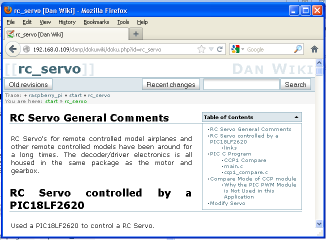

## Other Items Tested

### Mounting USB drives

Followed directions at
<http://elinux.org/RPi_Adding_USB_Drives#Mounting_a_Partition> I deviated from
the instructions in that page in that no USB hub was used. Access to the flash
drive is working.

### Setting up Printer

Used procedure given at <http://www.penguintutor.com/linux/printing-cups> to
set up printer.

### Installed Lynx Text Only Web Browser

Installed [Lynx](http://www.lynxbrowser.com/) text only web browser. It
reminds me of the early days of the world wide web. It can be used with the
remote raspbian command line interface. Lynx allows one to test what a web
page looks like without images and ensure it can be navigated by web robots
and screen reader systems. It is also possible to edit wiki pages (this
paragraph was edited using Lynx running on the Raspberry Pi).

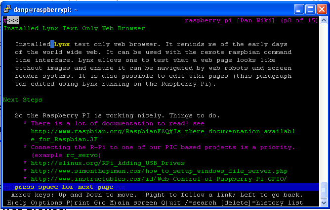

The screenshot shown above is from the Windows desktops.

To get **Lynx** to work with the Android tablet it was necessary to install an
alternate keyboard. **"Hackers Keyboard" Android application** was installed.
This virtual keyboard application works with
[ConnectBot](http://code.google.com/p/connectbot/) as well. The default
virtual keyboard lacks a **Ctrl** key and **arrow keys** that are needed for
both **lynx** and **ConnectBot**.

  * Recall that ConnectBot is a SSH client (a virtual terminal that runs an an Android). At the command prompt it works fine with the default Android virtual keyboard. 

For more on remote access see [ssh.html](ssh.html).

### Halting the Raspberry Pi

Use the following to halt the Raspberry Pi:

    
    
    sudo shutdown -h now

You will be prompted for the su password. Then just type **logout**.

You should see all of the LED's turn off except the power LED. It is then safe
to pull the power plug.

### Rebooting the Raspberry Pi

    
    
    sudo reboot

Expect the reboot to take some time. Progress can be watched on the LED's.
When the Raspberry Pi has fully booted with a network cable attached the LED's
will be on as follows

    OK    off
    PWR   on green
    FDX   on green
    LINK  on green may still flash a bit
    10M   on green

### Logging the IP address

I am generally using the Raspberry Pi headless (without a monitor and keyboard
but with a network cable).

  * At home I control the IP address by setting IP reservations on the DHCP settings of my router. 

  * In the physics lab and other places I don't have that control over the IP address. The IP address can be saved to a log file by making a small change to the /etc/rc.local file.

The lines that I added to rc.local all contain **>> /home/danp/ip.log** (danp
is just the login username I am currently using). In the lab computers are
consistently getting the same IP address from DHCP when they are switched on.
There is no certainty the IP address assigned will always be the same address
in the future but if it changes the new address will be logged. It would be
handy to have a router on hand to make it easier to read the log if/when this
should happen.

    
    
    #!/bin/sh -e
    #
    # rc.local
    #
    # This script is executed at the end of each multiuser runlevel.
    # Make sure that the script will "exit 0" on success or any other
    # value on error.
    #
    # In order to enable or disable this script just change the execution
    # bits.
    #
    # By default this script does nothing.
     
    # Print the IP address
    _IP=$(hostname -I) || true
    if [ "$_IP" ]; then
      printf "My IP address is %s\n" "$_IP"   # the output from this line should appear near the end of all the
                                              # boot message if one is watching the boot-sequence with a monitor.
      printf "\tMy IP address is %s\n" "$_IP" >> /home/danp/ip.log  # appends the logfile
    fi
     
    date >> /home/danp/ip.log                  # these lines also print msgs at the end of the log file
    printf "rc.local was modified by Dan Peirce B.Sc.\n" >> /home/danp/ip.log
     
    exit 0

The log shows:

  * The #1 Raspberry Pi is getting an IP of **10.213.1.85** (mac is b8-27-eb-fc-b8-d1) when connected in the Richmond physics lab. That network has a firewall so it is not reachable from outside.

Two more Raspberry Pi's were received on October 4, 2012. A new log entry
shows:

  * The [#2 Raspberry Pi](raspberry_pi2.html) is being assigned an IP address of **10.213.1.60** (mac is b8-27-eb-7e-49-b0)
'
## News

  * Sept. 19, 2012 [ Introducing turbo mode : Temperature and frequency widgets : USB interrupt rate reduction : WiFi is now supported out of the box...](http://www.raspberrypi.org/archives/2008)

  * Oct. 15, 2012 [Model B now ships with 512MB of RAM](http://www.raspberrypi.org/archives/2180) -- This should be kept in mind for future reference. So far the Model B's we have were all ordered and received before this development. It should help desktop performance (which is slow on our RPi's -- so far I have mostly been using a bash shell).

## GPIO Connections

**/dev/ttyAMA0 UART now tested and working with LED-PIC project ** see ttyama0_uart   
Next step to read temperature sensor. Once I have some hardware as I want it I
will hard wire it on a Protoyping Pi plate. For now I am using a breadboard.  
[Adafruit Prototyping Pi Plate Kit for Raspberry Pi](http://www.abra-
electronics.com/products/801-Adafruit-Prototyping-Pi-Plate-Kit-for-Raspberry-
Pi-.html). There is a review of this board and others at
[http://www.doctormonk.com](http://www.doctormonk.com/2012/08/review-of-
raspberry-pi-prototyping.html).

  * <http://elinux.org/RPi_Low-level_peripherals#General_Purpose_Input.2FOutput_.28GPIO.29>

  * <http://elinux.org/RPi_BCM2835_GPIOs> -- table of all BCM2835 GPIO pins including those on the RPi P1 header

  * [http://www.raspberrypi.org/phpBB3/viewtopic.php?f=37&t=15511](http://www.raspberrypi.org/phpBB3/viewtopic.php?f=37&t=15511). -- setting up i2c and spi

### RPi UART

  * [rpi_uart.html](rpi_uart.html)

## How we Might Use the Raspberry Pi

I think we would continue using a PIC18F for interfacing to sensors, LED's and
switches. We could then add the Raspberry Pi when we want to access the PIC18F
from a PC. One can log into the R-Pi over a LAN using a secure shell. [There
are many options for accessing the PIC from the
[R-Pi.](rpi_pic_led.html)

The Raspberry Pi is also capable of running a simple web server. It could act
as a bridge between our PIC18f and the LAN.

The Raspberry Pi does have a serial port running at 3.3v (rather than RS-232
voltage levels). One should be able to connect a PIC also running at 3.3 volts
directly to the Raspberry Pi serial port. (It may be significantly easier to
do this with python. Something to look into).

Other uses might eventually present themselves but that alone would probably
justify the cost.

### Other Uses

#### Writing simple C programs

They were developed as computers for teaching programming. They come with
Python installed for that purpose. Since they run Linux they also have a
native c compiler. We would could connect to the Raspberry Pi's over the LAN
using a remote login.

  * see [ setting up remote login](ssh.html)

If the raspberry pi is used as a workstation with a monitor and keyboard one
can use a graphical inte'grated development environment. If used with a remote
command line interface one will only have command line tools. If nothing else
using command line tools gives one some insight into how the C build process
works.

  * C Programming on the Raspberry Pi Using the CLI remotely [c_programming_cli.html](c_programming_cli.html)

Access to GPIO

  * [http://www.raspberrypi.org/phpBB3/viewtopic.php?f=44&t=9230](http://www.raspberrypi.org/phpBB3/viewtopic.php?f=44&t=9230)

    * <http://www.open.com.au/mikem/bcm2835/index.html> -- tempting but not recommended because in Linux the kernel owns IO! (see link above)

More on GPIO at <http://elinux.org/RPi_Low-level_peripherals> I think for now
I will avoid access to the gpio apart from the UART for which the kernel
support exists and should stay stable in upcoming releases. The UART should be
able to talk to a 3.3 V PIC USART without issues; however it would be
expedient to have a buffer at the Raspberry Pi as a precaution.

#### Networking

In the old Electronics Technology program we used to use Linux boxes to teach
networking. One limitation of this "computer" is that it only has one network
port and we can't just plug in another one. There are things we could do with
these.

  * setup a web server

  * do remote logins

  * should be able to set up a DNS

  * Does not look like the Raspberry Pi would make a router or a bridge but these days routers and bridges and hubs are not expensive. We could use a bunch of these Raspberry Pi's with a few of those to test different configurations.

## Notes Links

  * <http://alexba.in/blog/2013/01/06/setting-up-lirc-on-the-raspberrypi/>

  * <http://www.guardian.co.uk/technology/2012/nov/04/raspberry-pi-programming-jam-cern>

  * <http://www.palebluedot.nl/jml/computer-stuff/3-linux/33-webcam-streaming-with-raspberry-pi.html>

  * <http://www.themagpi.com/> -- Free downloadable Magazine For Raspberry Pi Users

  * <http://www.element14.com/community/groups/raspberry-pi?view=overview> -- links to docs and forums 

  * <http://elinux.org/Rpi_Low-level_peripherals>

  * <http://www.ftdichip.com/Support/Documents/DataSheets/Modules/DS_RPi_HUB_Module.pdf>

  * <http://www.ftdichip.com/Support/Documents/ProgramGuides/D2XX_Programmer>'s_Guide(FT_000071).pdf

  * <http://www.ctheroux.com/2012/08/a-step-by-step-guide-to-setup-a-bluetooth-keyboard-and-mouse-on-the-raspberry-pi/>

  * <http://giovanni.wordpress.com/2007/04/06/how-to-use-tcpip-over-bluetooth/>

  * <http://www.pcworld.com/businesscenter/article/253857/raspberry_pis_35_linux_pc_hits_the_streets_at_last.html> -- includes video

  * <http://www.bit-tech.net/hardware/pcs/2012/04/16/raspberry-pi-review/1> -- Ok interesting review but that is not how we will use it (at least that's what I am thinking now).

  * <http://www.cyberciti.biz/faq/linux-how-to-determine-find-out-file-system-type/>

  * <http://elinux.org/RPi_Beginners>

    1. <http://elinux.org/CLI_Spells> command line interface -- startx will start the GUI but that takes system resources also may well raspberry_pi with a remote login! (welcome to linux)

    2. <http://elinux.org/RPi_Tutorial_Easy_GPIO_Hardware_%26_Software>

  * <http://downloads.element14.com/raspberryPi2.html?isRedirect=true>

    1. <http://www.raspberrypi.org/>

      * <http://www.raspberrypi.org/forum/features-and-requests/i2c-programming>

      * [http://www.raspberrypi.org/forum/projects-and-collaboration-general/wifi-connected-remote-monitoring-station?value=apache&type=1&include=1&search=1&ret=all](http://www.raspberrypi.org/forum/projects-and-collaboration-general/wifi-connected-remote-monitoring-station?value=apache&type=1&include=1&search=1&ret=all)

      * [ Raspberry Pi and Arduino](http://www.raspberrypi.org/archives/1171)

      * [ gertboard](http://www.raspberrypi.org/archives/411) I O board -- this could be very useful but there are others...

      * <http://elinux.org/RPi_Expansion_Boards#Current_expansion_boards>

      * <http://www.raspberrypi.org/forum/projects-and-collaboration-general/linux-device-drivers-for-rapberry-pi-on-board-io>

      * [ SPI driver ](http://www.raspberrypi.org/forum/projects-and-collaboration-general/i-wrote-a-spi-driver-now-what/page-3)

      * <http://www.raspberrypi.org/forum/general-discussion/development-environments/page-4>

      * <http://www.raspberrypi.org/forum/educational-applications/teaching-real-time-systems#p76468>

      * <http://www.raspberrypi.org/archives/tag/hacker-news-london>

