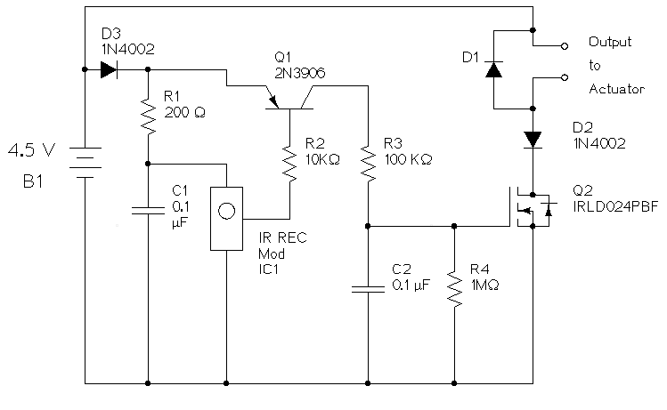
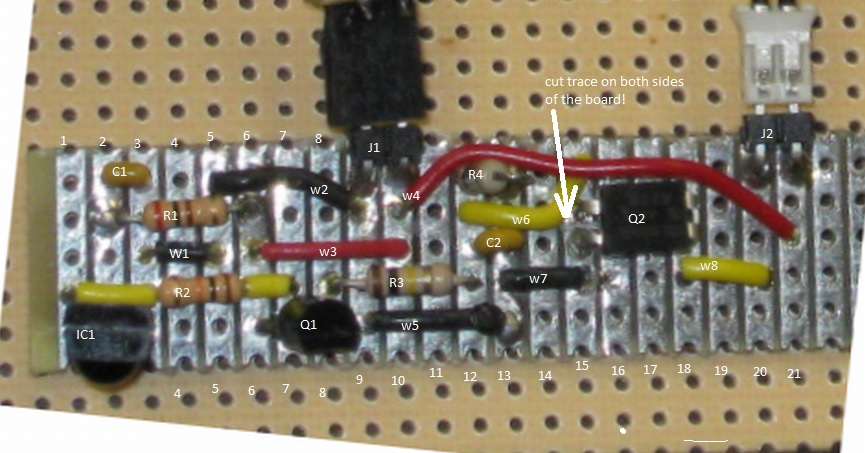
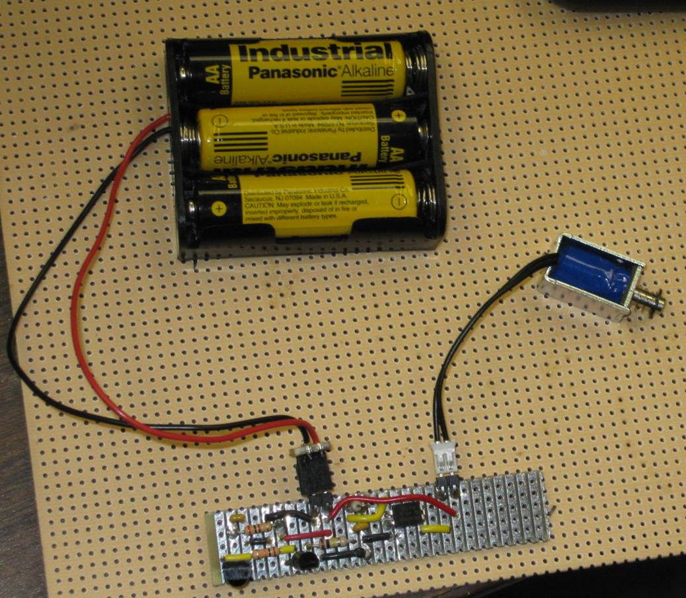
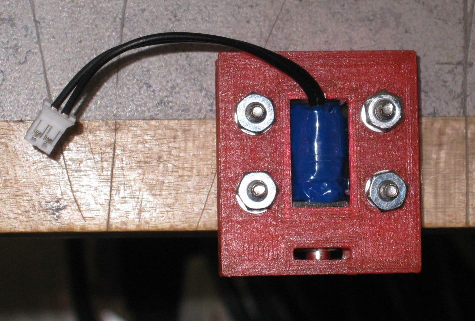

title: Remote IR Actuator

# Remote IR Actuator

Page written and circuit created in 2015 By Daniel Peirce B.Sc. 

[TOC]

## The Circuit

### Schematic of circuit

(schematic updated April 26, 2015)

The schematic was drawn using the open source program [XCircuit](http://opencircuitdesign.com/xcircuit/) on a 
[Debian Linux](https://www.debian.org/) computer.

### Part Placement

### Circuit Description

IC1 is a [infrared detector module designed](http://www.digikey.ca/product-detail/en/TSOP32156/TSOP32156-ND/4074457) 
to detect IR remote codes modulated at 56 KHz. RCA device IR remotes are 
known to use a 56 KHz carrier. IC1 contains an IR detector diode, an amplifier, a 
band pass filter and a demodulator. The output contains encoded data 
related to the keys pressed on the remote. This data is binary and 
active low.

The components R1 and C1 form a low pass filter for the power supplied to IC1. 
R1 and C1 are recommended in the [datasheet for IC1](http://www.vishay.com/docs/82490/tsop321.pdf) 
on page 3.

The signal from IC1 needs to be modified in two ways before being used to 
drive the output N channel power MOSFET Q2. The encoding is not relevant 
to this project; we only want to know when a key is pressed and don't 
care which key it is. The components Q1, R2, R3, R4 and C2 work together 
as a combination peak detector and binary logic inverter. 

Q1 is a 2N3906 PNP bipolar transistor. In this circuit it acts as an 
inverting binary switch. When the base terminal is pulled low it allows 
current to flow from the battery through R3 and into C2. When the base is 
high no current flows in R3. C2 discharges slowly through R4. R4 is ten 
times larger than R3 so the voltage on C2 rises much faster than it 
falls. This removes the encoding from signal since the signal cannot drop 
fast enough to retain the fast binary data that contains the code.

* R3 controls the rate at which C2 charges
* R4 controls the rate at which C2 discharges

The codes sent from an RCA remote repeat as long as a button on the remote 
is pressed but there are gaps in time before the code is repeated. The 
relatively slow discharge of C2 ensures the voltage on C2 is held at 
a logic one during the time between code repeats. 

It was discovered by trial and error that if C2 was allowed to charge too 
quickly the circuit would respond to camera flashes. That sensitivity 
was eliminated by the addition of R3.

Q2 turns off abruptly. As the magnetic field in the solenoid collapses 
a path is required for current generated by the solenoid. The diode 
D1 provides that path.

[Q2 is a power MOSFET](http://www.digikey.ca/product-detail/en/IRLD024PBF/IRLD024PBF-ND/812492) 
that can handle the current required by the output 
solenoid. Since a MOSFET requires essentially no current at the gate it 
does not load C2.

Diodes D2 and D3 were added to block reverse current in case the battery 
holder plug is inadvertently connected backwards.

### Parts list

  part ID  |  part description              |  part number   
---------- | ------------------------------ | ---------------
  C1, C2   |  0.1 &mu;f capacitor           |                     
  D1       |  diode                         |                
  D2, D3   |  1N4002 diode                  |             
  IC1      |  IR receiver Module 56 KHz     |  TSOP32156-ND digikey
  J1, J2   |  2 pin header right angle      |  
  Q1       |  2N3906 PNP transistor         | 
  Q2       |  MOSFET N-CH 60V 2.5A 4-DIP    |  IRLD024PBF-ND digikey
  R1       |  200 &Omega; resistor 1/4 watt |   
  R2       |  10 K&Omega; resistor 1/4 watt |
  R3       |  100 K&Omega; resistor 1/4 watt |  
  R4       |  1 M&Omega; resistor 1/4 watt |  
  w1-w8    |  wire jumper                  |   

### Photo of Circuit

### Photo of Solenoid in Bracket

A bracket was designed and made to facilitate holding and releasing a string.

More on the bracket can be found on [Github](https://github.com/danpeirce/actuator-bracket).

## Creative Commons 0

  
   
  To the extent possible under law,
  <a rel="dct:publisher"
     href="http://members.shaw.ca/danpeircenotes2/remote-actuator.html">
    Daniel Peirce</a>
  has waived all copyright and related or neighboring rights to
  Remote IR Actuator.
This work is published from:

  Canada.

