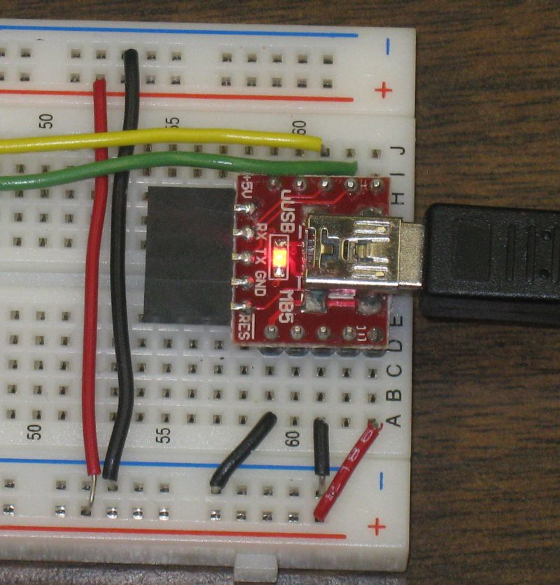

title: RPi and PIC

.... this is continued from
[raspberry_pi_and_pic18lf2620](rpi_echo_led.html#raspberry_pi_and_pic18lf2620) That
page contains photos and a description of the setup. It also has PIC C18 code
for a simple echo program. I have taken the project on step farther and added
code for the PIC that will turn an LED on or off in response to keypress on a
remote computer or tablet (or android phone). For more on remote access see
[remote_login](raspberry_pi.html#remote_login)

Updates on [bitbucket](https://bitbucket.org/danpeirce/pic18_serial_io). Have
a new adc branch. The ADC can be used to read the voltage on the LED.

[TOC]

# Headless Raspberry Pi Connected to PIC18LF2620 Connected to LED

## Using /dev/ttyUSB0

Note

  * The connection to the [ FTDI UART to USB converter (from Solarbotics)](http://www.solarbotics.com/product/39240/) is more reliable when the Raspberry Pi is connected to a USB hub and the USB to Serial FTDI board is downstream of the USB hub.

 The USB board shown is just a power
source.

  * I have also tested another board [uUSB-MB5](http://www.abra-electronics.com/products/%CE%BCUSB%252dMB5-Breakout-Board-for-CP2102-mini-USB-to-Serial-.html) which uses a CP2102 Bridge from Silicon Labs and has a 3.3 volt regulator IC. The Raspberry Pi also recognized this board without intervention. 

## Using /dev/ttyAMA0

notes on

  * setting up /dev/ttyAMA0 for general use at [ttyama0_configuration_reset](raspberry_pi.html/#ttyama0_configuration_reset)

  * connections using jumpers at [ttyama0_uart](raspberry_pi.html#ttyama0_uart)

## Options for Access to the PIC

When I ran through options 1 to 6 I was using /dev/ttyUSB0. The same should
work for /dev/ttyAMA0 although so far I have only tested option 1 with
/dev/ttyAMA0.

### Running in minicom Terminal (option 1)

The box below was copied from a window on a PC running a PuTTY SSH session.
Within the SSH session minicom was run.

  * Each time a "L" (upper or lower case) is pressed on the PC computer the LED is switched on. 

  * Each time the "F" (upper or lower case) is press on the PC computer the LED is switched off.
    
    
            pic18lf2620
    August 19, 2012
    by Dan Peirce B.Sc.
    Echo to sender & LED....
    L - LED on
    F - LED off
    
    flf
    lf
    l

### Running a Python interactive Session (option 2)

As before but running the python interpreter in interactive mode rather than
running minicom.

    
    ::;python
    danp@raspberrypi ~ $ python
    Python 2.7.3rc2 (default, May  6 2012, 20:02:25)
    [GCC 4.6.3] on linux2
    Type "help", "copyright", "credits" or "license" for more information.
    >>> import serial
    >>> ser = serial.Serial('/dev/ttyUSB0', 115200, timeout=1)
    >>> ser.read()
    ''
    >>> ser.write("L")
    1
    >>> ser.read()
    'L'
    >>> ser.write("F")
    1
    >>> ser.read()
    'F'
    >>> exit()
    danp@raspberrypi ~ $

### Running a Simple Python Script (option 3)

This type a python script was run. The power to the PIC MCU was turned on
after the **enter** was pressed on the remote keyboard (remember the Raspberry
Pi is being operated headless and is being controlled in a SSH session).

    
    :::python
    danp@raspberrypi ~ $ python usb_led.py
            pic18lf2620
    August 19, 2012
    by Dan Peirce B.Sc.
    Echo to sender & LED....
    L - LED on
    F - LED off
     
    L
    F
    danp@raspberrypi ~ $

The python script in the file **usb_led.py** is as follows:

    
    :::python
    #!/usr/bin/python
    # -*- coding: utf-8 -*-
    import serial
    from time import sleep
     
    ser = serial.Serial('/dev/ttyUSB0', 115200,  timeout=5)
    input = ser.read(105)
    print input
    ser.close()
    sleep(2)
    ser = serial.Serial('/dev/ttyUSB0', 115200,  timeout=1)
     
    ser.write("L") # turns LED on
    print ser.read()
    sleep(2)
    ser.write("F")
    print ser.read()
    ser.close()

### Running a Simple PHP Script from the CLI (option 4)

Since I have PHP installed on this Raspberry Pi I thought I would try a php
script from the command line first and then try it as part of a web page.

  * <https://www.assembla.com/spaces/fritzbee/messages/10285> \-- adapted this example

  * <http://www.phpclasses.org/browse/file/17926.html> \-- source of php_serial.class.php

#### on.php

    
    :::php
    <?php
    include "php_serial.class.php";
     
    // Let's start the class
    $serial = new phpSerial;
     
    // First we must specify the device. This works on both linux and windows (if
    // your linux serial device is /dev/ttyS0 for COM1, etc)
    $serial->deviceSet("/dev/ttyUSB0");
     
    // We can change the baud rate, parity, length, stop bits, flow control
    $serial->confBaudRate(115200);
    $serial->confParity("none");
    $serial->confCharacterLength(8);
    $serial->confStopBits(1);
    $serial->confFlowControl("none");
     
    // Then we need to open it
    $serial->deviceOpen();
     
    // To write into
    $serial->sendMessage("L");
     
    // Or to read from
    $read = $serial->readPort();
     
    // If you want to change the configuration, the device must be closed
    $serial->deviceClose();

I have also created a file off.php. It is exactly the same except it sends a
"F" rather than an "L".

### Running a Simple PHP Script from a Web Browser (option 5)

I have Apache and PHP installed on the Raspberry Pi so it is possible to run
PHP scripts that interact with the PIC from a remote web browser.

**This example works initially but needs to be improved for better reliability ** \-- I have not come back to this in some time. Instead I have used VNC which has not given me any problems. 

For Apache to access **/dev/ttyUSB0** www-data must be in the dialout group.

    
    
    sudo adduser www-data dialout

To check if www-data is in the dialout group use id:

    
    
    danp@raspberrypi /var/www $ id www-data
    uid=33(www-data) gid=33(www-data) groups=33(www-data),20(dialout)
    danp@raspberrypi /var/www $

Once added it is necessary to restart the R-Pi (or at least Apache) for the
new group to actually take effect.

The web page **on.php** can be used to turn the LED on. Another web page
**off.php** can be used to turn the LED off. Each contains a link to the
other.

This screen shot was made at home. In the richmond lab the IP address to set
the browser to is **10.3.30.237**

This example has been kept very simple. No attempt has been made to check to
see if the LED is actually on or off. More than one remote
computer/tablet/phone can access the web page so with this simple version
someone else could change the state of the LED and the change in state is not
reported. Much could be done to expand the example.

**on.php** looks link this: 
    

    :::php
    <html>
    <head><title>LED ON</title>
    </head>
    <body>
    
<h1>The LED should now be on</h1>
     
    
Turn the LED <a href="off.php">off <i>{link}</i></a>.

    

    <?php
    include "php_serial.class.php";
     
     
    // Let's start the class
    $serial = new phpSerial;
     
    // First we must specify the device. This works on both linux and windows (if
    // your linux serial device is /dev/ttyS0 for COM1, etc)
    $serial->deviceSet("/dev/ttyUSB0");
     
    // We can change the baud rate, parity, length, stop bits, flow control
    $serial->confBaudRate(115200);
    $serial->confParity("none");
    $serial->confCharacterLength(8);
    $serial->confStopBits(1);
    $serial->confFlowControl("none");
     
    // Then we need to open it
    $serial->deviceOpen();
     
    // To write into
    $serial->sendMessage("L");
     
    // Or to read from
    //$read = $serial->readPort();
    // echo " sent an an <b>L</b> and recieved an <b>$read</b>.";
     
    // If you want to change the configuration, the device must be closed
    $serial->deviceClose();
     
    ?>
    </body>
    </html>

**off.php** looks much the same. 

As stated in the previous section the PHP code is adapted from

  * <https://www.assembla.com/spaces/fritzbee/messages/10285>

### Running C Program Access to /dev/ttyUSB0 (option 6)

Target for this C program is the Raspberry PI. Writing C programs for Linux is
relatively new to me so I am taking this slow step by step.

  * program based on <http://tldp.org/HOWTO/Serial-Programming-HOWTO/x115.html>

I am essentially using the code from the "HOWTO" section 3.2 with some
modifications.

  1. Modifications were made so it will compile without warnings or errors.

  2. Write statements were added to tell the PIC to turn the LED on and off. 

  3. Configuration was changed so that read() statements will wait up to 0.1 seconds for a character to arrive (if nothing is in the input buffer. Original code waited for at least one character to be received. Changes made to the newtio.c_cc[] so that if nothing is in the receive buffer it will wait up to 0.1 seconds for input to arrive or return with a null string.

Lines added or modified contain a comment using the single line comment method
(the original comments still intact use the multi-line format even when on
just one line.

So far this code is appearing to be reliable.

  * I plan to revisit option 5 which was not reliable. Perhaps I will use C code like this to access the actual port. Perhaps the PHP code could leave a message in a file and the C code could pass on the message to the PIC. In that case a channel to ttyUSB0 could be keep open.
    

          :::c
          #include <sys/types.h>
          #include <sys/stat.h>
          #include <fcntl.h>
          #include <termios.h>
          #include <stdio.h>
          #include <unistd.h>     //added for read() write()
          #include <strings.h>    // added for bzero()
     
          #define BAUDRATE B115200                     // set for 115200 bps
          #define MODEMDEVICE "/dev/ttyUSB0"           // set for FTDI on ttyUSB0
          #define _POSIX_SOURCE 1 /* POSIX compliant source */
          #define FALSE 0
          #define TRUE 1
     
          volatile int STOP=FALSE; 
     
          int main(void)
          {
            int fd, res;                          // removed variable "c" since it was not used
            int count=0;                          // added count variable
            struct termios oldtio,newtio;
            char buf[255];
     
            fd = open(MODEMDEVICE, O_RDWR | O_NOCTTY ); 
            if (fd <0) {[perror](http://www.opengroup.org/onlinepubs/009695399/functions/perror.html)(MODEMDEVICE); return (-1); }        // removed error(-1) and added return (-1) 
                                                                   // since error() was giving compiler warnings
     
            tcgetattr(fd,&oldtio); /* save current port settings */
     
            bzero(&newtio, sizeof(newtio));
            newtio.c_cflag = BAUDRATE |  CS8 | CLOCAL | CREAD;  //changed so can write **removed | CRTSCTS ** 
            newtio.c_iflag = IGNPAR;
            newtio.c_oflag = 0;
     
            /* set input mode (non-canonical, no echo,...) */
            newtio.c_lflag = 0;
     
            newtio.c_cc[VTIME]    = 1;   // inter-character timer used and set to 0.1 second **this is a change**
            newtio.c_cc[VMIN]     = 0;   // minimum characters to read 0  **this is a change**
     
            tcflush(fd, TCIFLUSH);
            tcsetattr(fd,TCSANOW,&newtio);
     
            write(fd, "L", 1);                     // tells the PIC to turn on the LED  ** this is new **
            while (STOP==FALSE)      /* loop for input */
            {       
     
              if(count==100) write(fd, "F", 1);     // new from here
              if(count==200) write(fd, "L", 1);     // used steps of 100 so it was easy to measure timing (10.0 seconds)
              if(count==300)                        //  keep in mind the current PIC program will
              {                                     //    echo everything received back to the R-Pi
                 write(fd,"~F\r",2);                //    When the PIC receives an "L" it turns the LED on
                 count=0;                           //    When the PIC receives an "F" it turns the LED off
              }                                     //
              count++;                              // to here
              res = read(fd,buf,255);   // will wait up to 0.1 seconds for input 
              buf[res]=0;               /* so we can printf... */
              [printf](http://www.opengroup.org/onlinepubs/009695399/functions/printf.html)("%s", buf);                    // print statement changed so only prints received characters
              if (buf[0]=='~') STOP=TRUE;
            }
            tcsetattr(fd,TCSANOW,&oldtio);
            close(fd);
            return 0;
     
         }

### Running A Python TCP server that also Interacts with the Serial Interface
(option 7)

...working on this... The plan is to combine the serial interface from
running_a_simple_python_script_option_3 with [from_wwwbinarytidescom_python-
socket-programming-tutorial](python_tcp_sockets.html#from_wwwbinarytidescom_python-
socket-programming-tutorial)

# Simple LED and Echo Program in C

The C program runs on a PIC18LF2620 (or PIC18F2620). Created a [git](git)
repository for this project as I plan to continue to develop it. Posted to
bitbucket

  * <https://bitbucket.org/danpeirce/pic18_serial_io/overview>

The code that had been shown here is now on bitbucket <https://bitbucket.org/d
anpeirce/pic18_serial_io/changeset/ed7f201c3c146ea327c74c33dcc0bc7e584792c6>

    
    
    commit ed7f201c3c146ea327c74c33dcc0bc7e584792c6
    Author: Dan Peirce <peirce.dan@gmail.com>
    Date:   Sat Oct 6 13:58:54 2012 -0700
    
       ...two more corrections: tested as I remember

### Added Output Buffer

I have added code so that an output buffer is used. printf() now prints to a
120 character buffer and a function in the main event loop sends one character
at a time to the UART when space is a available on the UART's small two byte
buffer. This is to avoid long messages blocking other operations of the PIC
(like listening to the input of the UART).

The code with the output buffer is available at: <https://bitbucket.org/danpei
rce/pic18_serial_io/changeset/ed7116075280c466811d123fc5dd9b29aa8d32cb>

    
    
    commit ed7116075280c466811d123fc5dd9b29aa8d32cb
    Author: Dan Peirce <peirce.dan@gmail.com>
    Date:   Sat Oct 7 00:49:43 2012 -0700

### Changed echoRx() to Use Output Buffer

Made a change to echoRx() to make use of the Output Buffer by using printf().
This should ensure the UART is not and ensure that the character echoed will
not land in the middle of a longer message.

<https://bitbucket.org/danpeirce/pic18_serial_io/changeset/b8c10af1b10db01f6e4
be1791bb2717905f0ad9b>

Bitbucket provides a convenient way to make the entire project available
including different versions and new features added.

