title: Changes To Sumovore and Brain board 2

[TOC]

# Summary of Changes to Sumovore and Brainboard 2

by Dan Peirce B.Sc.
March 18, 2010 (rev. **March. 2, 2011**)

## The Purpose of the Modifications

The purpose of the modifications listed on this page are each for
one of the following reasons:

1.  To make the **robot hardware more reliable**. Reliability is
    essential. It is virtually impossible for the students to have
    reasonable success modifying their programs in a resonable
    amount of time if the robot hardware does not behave
    consistently. The PIC has now being configured to watch for out
    of spec. power supply conditions. Changes to sumovore.c and
    sumovore.h were made for this purpose. see
    <changesSumovore_h.html>
2.  To make programing with the PICkit2 possible.
3.  To make the robots as interchangeable as reasonably possible. A
    program should work equally well on any of the robots (to the
    extent reasonably possible).
4.  To simplify the task of building the robots (i.e. leaving off
    unnecessary components the robot was designed for the
    mini-sumo event and doubles for line following as a secondary
    purpose. We only do line following because it is a better
    programming task. Also, the florescent tube lighting and
    electronic ballast used in our labs can interfere with the IR
    opponent detectors [IR DET1, IRDET2] as the florescent tubes
    age).
5.  To avoid scratching the clear plastic that will be placed over
    the competition track (and practice tracks).

Note 100Kohm chip resistors are no longer added to new main boards.
This is because the new brain board 2 has resistors for the same
purpose (this was not the case in the old brainboards 1.0 that we no
longer use).

## Robot 1.1

This image shows parts that I am not installing when building the
new version 1.1 robots.

1.  IRDET1, IRDET2, LED1, LED2 *not needed saves build time*
    LED1 and 2 only confuse our students and waste battery
    power.
2.  IC1 removed because it interferes with changes for dynamic
    braking. I leave the socket off to save build time. This IC
    is essential if one were to use the discrete brain board that
    comes with the sumovore but we don't use it. I save those
    parts for other things.
3.  C2, C3, R3, R4 without IC1 they don't do anything *I
    leave them off to save build time*
4.  Thinking about adding 0.1 microf Cap. Some of the 1.0 version
    robots needed it. (**added March. 2, 2011**)
    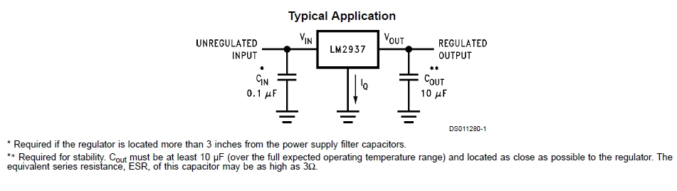
5.  test point added to mainboard to check battery level (not
    added in the above image yet).

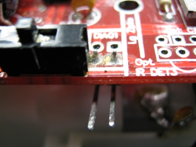 this image is actually of mainboard 1.0 but the
position of Diag1 is about the same on version 1.1 board (just
slightly farther from switch and the Ziptie ref. no longer exists
on the newer board)

### Sensor board on version 1.1 robot

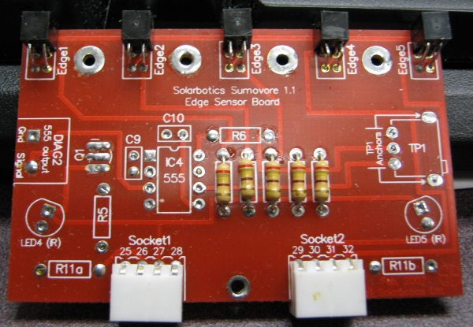

Note most of the parts left off.

All copper is coated with solder to avoid oxidation. Note IC4 does
not do anything good for us. It just creates some EMI that could
possibly cause spikes on the sensor outputs. LED4 and LED5 just
waste battery power. TP1 is for adjusting 555 frequency and is not
needed.

## Robot 1.0  

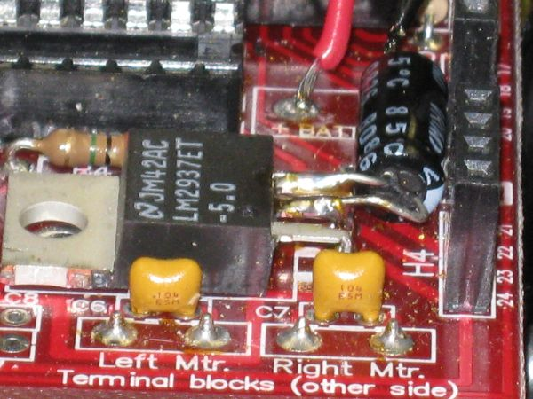

1.  22 microF Capacitor Added the following note is from the
    LM2937 datasheet! Note the board layout for the version 1.1
    robots was changed to bring a large capacitor close to the
    output of the regulator which means this modification is not
    requried for the newer version of the robot!
2.  0.1 microF Capacitor Added from the same note of the
    LM2937 datasheet! It seems like just adding the 22 microF
    capacitor was not good enough for some of the regulators
    (**added March. 2, 2011**)
    
3.  IC1 removed from socket. removed because it interferes with
    changes for dynamic braking
4.  test point added to mainboard to check battery level

### Sensor board on version 1.0 robot

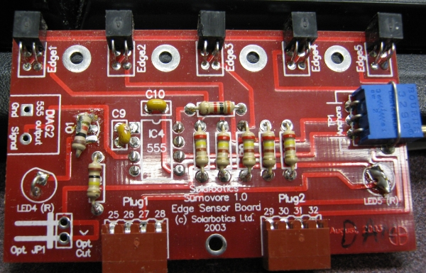

* IC4 removed. to void unnecessary EMI 
* LED4 and LED5 removed to avoid unnecessary IR. 
* To keep LED3 on mainboard functional to indicate power is on other
parts are added:

    1.  Q1 is replaced with a 1 Kohm resistor from Collector pad to
        Emitter pad. Note that the NPN transistor would not work
        without the signal from IC4.
    2.  Jumpers replace LED4 and LED5.

## PIC Brainboard \#2

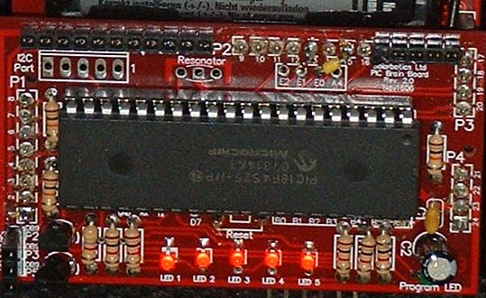
 
PIC16F877A is replaced with a PIC18F4525

1.  PIC16Fxxx components are not optimized for C while the
    PIC18Fxxxx components are
2.  PIC16Fxxx components have only a 8 level hardware stack while
    PIC18Fxxxx components have a 32 level hardware stack. this
    makes the PIC16Fxxx components much more prone to hardware
    stack overflow problems which is bad when one is encouraging
    students to create functions. Also the printf() function
    itself is a wrapper that calls functions that call functions
    (all in the stdio module). It is easy to exceed 8 levels of
    function calls.

Resonator not installed we use the internal osc

I2C connector not installed. we don't use it

Reset switch not installed instead we use the two holes for our
programming adapter board see below

In Richmond I change 5 resistors (under the PIC) so that the
sensors do not go into saturation even above white paper
(resistors chosen in an attempt to get same response to grayscale
for each sensor).

Two jumpers added for dynamic braking. E1 to p13 of P2 and E0 to
p15 of P2.

a custom board is installed under the PIC board to provide a
connection for programming.

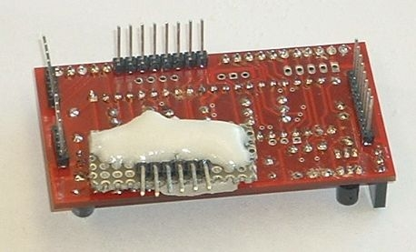

The white stuff is epoxy with a micro sphere filler. I added that
to avoid shorts.

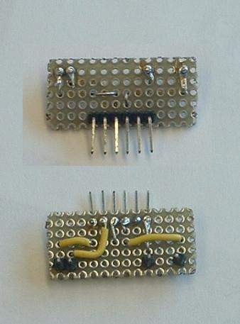

There are four connections between the two boards (see four pins).
The two pins that are 0.4 inch apart fit into the holes where the
reset switch would have been. The two pins close together fit into
the holes for B6 and B7. Those four points are indicated in the
image below.

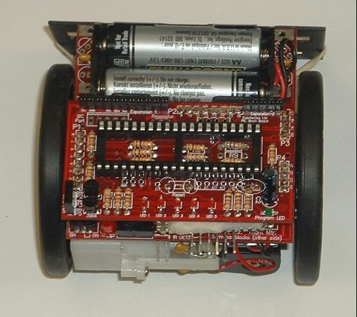

## All Robots

Tape sensor board to front scoop.

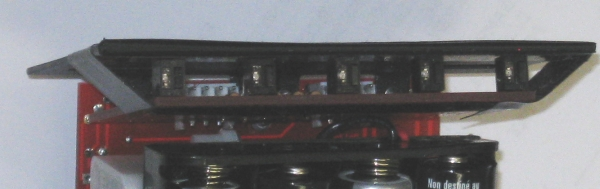

Layer \#1 folded over bottom edge of scoop
Layer \#2 wrapped around scoop from end to end to keep layer \#1
from lifting 
Layer \#3 wrapped around sensor board and scopp from end to end to
keep sensor board tight against scoop and to try to keep sensor
board from moving. 

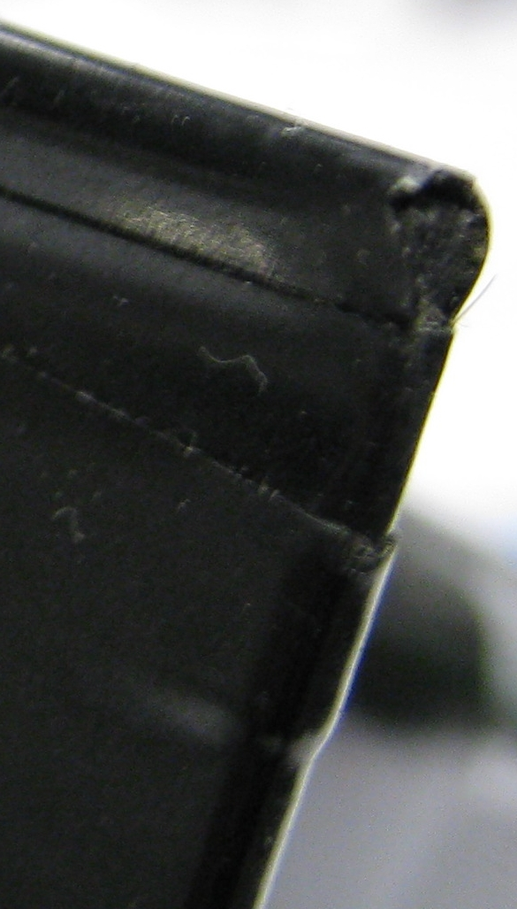

Close up from end showing tape wrapped around bottom edge of scoop
(upside down)

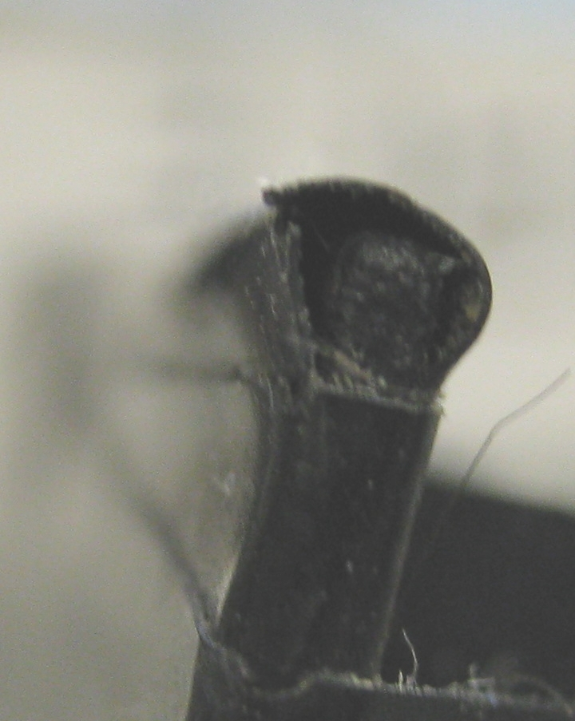

New passive cable to be used with version 2 brain board
A simple passive cable is needed to connect between the robot and
the PC COM1 port. Page 13 of the [PIC brainboard V 2.0
manual](http://www.solarbotics.com/assets/documentation/solarbotics_sumovore_pic_brainboard_v2.pdf)
PIC brainboard V 2.0 manual shows the connections between the DB9
connector and pins that fit into the brainboard. As suggested I
used a cable from a dead serial mouse for the connector and
cable.

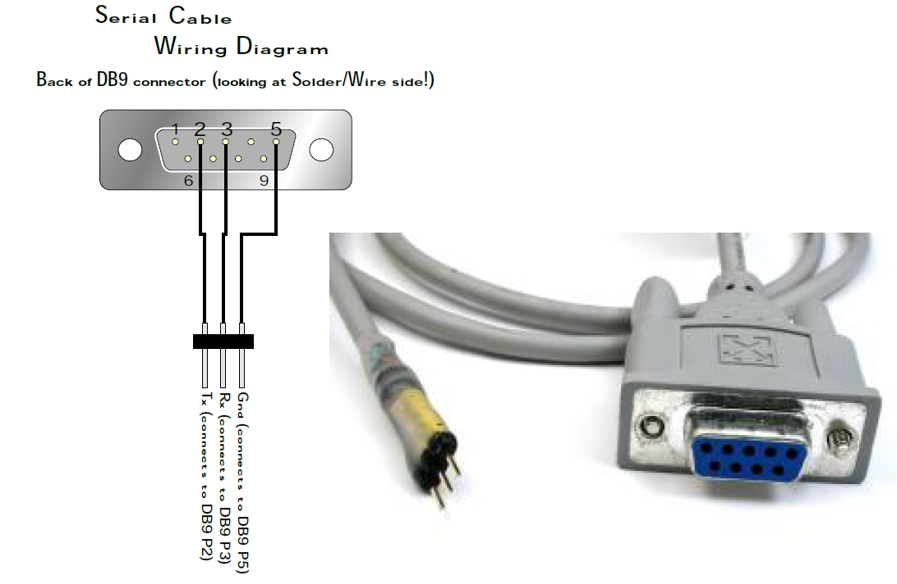
