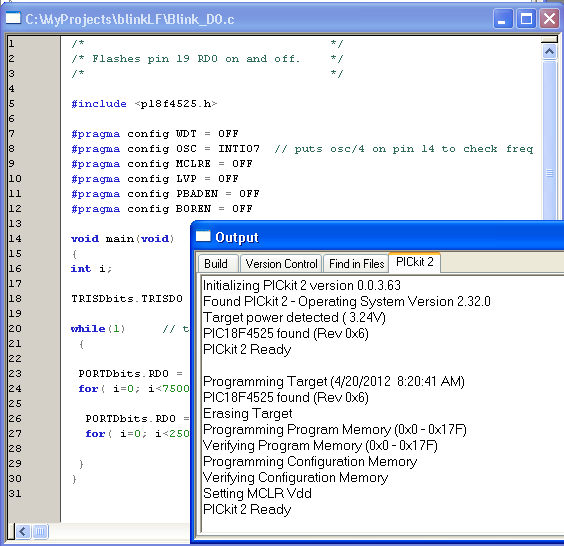

title: Testing USB Powered PIC18LFXXXX

# Testing USB Powered PIC18LFXXXX

    by Dan Peirce  

Translated from dokuwiki July 20, 2013

[TOC]

## Regulator Board

The [USB regulator board](http://www.mikroe.com/eng/products/view/636/usb-reg-
board/) purchased from Mouser comes preassembled except for the voltage supply
pins. The board comes with a three pin breakaway header. I broke off one pin
so that the other two could be inserted into the 3.3 volt and ground holes on
the regulator board (the unregulated 5V pad/hole left empty). This way the two
pins of the header then fit into the power rails of the breadboard. I added
jumpers to the solderless breadboard to join the two positive power rails
together and to joint the two negative rails together. I also inserted jumpers
to the power pins of the PIC IC.

## Programming Header

Five wires were used on the programming header. In APSC1299 we only use four
wires but I felt it would be better if the students could read the voltage
supplied to the PIC in MPlab. The extra wire is for Vdd which lets the PIC
read this voltage. **Power should be applied to the regulated board before
connecting the PICkit2** (otherwise the PICkit2 will not detect the 3.3 volts
from the regulator and may attempt to supply 5 volts to the board).

## Blink D0 Test Program PIC18LF4525

For testing I used the blinkD0.c file from lab3 of APSC1299. The only change
required was to explicidly turn off the Brown Out Reset Enable. In the image
below both the MPlab IDE output window and some of the BLINK_D0.c code can be
seen.

**Notice**

  * The **#pragma config BOREN = OFF** directive

  * The third line of the output window **Target power detected (3.24V)**.

  * The PICkit2 detects the PIC18LF4515 as a PIC18F4525 since the only difference is the supply voltage the chip can be used at.

As with the original program the PIC is left at the default internal clock
frequency. **At 3.3V this MCU should not be clocked at more than 16 MHz.**

## PIC18LF2620

I have also purchased some PIC18LF2620 MCUs. I believe we do not actually
require all the pins available on the PIC18LF4525. The PIC18LF2620 is the same
in most respects but it only has 28 pins rather than 40 and comes in a [
package that is half as wide](pic18lf.html).

### Differences between the PIC18LF4525 and The PIC18LF2620.

<table>
   <caption>PIC18LF4525 compared to PIC18LF2620</caption>
   <thead>
      <tr>
         <th>PIC18LF4525</th>
         <th>PIC18LF2620</th>
      </tr>
   </thead>
   <tbody>
      <tr><td>Has D port</td><td>No D Port</td></tr>
      <tr><td>Program Memory 48KBytes</td><td>Program Memory 64KBytes</td></tr>
      <tr><td>1 CCP, 1 ECCP</td><td>2 CCP</td></tr>
      <tr><td>ADC 13 ch</td><td>ADC 10 ch</td></tr>
      <tr><td>two Vdd pins</td><td>only one Vdd pin</td></tr>
      <tr><td>40 pins</td><td>28 pins</td></tr>
      <tr><td>0.6 inch wide DIP</td><td>0.3 inch wide PIC</td></tr>
   </tbody>
</table>

## Blink B0 Test Program PIC18LF2620

For testing I used the blinkD0.c file from the PIC18LF4525 project.

  1. Changed the file name to blinkB0.c

  2. Changed all references to the D port to the B port. 

  3. included p18f2620 rather than p18f4525

Changes to wiring

  1. Popped the PIC18LF4525 out of the breadboard and popped the PIC18LF2620 in. 

  2. Moved a ground wire from pin 12 to pin 8 (on the other side of the chip the power and ground did not need to be moved even though the designation of the pins are different they are the same distance from the top of the IC).

  3. Removed a Vdd wire (only one used on the PIC18LF2620)

  4. Moved the LED over to B0 (pin 21).

The Progamming adaptor wiring is the same as the PIC18LF4525.

## Parts for Physics1600

  * Testing Parts for Physics 1600 -- [phys1600_parts](phys1600_parts.html)

