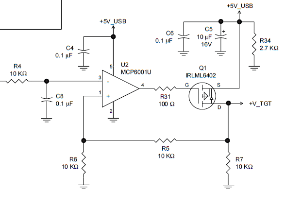
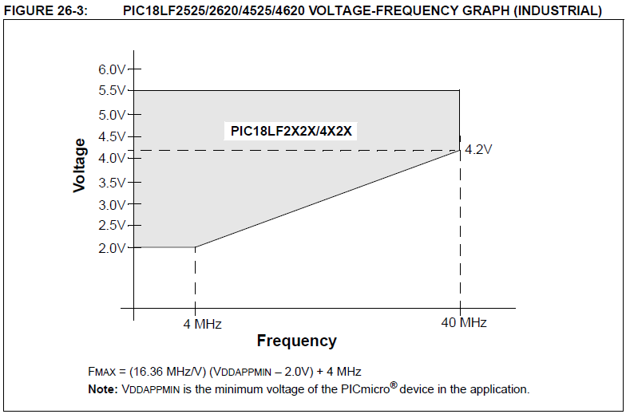

title: Powering a Project from the USB

[TOC]
# Powering a Project from the USB

    by Dan Peirce B.Sc.

Reformatted from [Dokuwiki](http://danpeirce.net46.net/dokuwiki/doku.php?id=usb_power)

The voltage supplied on the USB has a nominal voltage of 5V but it is not
regulated at 5v. In practice it can be anything from 4.4 v to 5.25 volts. The
supply circuits are implemented differently on different types of computers.
On a desk top computer the voltage may be quite consistant where as on a
laptop it may be more variable.

To get more than 100 mA from the USB the device has to negotiate with the
host!

  * A passive cable cannot negotiate.

Many USB devices are powered from the bus but the board in the device often
runs at 3.3 Volts. In that case a simple regulator is on the board that takes
the 4.4 to 5.25 volt input and supplies 3.3 volts out for the board. The PIC
we have been purchasing does not run off of 3.3Volts but there is a [ low
voltage version (PIC18LF)](pic18lf.html) of the PIC18F microcontroller; however, to
be reliable at the lower supply voltage the low power version of the chip
needs to run at a lower clock frequency than we use for apsc1299.

  * On April 20, 2012 I [ tested a PIC18LV4525 MCU powered from a 3.3 volt regulator](testing_usb_powered_pic.html) that was powered from a USB port. 

  * Another possibility is to use a MCP2210 breakout board.  The MCP2210 breakout board also has a on board 3.3 volt regulator but it also has a USB to SPI translator that could allow one to communicate with a PIC or any device that incorparates SPI   
common examples (used in cellphones and other many other devices]):

    * sensors, 
    * flash memory, 
    * ADC, 
    * DAC...

Another way around the voltage supply issue is to use the Vdd output from the
PICkit2. The PICkit2 contains an OpAmp/powerMOSFET circuit to allow it to
generate an output voltage that can be adjusted! This can work because
generally if the USB is not heavily loaded it will be sitting at or close to
5.25 volts. A PWM signal from the PIC in the PICkit2 drives a low pass RC
filter and that is fed into an op amp. In the circuit shown below the output
on pin 4 of U2 will adjust to keep the voltage at the input at pin 1 virtually
equal to the input at pin 3. R5 and R6 form a voltage divider so the voltage
at pin 1 of U2 is half the voltage at output +V_TGT. The PWM signal feeds into
R4 and the duty cycle will be such that the voltage at pin 3 is whatever it
needs to be to get the output voltage +V_TGT to the required voltage (this
will work within reason and it will self adjust to keep the output voltage
from dropping as the load is increased as long as +5V_USB stays fairly
constant).

The image below has been copied from the Appendix B of the [ PICkit2 User
Guide](http://ww1.microchip.com/downloads/en/DeviceDoc/51553E.pdf)

PICkit2 Vdd output (+V_TGT) circuit

Microchip recommends keeping the load current to 25 mA or less.

## Relationship between Minimum Voltage and Oscilator Frequency in LF PICs

See [ PIC device
Datasheet](http://ww1.microchip.com/downloads/en/devicedoc/39626b.pdf) page
325

## USB Circuit (suggestions found on the web)

  1. <http://www.edn.com/article/510572-Power_supply_circuit_operates_from_USB_port.php>   
also read comments ("Talkback") at bottom linked page

  2. <http://www.maxim-ic.com/app-notes/index.mvp/id/1161>   
This is the ideal solution. I should say it would be the ideal solution if it
were available in a prebuild demo board. This is what we should be looking
for.

  3. data <http://www.mikroe.com/eng/products/view/636/usb-reg-board/>   
<$8 a board from mouser <http://ca.mouser.com/ProductDetail/mikroElektronika/M
IKROE-658/?qs=7CTBMF0jTsGDvSykqNSzk6DfxtMJ7GJb>  
This board provides both the unregulated +5(ish) and a regulated 3.3 volts to
a breadboard!

  4. <http://www.instructables.com/id/Power-your-breadboard-with-USB/?ALLSTEPS>   
Very simple but I worry one could damage the computer.

  5. <http://www.sparkfun.com/products/8376>   
Is a simple kit. Has a switch. The mouser board is actually smaller, less
expensive and built but it does not have a switch.

  6. <http://www.canakit.com/breadboard-power-supply-usb-5v-3-3v-prt-08376.html>   
Looks like the same sparkfun board from a local source (but they are out of
stock).

I suggest ordering and trying some of the boards from mouser. That is #3
(above). Also, I strongly suggest that if this is the way you want to go that
you also purchase the low power version of the PIC and run it from 3.3 volts.
The 3.3 volt regulator has built in short circuit protection!

I have now ordered some of the sparfun boards, mikroe boards and some [ low
voltage (LF) PICs](pic18lf.html) The mikroe board as been tested[ -jump to USB
powered PIC](testing_usb_powered_pic.html)

mikroe board

## Caution Regarding Student Built Circuits

From the pickit2 user guide sec 3.4.1

    "The USB port current limit is set to 100 mA. If the target plus the
    programmer exceeds this current limit, the USB port may turn off. The target
    may be powered externally if more power is required."

    "Current draw should be limited to 25 mA when using the programmer to power
    the application circuit. Ensure that the application circuit does not slow the
    VDD rise time to longer than 500 micro seconds."

I think 25 mA is too restrictive.

from the LCD datasheet "The SerLCD uses 3mA with the backlight turned off and
~60mA with the backlight activated."

