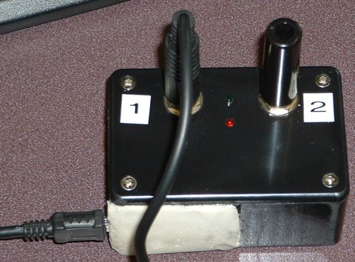
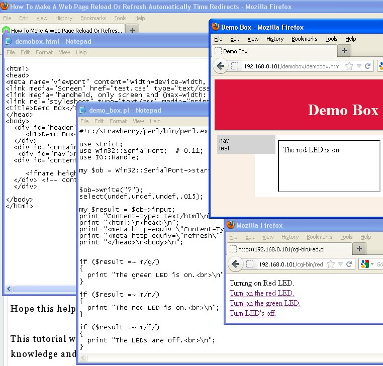
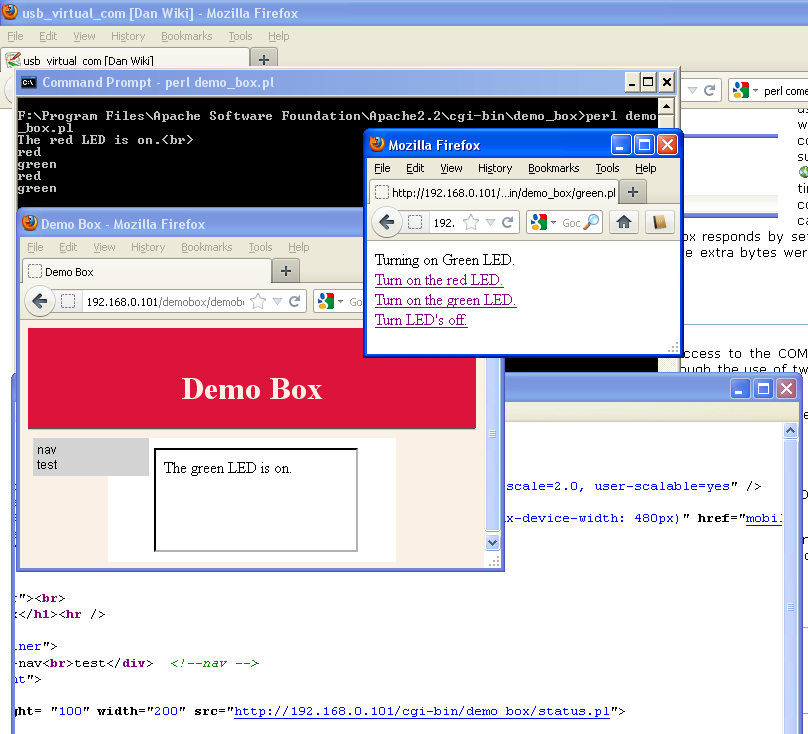

title: USB Virtual COM Port

[TOC]

# USB Virtual COM Port

    by Dan Peirce B.Sc.

Reformatted from [Dokuwiki](http://danpeirce.net46.net/dokuwiki/doku.php?id=usb_virtual_com)

One method of getting data from a PIC into a PC is using a USB virtual com
port.

## Using old ProtoType Box

We have used a virtual com
port before in our [ photogate project](http://www.kwantlen.ca/science/physics/faculty/dpeirce/notes/timer_box/). I still have the prototype box built for
that project so I decided to make use of it while I have new virtual com port
boards on order. Controlling the LEDs is not that interesting but since they
are all that are attached to the PIC that is what I started with.

## Simple CGI Interface

Rather than write a GUI to a low one to interact with the prototype/demo box I
thought it would be quicker and easier to use an existing web browser. **As an
added bonus, this method of interacting with the COM port and timer box allows
great flexibility. One can both control and monitor the demo box from the same
computer that it is connected to by the USB. It is no more difficult to
monitor and control the demo box from a remote computer. It is also possible
to control from one computer and monitor on another.** If there were no
firewall between the connected computer and the Internet it would also be
possible to control and/or monitor the timer box from any computer on the
Internet.  
  
At home I have tested this setup with **Mozilla Firefox** and **Internet
Explorer**. I have also used the **Android browser** to **control and monitor
the demo box remotely.** No doubt the methods used could be substantially
refined but it is actually amazing how quick and easy this was to set up in
the present form (although I did already have [
Apache](http://www.apache.org/) and [Perl](http://strawberryperl.com/)
installed for previous projects). **The fact that the interface is a web
interface means that virtually any computer or WI-fi connected device could be
used to control/monitor the demo box!** Any one of a multitude of sensors
could also be attached to the demo box and monitored over a LAN. This I would
also like to demonstrate when time permits.  
  
I already have [ Apache](http://www.apache.org/) web server and
[Perl](http://strawberryperl.com/) installed. Perl was the choice for CGI
language since there is an existing [Perl](http://strawberryperl.com/) module
for com port communication. In 2006 I used **Tcl/tk** to make a **GUI** to
communicate with the demo box but at that time I had no working com port Perl
module for the windows platform. This has changed with Strawberry
[Perl](http://strawberryperl.com/). Unlike Active Perl, Strawberry Perl comes
with a C compiler that allows one to download modules from
[CPAN](http://www.cpan.org/), compile the module and install it.  
  
 In this screen shot you can see a
browser window titled **"Demo Box"**. The file demo_box.html contains the HTML
tags needed to set the page up and references to test.css, mobile.css and
print.css (style sheet used before for other pages). The purpose of this page
is simply to show the status of the demo box. In this case it displays which
LED (if any) is on. The box that contains the information of which LED is on
is an **iframe** (inline frame).  
  
The content of the iframe is supplied by a CGI
[Perl](http://strawberryperl.com/) script called **demo_box.pl**. This script
sends a code ="**?**" to the **demo box** over the USB virtual COM port. It
searches the response text from the demo box for codes "r", "g" and "f"
(**r**ed, **g**reen or of**f**). **demo_box.pl** is set to automatically
refresh every 2 seconds to keep the content current. The **?** query code is
sent to the box when the script loads.  
  
A different window was used to control which LED will be on if any. The
contents of this window is supplied by one of three
[Perl](http://strawberryperl.com/) CGI scripts. Each time a link is activated
the corresponding script is called. Each script when loaded sends the command
code that corresponds it what it is indented to do (r, g or f). The box
responds by setting the correct LED and echoing the character back to the COM
port with a carriage return, line feed and ">" prompt. The extra bytes were
included in case hyper-terminal is used rather an the scripts.

## Second Variation of Simple CGI Interface

The difference between this example and the older example is that here only
demo_box.pl has access to the COM port. demo_box.pl is not actually CGI but is
run from a console prompt. demo_box.pl interacts with the CGI Perl scripts
through the use of two files (demo_box.txt and update.txt).
 **update.txt** is a file the
**demo_box.pl** reads to find messages left by the CGI scripts. Presently
there are just messages it might find:

  1. green

  2. red

**demo_box.pl** responds to a message by passing on the first letter of the message to the timer box via the COM port. It also writes to **demo_box.txt** with the message indicating the current status of the demo box. 

**demo_box.txt** is the file read by **status.pl** and it uses what it finds to update demo_box.html with what is happing. demo_box.html can be used by remote computers to monitor the demo box. On the computer that the demo box is actually connected to messages appear in the console window for demo_box.pl with lower latency. 

## Perl to File interface with PHP files for Web Interface

Since demo_box.pl acts as a interface between the virtual COM port and the
file system just about any programming or scripting language capable of
reading and writing files could be used with demo_box.pl. One could use PHP to
interact with these two files.

The status.php file for this example is quite simple.

    
    
    :::php
    <html>
    <head>
    <meta http-equiv="Content-Type" content="text/html; charset=iso-8859-1">
    <meta http-equiv="refresh" CONTENT="3;URL="status.php">
    </head>
    <body>
     
    <?php
    $demobox = "demo_box.txt";
    $fh = [fopen](http://www.php.net/fopen)($demobox, 'r');
    $theData = [fread](http://www.php.net/fread)($fh, [filesize](http://www.php.net/filesize)($demobox));
    [fclose](http://www.php.net/fclose)($fh);
    echo "The "; 
    echo $theData;
    echo "LED is on";
     
    ?>
     
    </body>
    </html>

  * <http://stackoverflow.com/questions/313083/is-php-or-vanilla-perl-cgi-faster>

## Perl Files

  * [ Files used in the project.](demo_box/cgi.html)

## Perl

Resources for running Perl on a windows system.

  * <http://strawberryperl.com/>
  * <http://win32.perl.org/wiki/index.php?title=Strawberry_Perl>
  * <http://www.cpan.org/> \-- Comprehensive Perl Archive Network

For the current project the Win32::SerialPort module is needed from CPAN

  * <http://search.cpan.org/~bbirth/Win32-SerialPort-0.22/lib/Win32/SerialPort.pm>

## Apache

Resources for running Apache.

  * <http://www.apache.org/>
  * <http://johnbokma.com/windows/apache-virtual-hosts-xp.html>
  * <https://our.kwantlen.ca/personal/danp/Blog/Lists/Posts/Post.aspx?ID=7> \-- This does little but provide the link given above.
  * <http://httpd.apache.org/docs/current/howto/cgi.html#writing> \-- CGI with perl and Apache

# See Also Sensor Related

  * <http://danpeirce.net46.net/notes.html#html5_canvas> \-- useful to display analogue data in a chart and other graphical information.
  * [html5canvas](html5canvas.html)
  * <http://www.kwantlen.ca/science/physics/faculty/dpeirce/notes/envi2307/photodiode.html>
  * <http://www.kwantlen.ca/science/physics/faculty/dpeirce/notes/envi2307/#sensors>
  * <http://www.solarbotics.com/product/35180/> \- HM55B Compass Module
  * [ MMA7455 3-Axis Accelerometer Module](https://www.parallax.com/StoreSearchResults/tabid/768/List/0/SortField/4/ProductID/585/Default.aspx?txtSearch=Accelerometer+)
  * <http://www.solarbotics.com/product/35220/> \-- H48C - 3 Axis Accelerometer
  * [ PIR Sensor (Rev B) ](https://www.parallax.com/Store/Sensors/ObjectDetection/tabid/176/txtSearch/gps/List/0/SortField/4/ProductID/83/Default.aspx)
  * [ PING))) Ultrasonic Sensor ](https://www.parallax.com/Store/Sensors/ObjectDetection/tabid/176/txtSearch/gps/List/0/SortField/4/ProductID/92/Default.aspx)
  * [ Analog Infra-Red Rangefinding System (AIRRS)](http://www.solarbotics.com/product/35060/)
  * [ HXT900 9g / 1.6kg / .12sec Micro Servo](http://www.solarbotics.com/product/25500/) \-- can be used with AIRRS
  * [ PING))) Bracket Kit with Servo ](http://www.solarbotics.com/product/35192/)

## HTML5 and websockets

HTML5 and Websockets is something to start looking at.

  * <http://showmetheco.de/articles/2011/2/diving-into-html5-with-websockets-and-perl.html>
  * <http://css.dzone.com/articles/updating-duct-tape-html5>
  * <http://mojolicio.us/>

## Polling and long polling and Other Possabilities

Unfortunately HTML5 websokets is not well supported yet. Expect this to change
but for now it would be a good idea to look at alternatives.

  * <http://query7.com/avoiding-long-polling>
  * <http://meteorserver.org/>
  * <http://stackoverflow.com/questions/1338123/what-is-a-safe-amount-of-time-that-i-can-wait-before-responding-to-a-browser-wi>

## Writing Data to an Excel File

As an alternative to using a CGI script to display Data in a browser the data
could be stored to an Excel file (including a scatter chart).

  * [perl_excel_writer](perl_excel_writer.html)

* * *

trying something newer [demo_box.pl](demo_box.pl)

